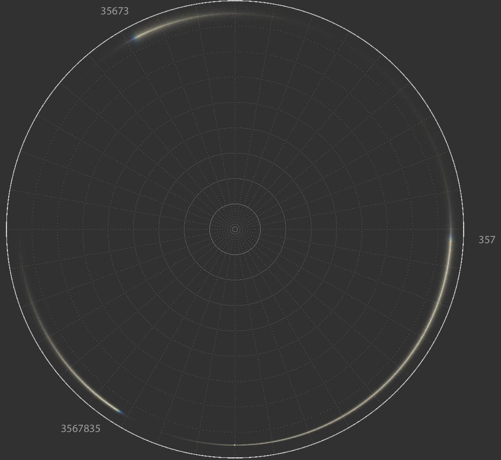
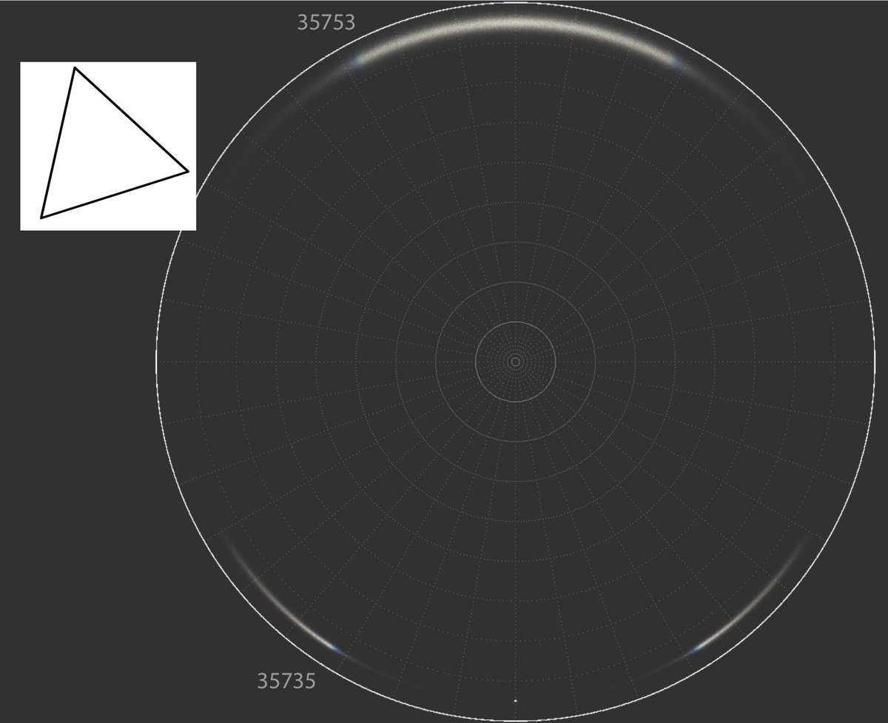

# Thread - 2025-08-19

**Original:** https://x.com/RiikonenMarko/status/1957779454979162423

---

### 1/2 - 2025-08-19 12:19 UTC

3 related parhelic circle blue edges at 120° from each other: 33, 87 and 153°. 35673 is the Liljequist parhelion blue edge, the segment is not concise because of non-regular hexagons. Probably a shorter raypath exists for 3567835. This feature is always masked by other rays.

---

### 2/2 - 2025-08-20 12:45 UTC

Indeed, the 33° blue edge is possible from a shorter raypath in triangles. Another five-hit raypath makes the 153° blue edge. "153° blue edge" is a better name over "Liljequist parhelia blue edge" because it can be seen even when Lilje parhelia can't due to non-regular hexagons.

---

