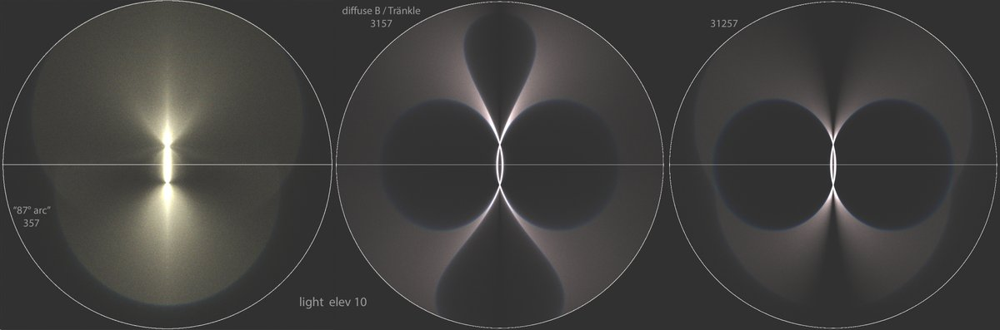
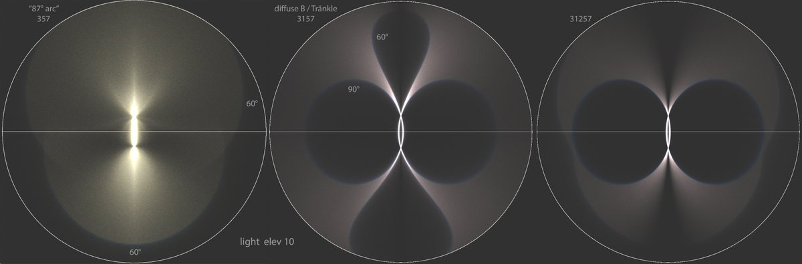
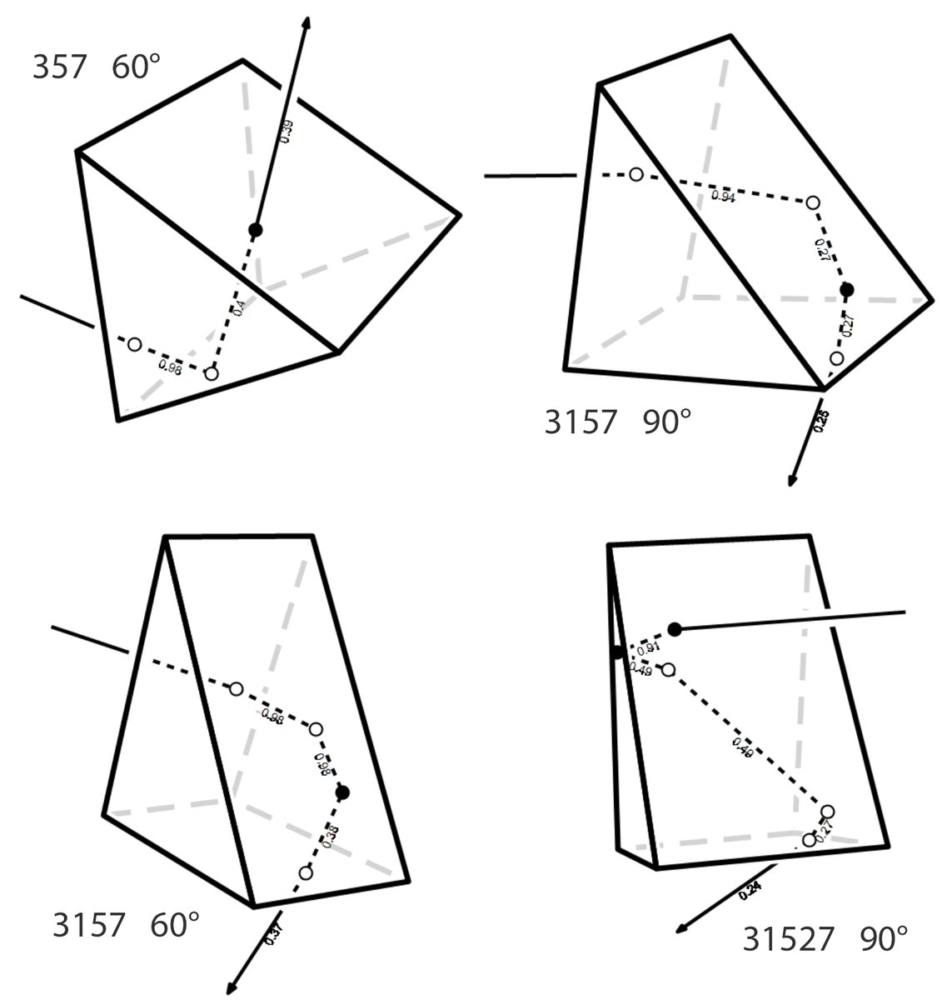
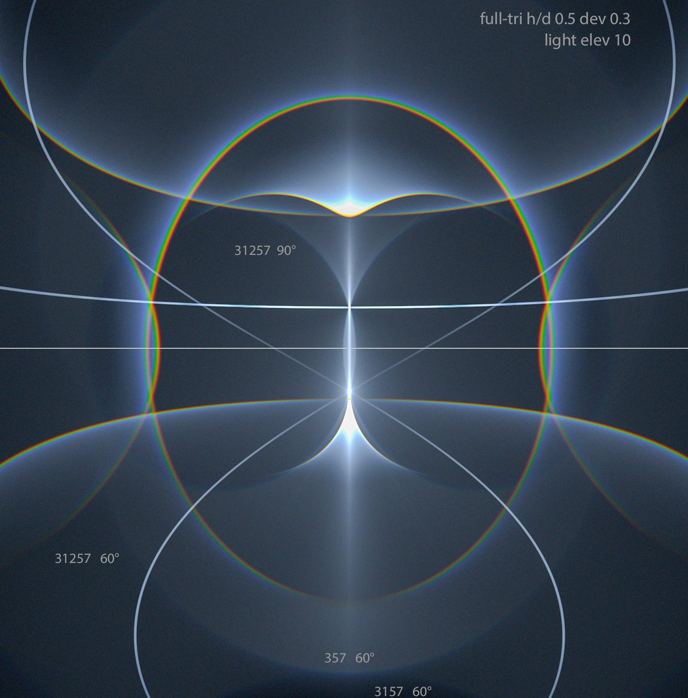

# Thread - 2025-08-21

**Original:** https://x.com/RiikonenMarko/status/1958604851388055560

---

### 1/5 - 2025-08-21 18:59 UTC

The feature known as "87° arc" (357) has the diffuse-B / Tränkle arc (3157) as its vertical reflection. They might as well be cut from different cloth. But if we reflect the diffuse-B vertically back (31257), that's birds of feather already: the basal face ping-pong carves out a

---

### 2/5 - 2025-08-21 18:59 UTC

90° blue edge in the 87° arc, giving rise to the "owl eyes" seen in Tränkle arc. The familiar blue edge of the 87° arc and the vertical loops (rarely observed) of the Tränkle arc are 60° blue edges. 60 and 90° refer to the type of the refraction halo formed by the leaking face.

---

### 3/5 - 2025-08-21 18:59 UTC

For 357, only 60° blue edge is possible: the leaked raypath is 35 and the halo is tanarc. For 3157, the 60° leaked raypath is 315 and the halo is Wegener, the 90° leaked raypath is 31 and the halo is supralateral arc. In the alternative basal reflection position, 3517, the two

---

### 4/5 - 2025-08-21 18:59 UTC

leaked raypaths are 35 and 351 – tanarc and supralatarc extension. For 31257 the list of leak halos is more extensive. In unfiltered simulation the 31257 90° blue edge comes out most distinct between the tanarc and the light, plate-like triangulars being optimal. There is some

---

### 5/5 - 2025-08-21 18:59 UTC

evidence for thin plates in column orientation. Even if that's not really happening, the effect comes up still quite happily with around h/d 1.0 triangular crystals. It's a stretch, but possibly some massive column-orientation-only display could have this feature realized.

---

