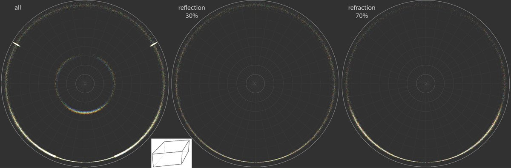
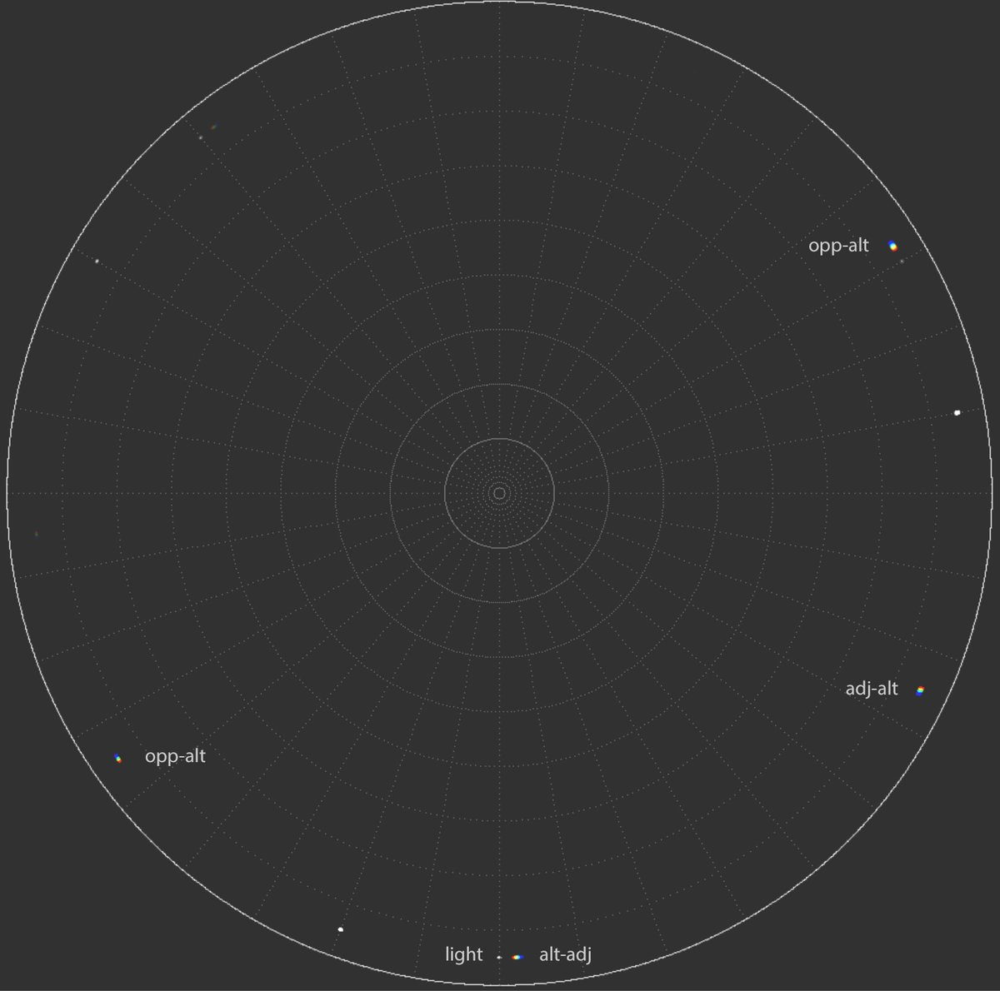
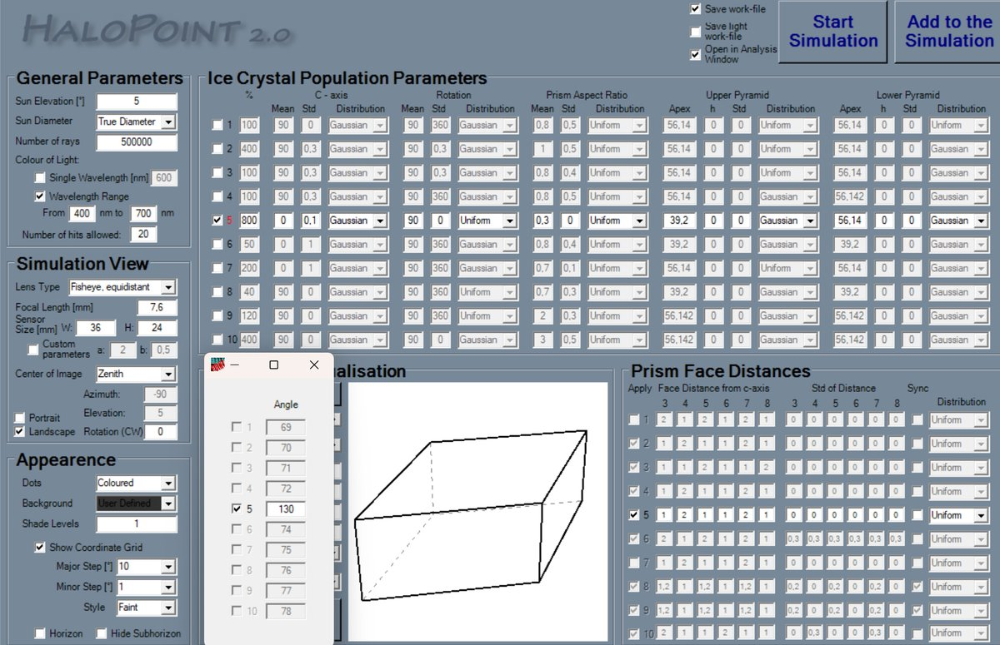

# Thread - 2025-08-23

**Original:** https://x.com/RiikonenMarko/status/1959226712371118440

---

### 1/4 - 2025-08-23 12:10 UTC

Parhelic circle is regarded as a reflection halo. But suppose there was a population of plate oriented diamonds. Then, at very low light elevations, the parhelic circle is dominated by refraction raypaths. These come in 4 variations, 356, 346, 358, 368, and might be coded more

---

### 2/4 - 2025-08-23 12:10 UTC

generally as alt-adj, adj-alt, alt-opp, opp-alt. In rotating crystals, the raypaths make white segment, az-locking transforms them into the colored parhelion spots. The shown HaloPoint simulation with az-lock value 130° turns up three of these triple-hit spot types. The other

---

### 3/4 - 2025-08-23 12:10 UTC

spots are those of reflection parhelic circle (contributed, in the order of dominance, by raypaths 3, 132 and 363), 120° parhelia and 120° rotated parhelia (weakly at 142° azimuth on the left). At the simulation's light elevation of 5 degrees the refraction parhelic circle

---

### 4/4 - 2025-08-23 12:10 UTC

raypaths dominate at h/d &gt; 0.09. At higher light, reflection raypaths gain upper hand. Maybe we should recognize the triple-hit type as e.g. "free rotated (refraction) parhelia", as opposed to the "120° rotated parhelia". In Herincs displays we seem to have both types observed.

---

