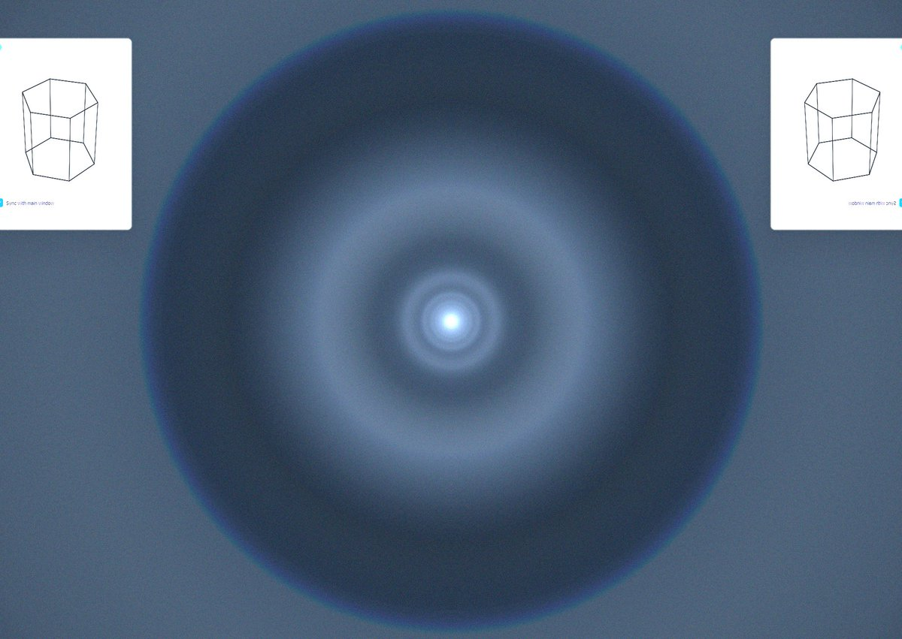
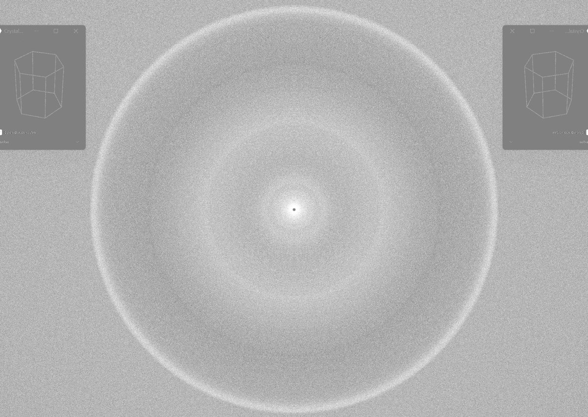

# Thread - 2025-08-28

**Original:** https://x.com/RiikonenMarko/status/1961028313381556242

---

### 1/1 - 2025-08-28 11:29 UTC

The diffuse counteranthelic halo expectedly has a weak blue edge at 153°, or at 27° as seen from the counteranthelic point. This is equivalent to the Lilje blue edge. Further out from the c-anthelic point is c-anthelic 46° halo, then 116° blue circle. Haloray simulation.

---

