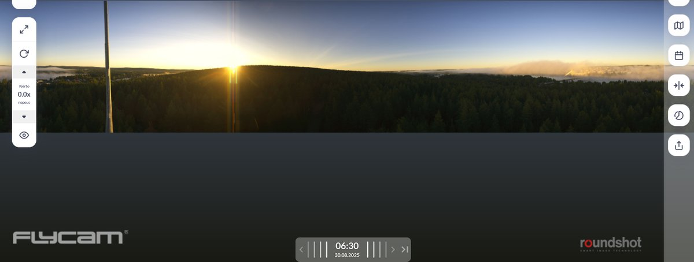
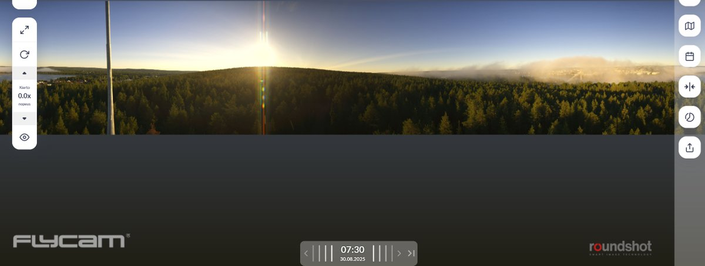
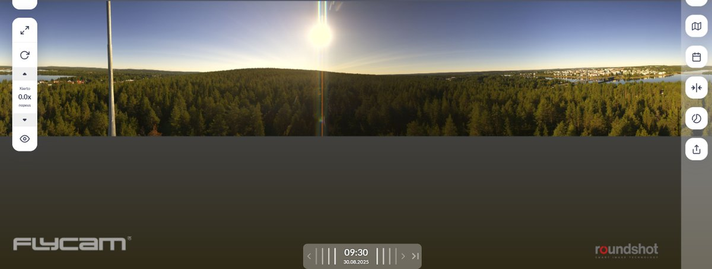
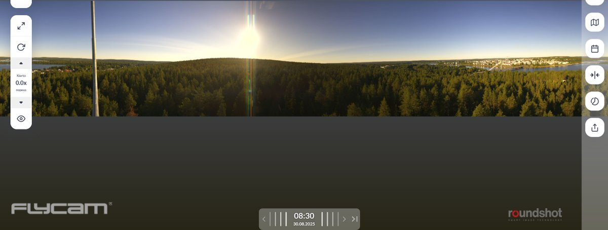

# Thread - 2025-08-31

**Original:** https://x.com/RiikonenMarko/status/1962107616546464082

---

### 1/2 - 2025-08-31 10:58 UTC

A really stationary cloud in the Rovaniemi skies caught my eye yesterday on 30 Aug 2025. Ounasvaara 360 camera was helpful for a better look. Cumulus rises at midday, but the stuff is still there, speeding up and clearing away after 19. I have regarded such more or less

[🎬 1962107616546464082-JVKGo8rfpuuw88A0.mp4](media/1962107616546464082-JVKGo8rfpuuw88A0.mp4)

---

### 2/2 - 2025-08-31 10:58 UTC

slow-movement "high cloud" that shows up only on the sun side as haze. Actually, I think high clouds are never this stationary. Must be the most steady haze I have encountered. Wonder what is was made of and at what elevation it was.

---

