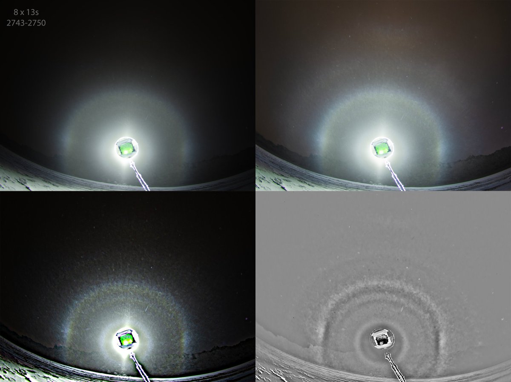
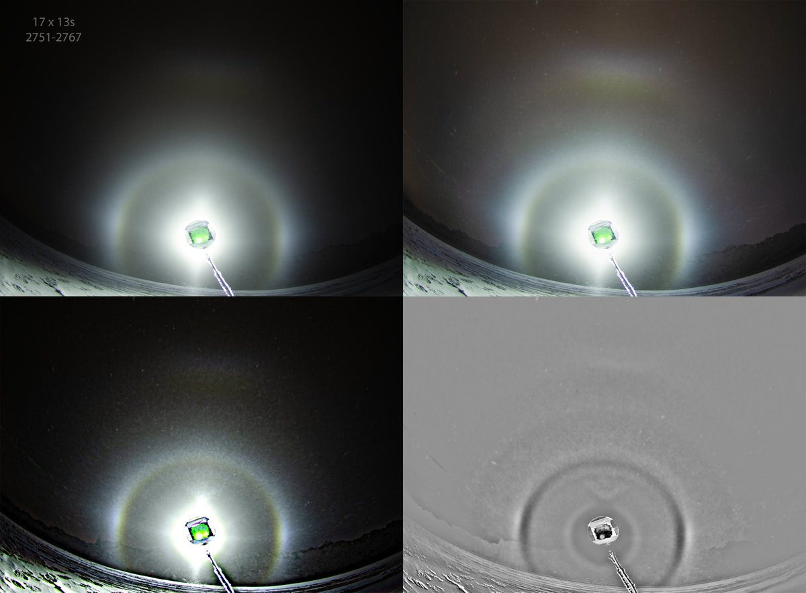
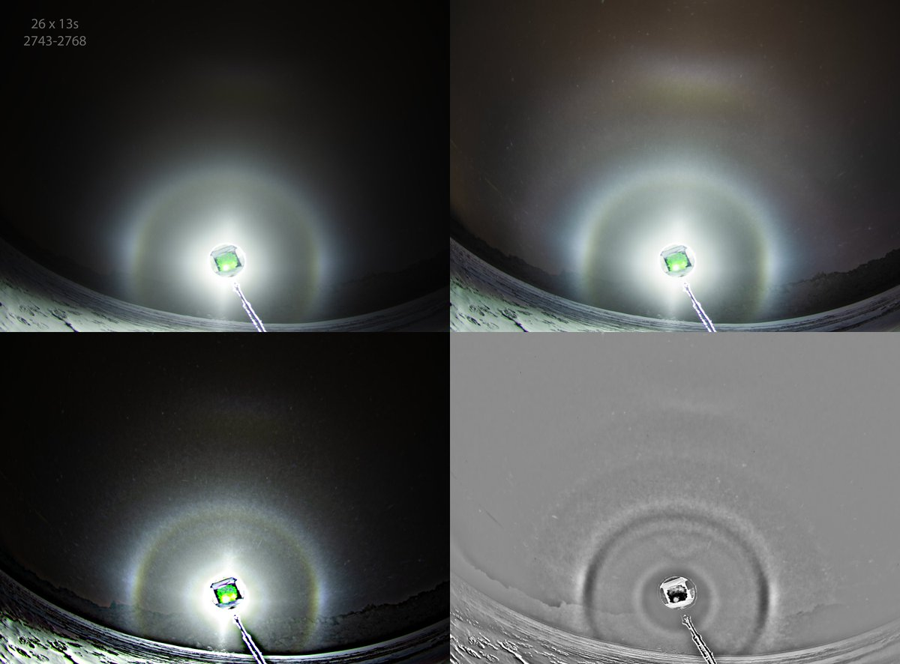
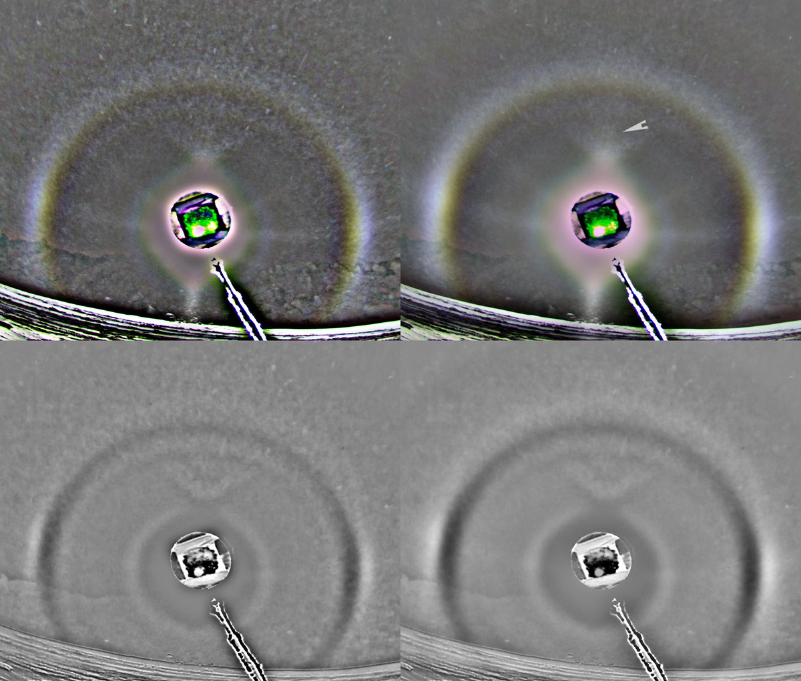
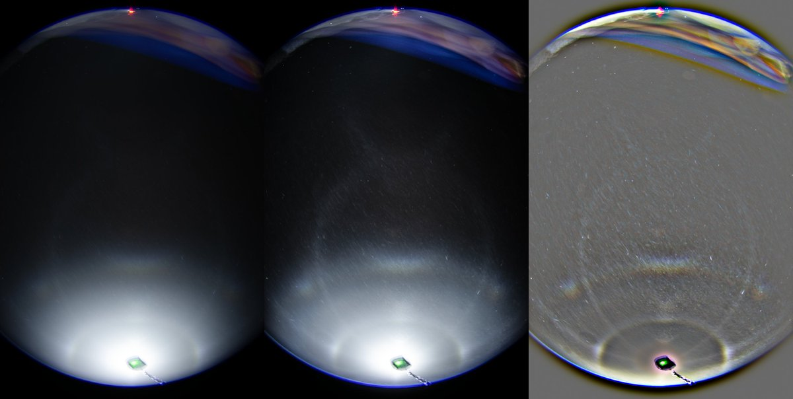

# Thread - 2025-09-28

**Original:** https://x.com/RiikonenMarko/status/1972272591835459972

---

### 1/5 - 2025-09-28 12:10 UTC

17/18 March 2025, Rovaniemi. The season will be starting in a month, and while it was not the plan, it is not out of question that I will be chasing some. So time to clear the last of last winter's backlog.

In this and next two posts are three stacks from the situation here https://t.co/ccKwGvDH6n but photographed with Nikon D7000. The display was lively, every frame different from the next, but broadly there were two phases when viewing the originals: with odd radii (this post) and without (next post). In the stacks the 'without' phase also gained distinct odd radii. The stack of the third post has both stages lumped together. I wonder if there is a suggestion of "alternate Moilanen" above the "common" Moilanen.

---

### 2/5 - 2025-09-28 12:10 UTC

17/18 March 2025, Rovaniemi.

---

### 3/5 - 2025-09-28 12:10 UTC

17/18 March 2025, Rovaniemi.

---

### 4/5 - 2025-09-28 15:23 UTC

17/18 March 2025, Rovaniemi. Made different versions to focus on the possible alt-Moila. Maybe there is something to it, that smudge does not look like lens flare. Another thing I am wondering about is whether that's 18 or 20° halo there. It is top-weighted, which in poorly plate oriented pyramids would be 20°, but in poorly column oriented pyramids possibly 18°. I have not made simulations, but here an earlier simulated case which was inconclusive: https://t.co/YLPD7qZeA9

---

### 5/5 - 2025-09-28 16:50 UTC

17/18 March 2025, Rovaniemi. A short duration (3 X 13s) of Parry orientation halos. Would have been longer if had been ready. This, and the other images above, were taken right next to the snow-guns at the Ylikylä snow-dump.

---

