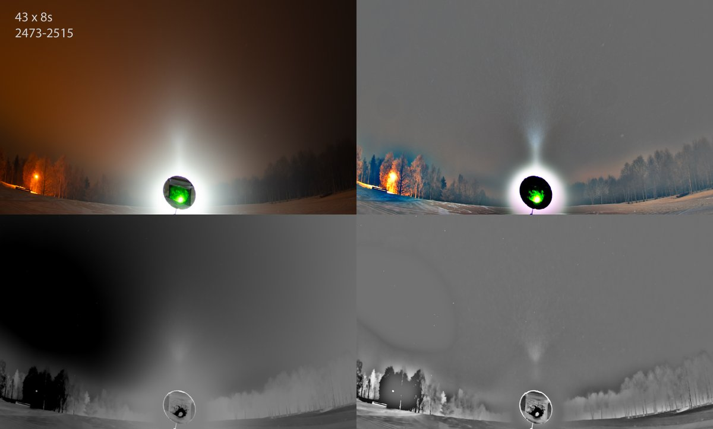
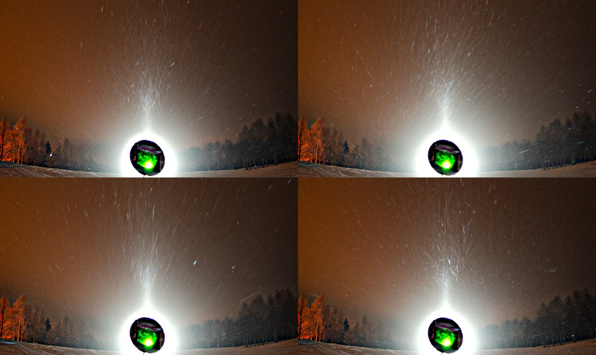

# Thread - 2025-10-03

**Original:** https://x.com/RiikonenMarko/status/1974122037837787511

---

### 1/3 - 2025-10-03 14:39 UTC

13-14 March 2025, Ylikylä swimming site, Rovaniemi. Solitary Moilanen arc (pillar does not count) was visible for quite long time in this location, here is a stack of the first set, 43 frames. I actually was trying a crystal sample here, but don't remember what went wrong. Something to try to set right coming winter, but then these kind of displays are not common in my experience.

---

### 2/3 - 2025-10-03 14:39 UTC

13-14 March 2025, Rovaniemi. Animation of the 43 frames in b-r. The swarm originated from Ylikylä snow-dump where Juujärvi Racing company was making deposit snow.

[🎬 1974122045442322667-G2V5WSWXAAA9KEC.mp4](media/1974122045442322667-G2V5WSWXAAA9KEC.mp4)

---

### 3/3 - 2025-10-03 14:39 UTC

13-14 March 2025, Rovaniemi. Four single frames, lightly usmed, from the 43 set. I will try to look at the rest of the photos in the coming days.

---

