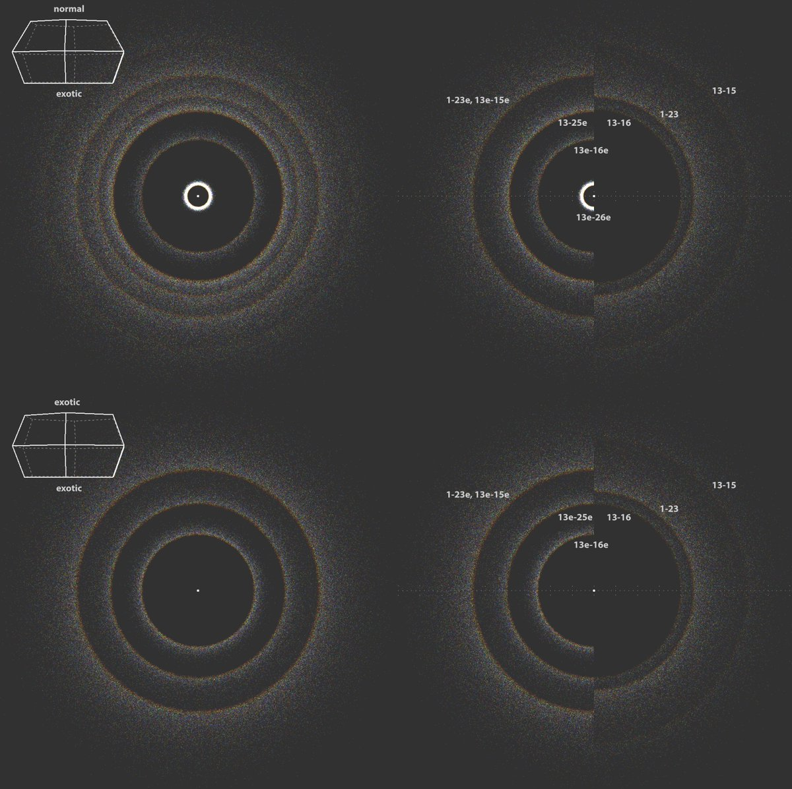
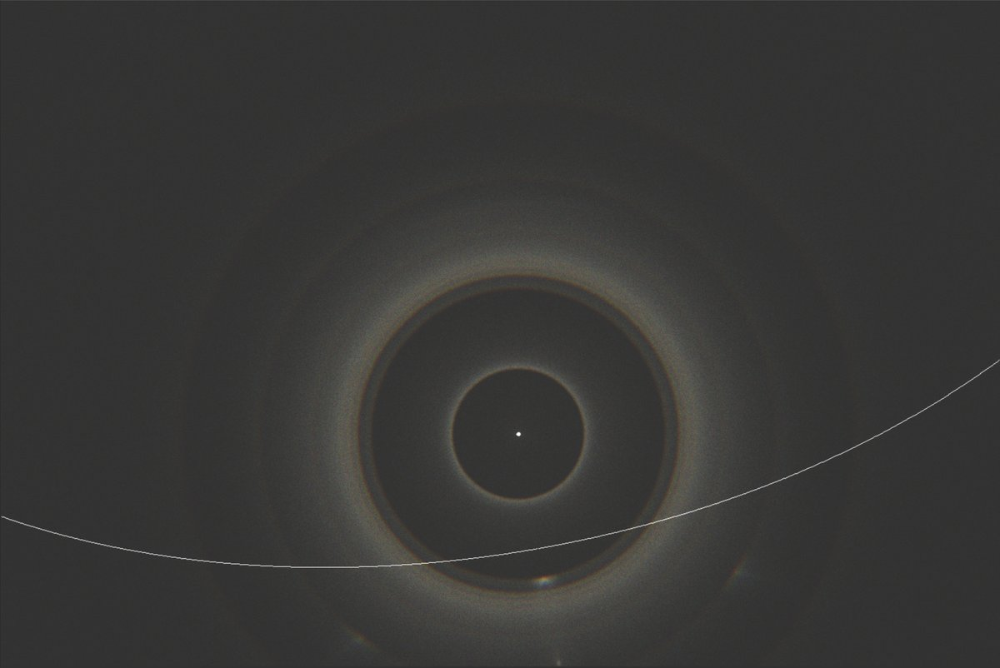

# Thread - 2025-10-23

**Original:** https://x.com/RiikonenMarko/status/1981320349594595645

---

### 1/2 - 2025-10-23 11:22 UTC

Made these simulations yesterday to check on some things concerning Martikainen's yet-to-be-published observation earlier this month.

On the upper left is a simulation with a "mixed" crystal having tiers of normal pyramid faces (56.1° apex angle) and exotic pyramid faces (39.2 apex angle, after the Lefaudeux's theory of Lascar display). Filtered from this simulation, in the adjacent split-simulation are the halos in which formation the exotic faces are involved (left), and the classic odd radius halos solely from normal pyramid faces (right).

On the bottom left is a simulation with a crystal that have both tiers exotic faces. In the adjacent split-simulation this is compared with the normal pyramid halos. This type of crystal produces one halo that is not made by the mixed crystal of the upper row: 13e-25e, which is of the same radius as the usual 20° halo, 13-16. Supposing both types of crystals were present, then at around 20 degrees it becomes quite congested as there is also the slightly smaller radius exotic halo 13-25e merging with these two. Lefaudeux in his paper gives the radius for these three halos as 20.0, 20.0 and 19.6 degs.

The regular hexagons used in the simulations here result in quite remarkable intensity of the exotic halo at 3 degrees (13e-26e). If this halo – or its spot from plate oriented crystals – indeed exits (which I doubt), it may be missed in a solar display, but would be less likely to pass notice in a lunar display.

I used here different raypath notation to Lefaudeux's, sticking with the traditional 1X and 2X pyramid face notation and denoting the exotic faces with 'e'.

Involving normal prism in between the pyramid tiers of these crystals would result in more halos.

---

### 2/2 - 2025-11-01 08:36 UTC

Martikainen's observation is online: https://t.co/P5UCYZWIPO

The impetus for making the simulations above was to look at the feature that is seen between 28° and 35° halos. The Lascar theory makes no halos in this area, but 23° plate arc fits right in, as shown by the rough simulation here for sun 16°. There is a little shape disagreement, the thing looks rather like a segment of circular halo in Martikainen's stack. But we are dealing here with a really weak feature which can make it look a bit different from what actually it is.

---

