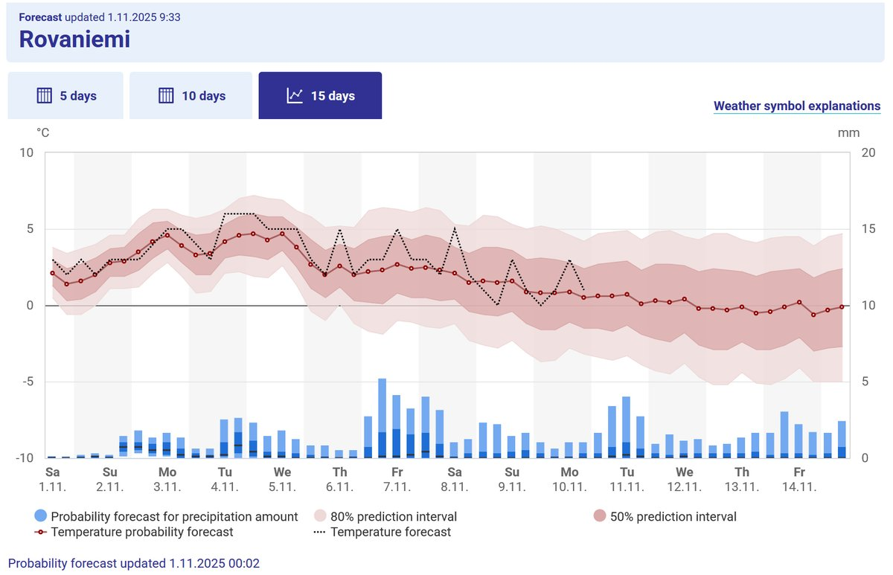

# Thread - 2025-11-01

**Original:** https://x.com/RiikonenMarko/status/1984536662848778425

---

### 1/1 - 2025-11-01 08:23 UTC

The season's start in Rovaniemi is normally around the turn of Oct-Nov. Looks like this year a considerable delay is on the cards – balancing the early mid-October start of 2023. If the delay gets severe, they may need to gun more at high temps, which is good as that's where the big displays are born.

---

