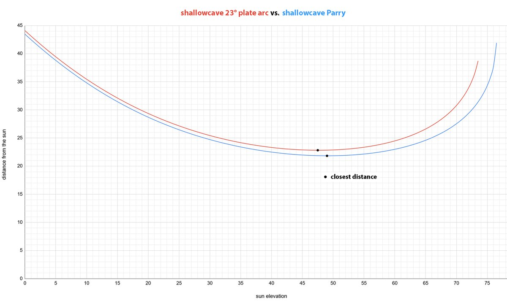
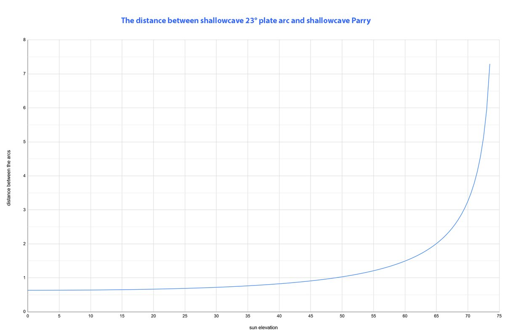
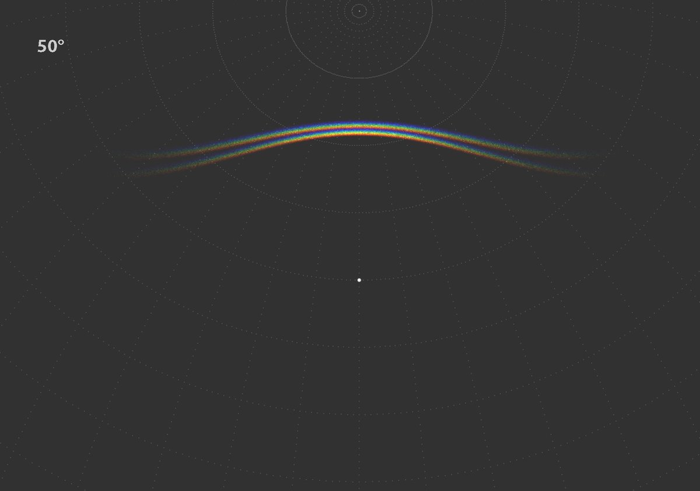
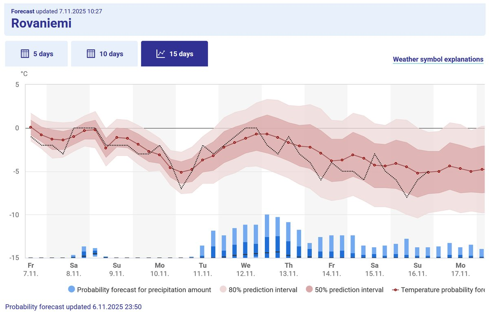
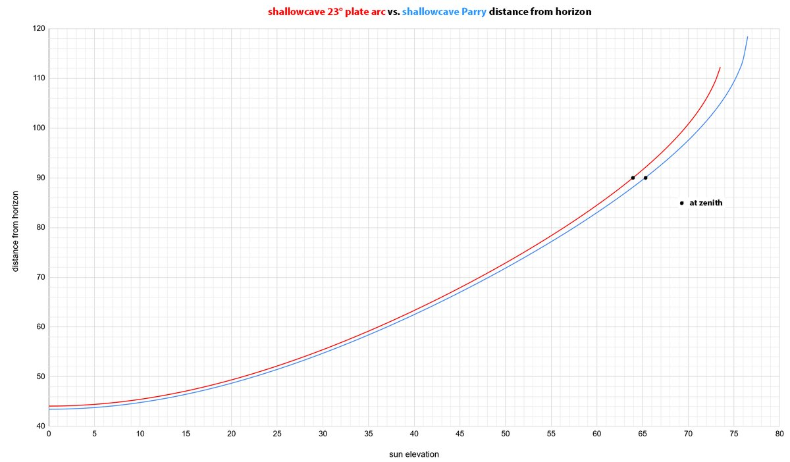
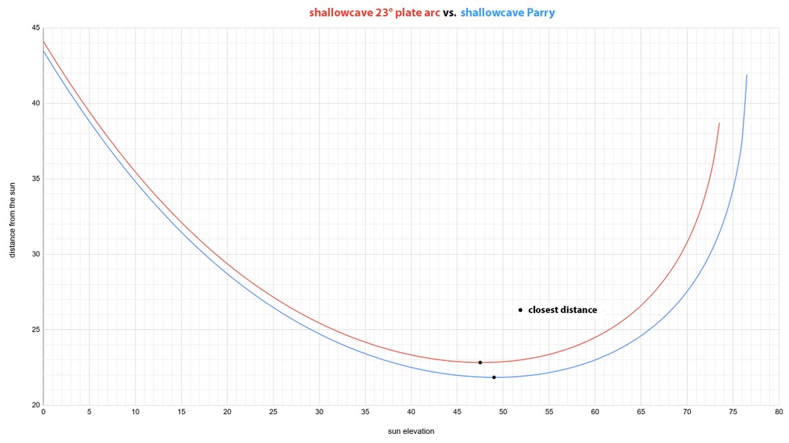

# Thread - 2025-11-07

**Original:** https://x.com/RiikonenMarko/status/1986719380995031048

---

### 1/2 - 2025-11-07 08:56 UTC

Two graphs on the distances of shallowcave 23° plate and shallowcave Parry. Any compelling photos of co-occurrence is still missing. The graphs don't tell the complete picture as the calculations are for solar vertical – the gap between arcs increases away from solar vertical. In case you are wondering about the names, well, that's how I see it just has to be... I think I am soon getting the nomenclature paper ready, there will be much more on Parry naming and else. But of course the closing ice fog season may put everything to halt. Looks like Mon-Tue night could see the first glitter in Rovaniemi. Elsewhere the action has started already some while ago, I got news from my Chinese colleagues of ice fog pillars in Inner Mongolia on 21 October.

---

### 2/2 - 2025-11-08 12:23 UTC

For the completeness, here are also the horizon-distances. And I amended the other graph by removing the slack.

The horizon distances get in the graph values higher than 90° after the arc passes the zenith. So it is a measurement along the celestial sphere from one point in the horizon.

---

