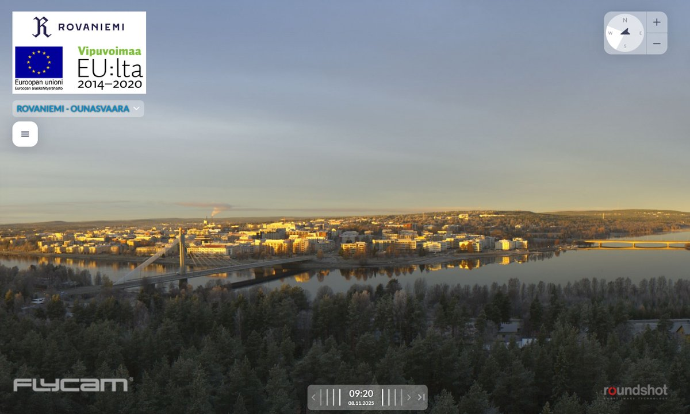

# Thread - 2025-11-08

**Original:** https://x.com/RiikonenMarko/status/1987079124288962921

---

### 1/1 - 2025-11-08 08:45 UTC

Last night was clear and in the daybreak Apukka station stood at -6 C, railway station one degree warmer. Ounasvaara 360 webcam shows fogs here and there, I also saw some in the distance from my window. But no snowguns running. Today it's gonna warm to 0° C, tomorrow back in the blue, but at first too windy. Looking forward to the Mon-Tue night, its promise still holds in the forecast.

---

