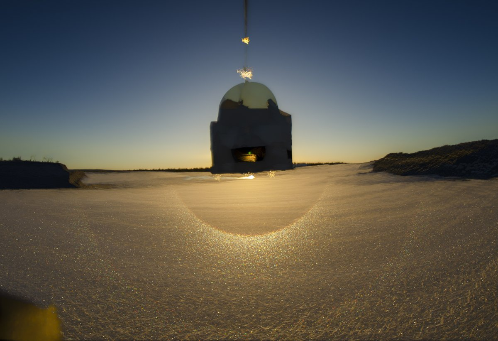
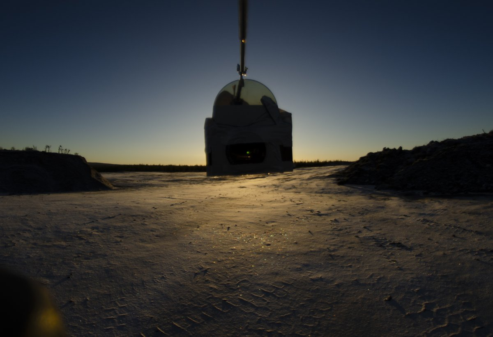
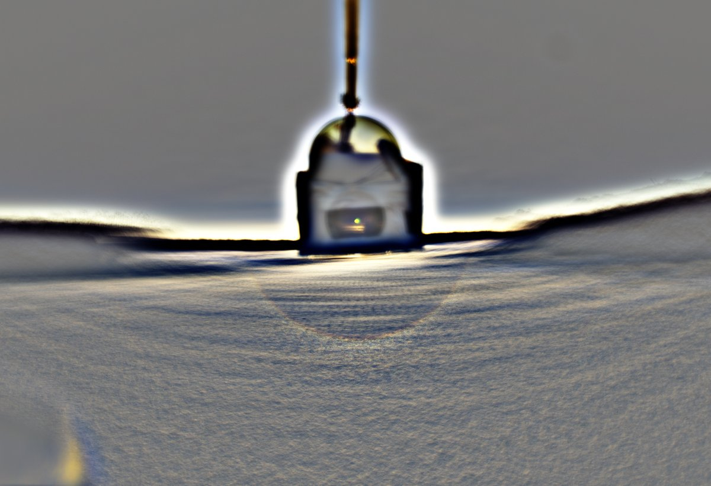
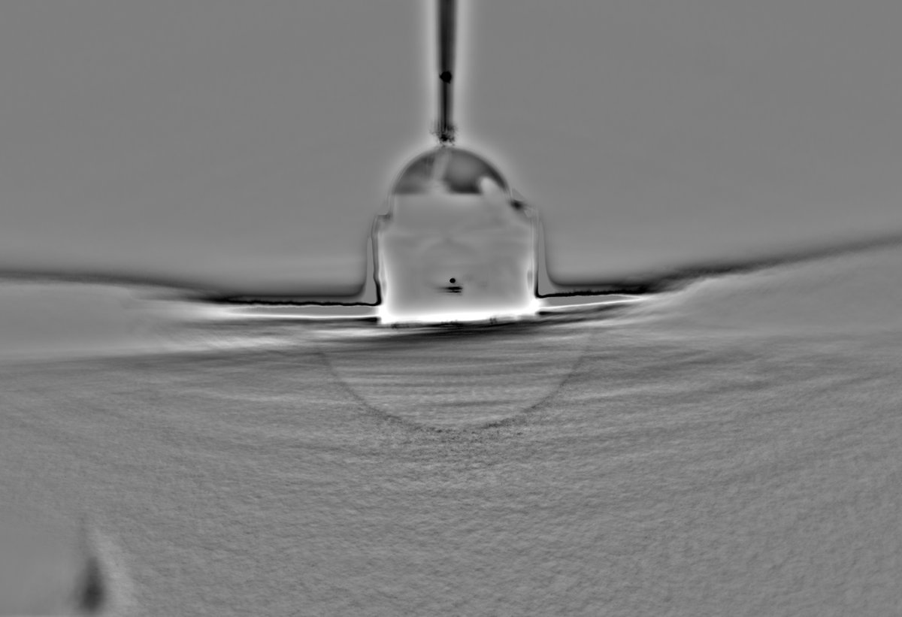

# Thread - 2025-11-09

**Original:** https://x.com/RiikonenMarko/status/1987579241844613186

---

### 1/1 - 2025-11-09 17:53 UTC

9 Nov 2025, Rovaniemi. As sun came up, a nice 22° halo was visible on the parking lot and a short segment was visible also on the roof of the opposite building. A thin layer of snow had deposited during the night. There was not enough space at the parking lot, so around 1 pm I drove to Anttilanvaara where on the earth moving lot I took a quick stack of 70 frames.

The 22° halo had most glints at the bottom, meaning poorly column oriented crystals. It looked quite good visually. In my experience, bottom weighted surface 22° halos don't occur that often.  

The night was cloudy and temperature was some decimals above freezing both in Apukka and railway station, going below zero at around 6 am. During photography it was around -3° C.

---

