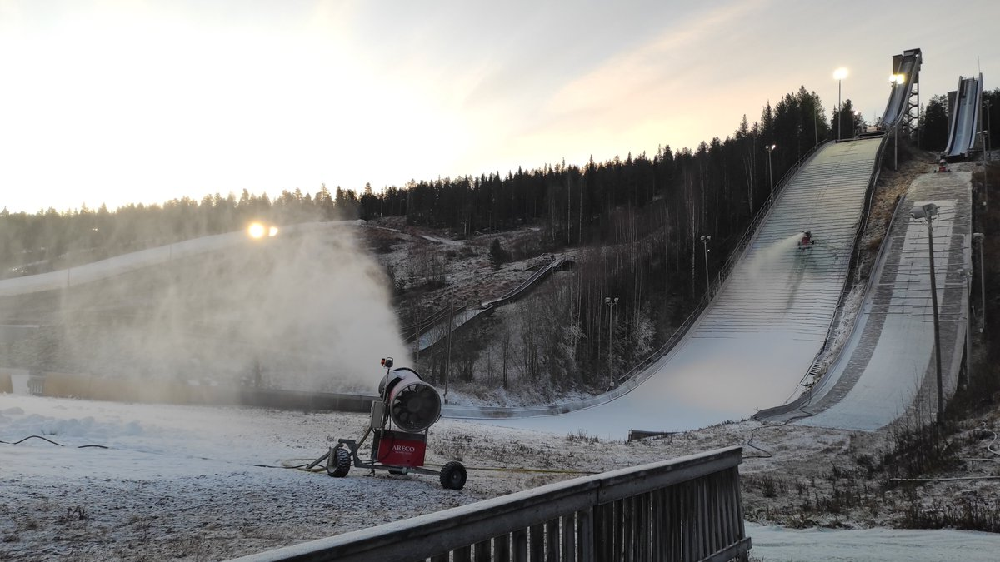
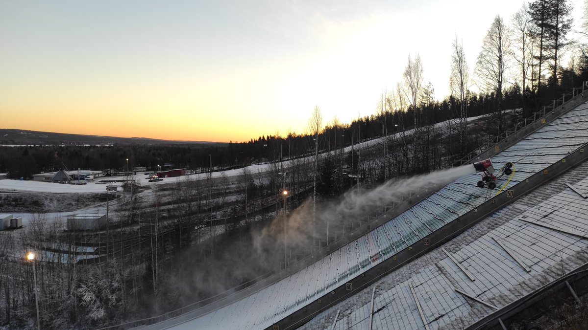

# Thread - 2025-11-10

**Original:** https://x.com/RiikonenMarko/status/1987874087029329921

---

### 1/1 - 2025-11-10 13:24 UTC

Superdry. Drove to slopes at the sunrise. Didn't expect much because of the threadbare Suosila power plant plume that is visible from my window. But I still expected to see at least small local cloud at the ski center, and when I drove closer and saw nothing, I started to wonder if they had turned the guns off. They were on all right, but the air so dry that there was zippo crystal growth. It is quite rare to see this dry conditions. Usually at least a little crystal growth cloud is seen rising up from the guns, visible from the distance, even if it does not grow into actual ice fog.

Apukka and railway station and airport all at -6 C around the time of my visit. It was windy. 

Heard from the guy supervising the guns that the ski center crew was also were supposed to start last night, but that didn't pan out for reason or another. Maybe tonight. Anyway, it don't matter, two guns is ample enough.

---

