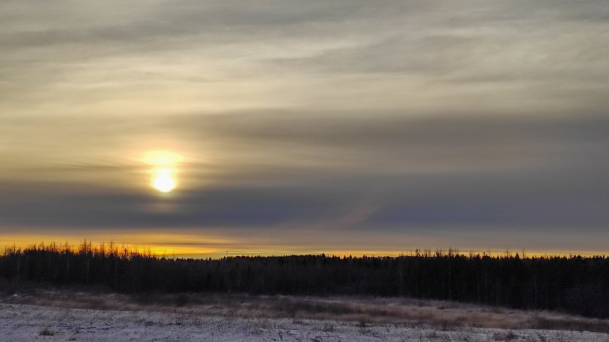
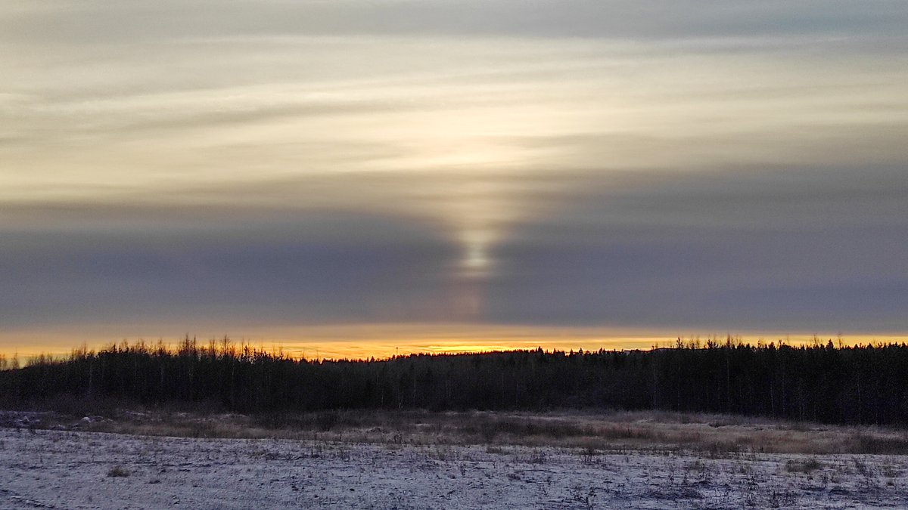
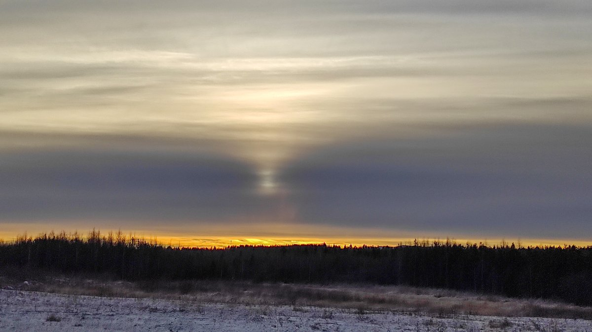
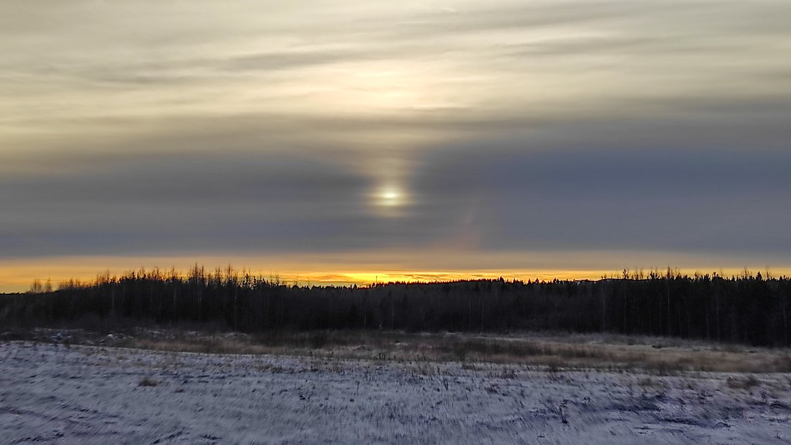
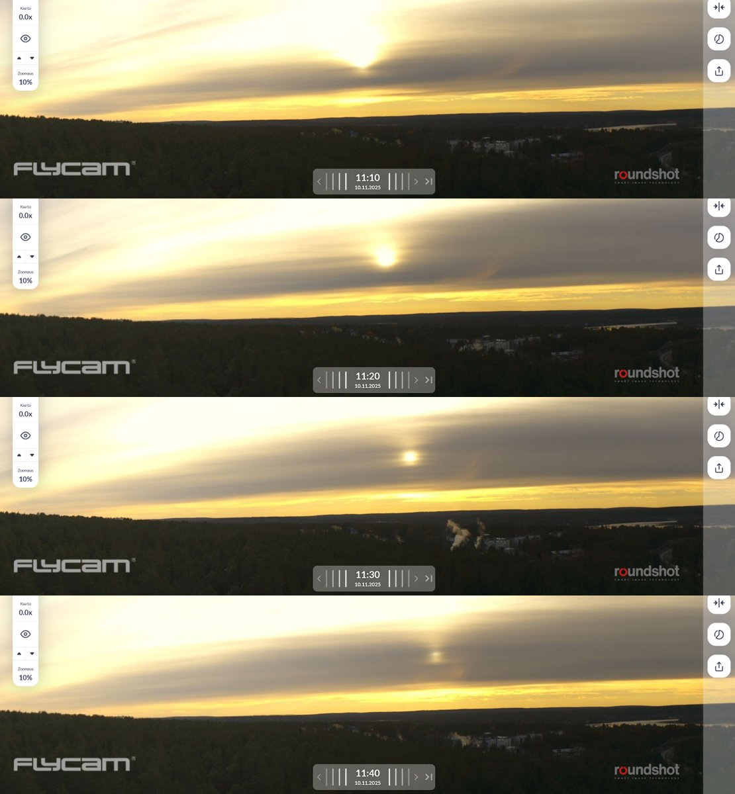
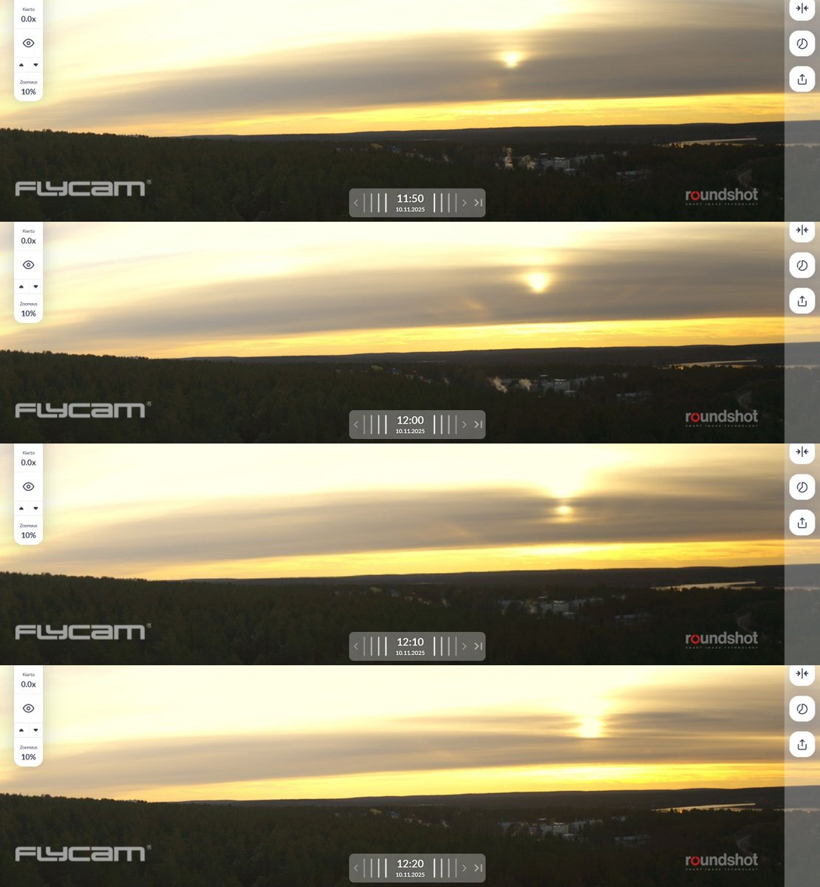

# Thread - 2025-11-10

**Original:** https://x.com/RiikonenMarko/status/1987881351438094500

---

### 1/2 - 2025-11-10 13:53 UTC

10 November 2025 Rovaniemi. It is rare to see sun at the same time with reflected cloud rays. This is what happened today – the cloud type, altostratus, allowed sun to shine some through. Regarding formation, both open and frozen up water bodies are an option, the latter is not yet covered by snow.

---

### 2/2 - 2025-11-10 14:38 UTC

Forgot completely that of course the Ounasvaara 360 camera was taking care of this. Would not have bothered with my poor phone camera photos.

---

