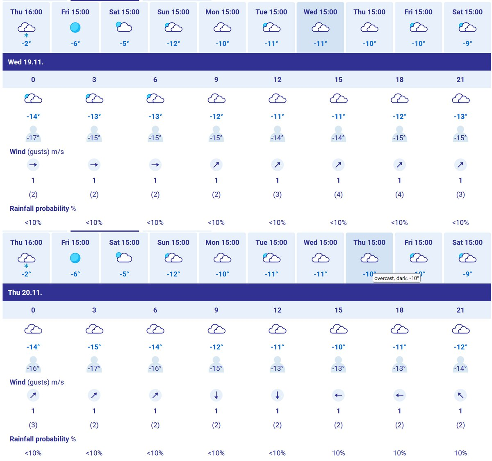
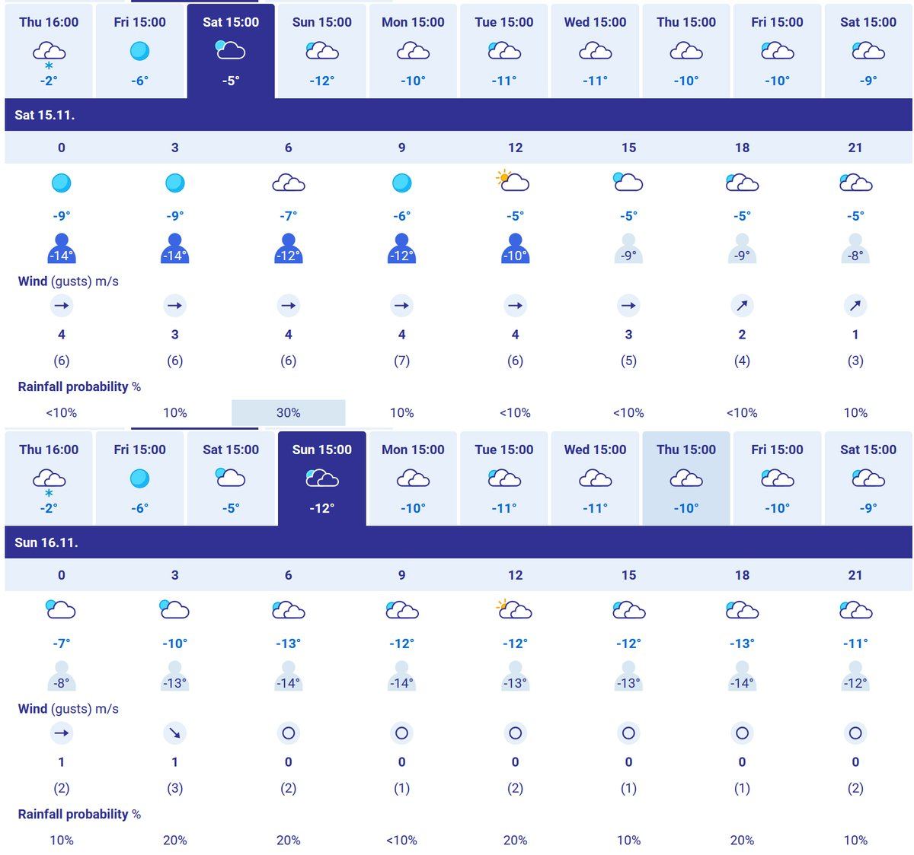
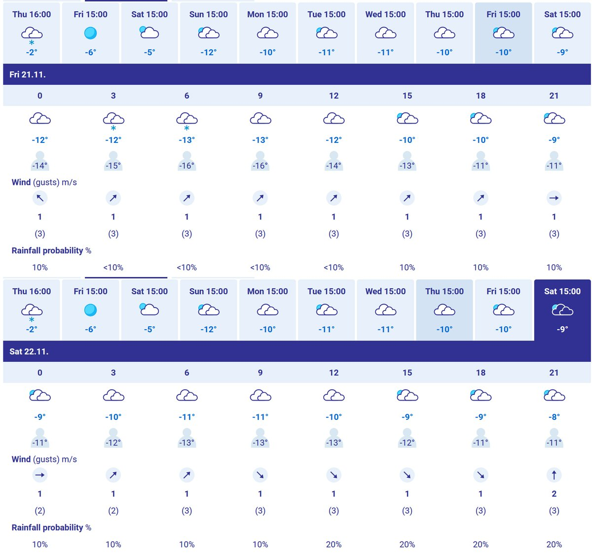
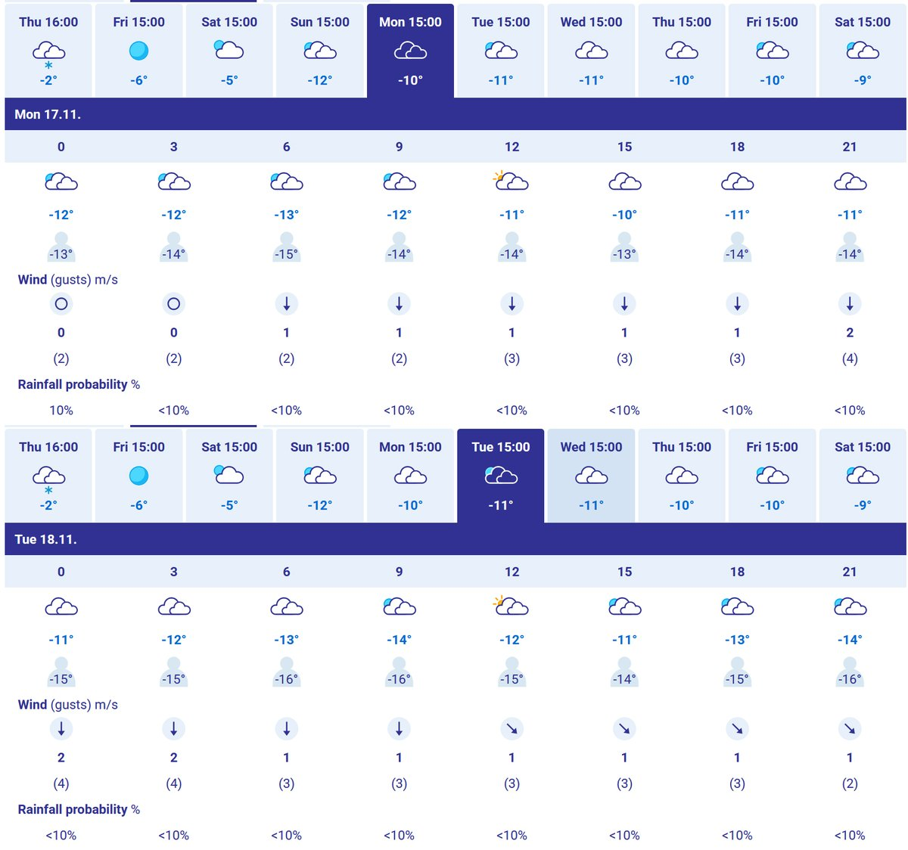

# Thread - 2025-11-13

**Original:** https://x.com/RiikonenMarko/status/1988969600420139127

---

### 1/1 - 2025-11-13 13:58 UTC

The FMI forecast looks a haloman wrecker. From Saturday evening to next Saturday 0 to 1 m/s winds, rainfall probability mostly <10%. This as a rule means fogs and low hanging stratus and indeed, Meteoblue meteogram concurs, the fog entering scene Sat-Sun night.

And those temps, they tell we are in the massive displays' range, the crapping happening when it gets colder than -13 C. More specifically, that's massive plate range.

If this pans out and I could pull it off, I could retire from chasing.

---

