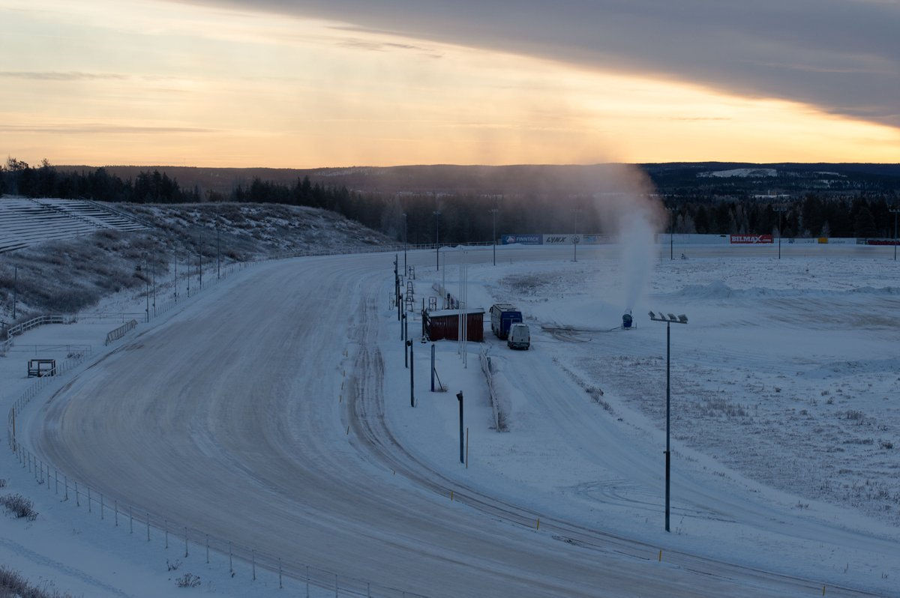

# Thread - 2025-11-15

**Original:** https://x.com/RiikonenMarko/status/1989681184180142338

---

### 1/1 - 2025-11-15 13:05 UTC

Last night was clear, below -10 C and guns were on. But too windy for ice fog. Visited the slopes around 9 in the evening, but came back because the forecast was not for the winds calming down.

In the morning I went for a drive to check the situation and it was as dry as in the evening. I ended up to Anttilanvaara, where some sound in the air nagged the low priority processes of my mind. When I spotted in the distance a smoke plume in a location where my memory said there should be nothing there, slowly the cogs started processing the ramifications of both this sight and the sound in the air: it is a snow gun running there, at the racetrack, 2.5 km away.

I hopped into car and headed to inspect. It was the same Juujärvi racing company that in March made snow at the Ylikylä snow dump. I went to talk to the guy. He said they will be making snow for many days to come for a coming up snow mobile race and also for the practice track.

So this is a good thing. Having gunning going on simultaneously in a different location to the ski center (which is 8 km to the east) diversifies options for chase locations. This diversification will get a different turn in January when the company will start making snow near Jääskönlampi, 5 km east from the ski-center. This means that it is earlier to have ice fog further east at the Jokkavaara gravel pits, which is one of the better places – I have photographed some nice odd radius displays there.

---

