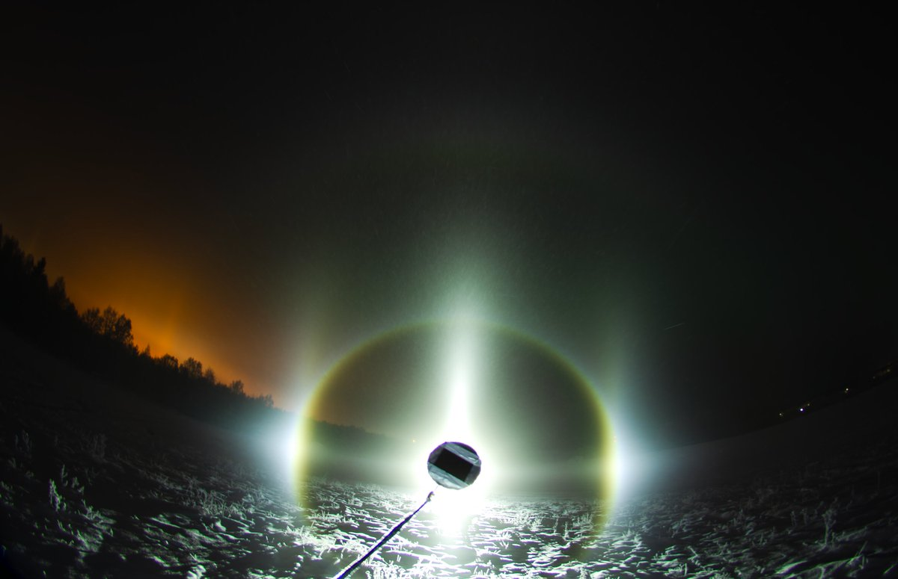
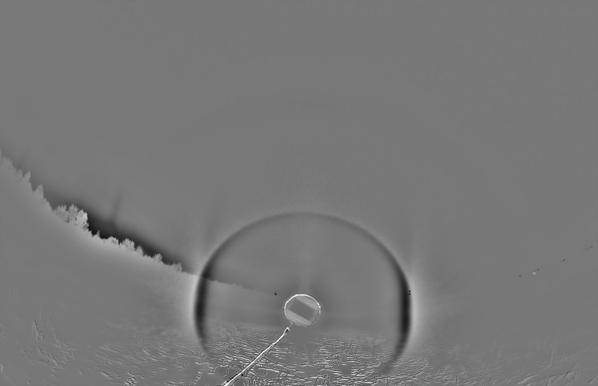
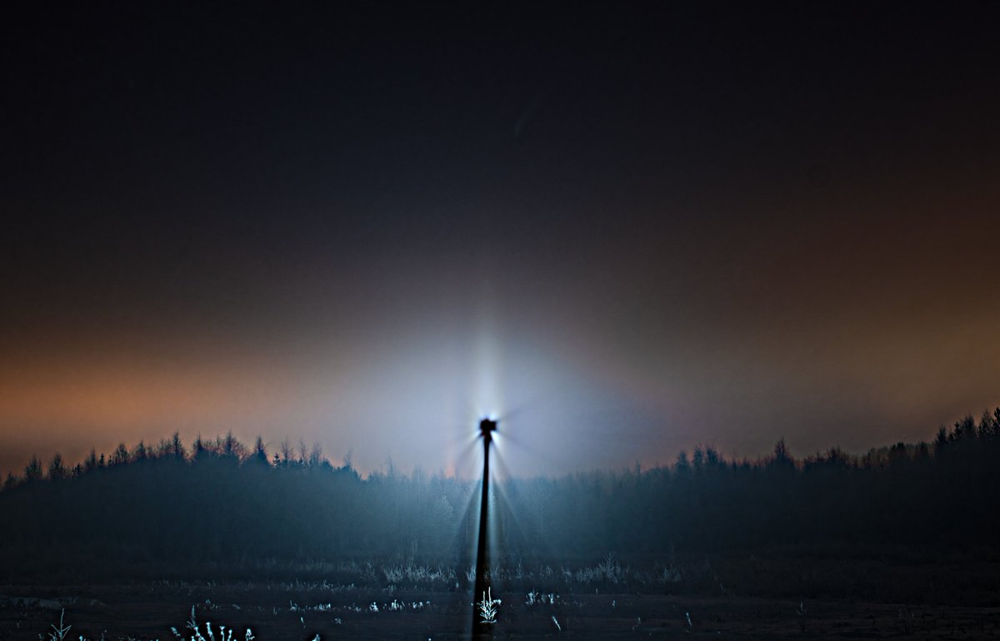
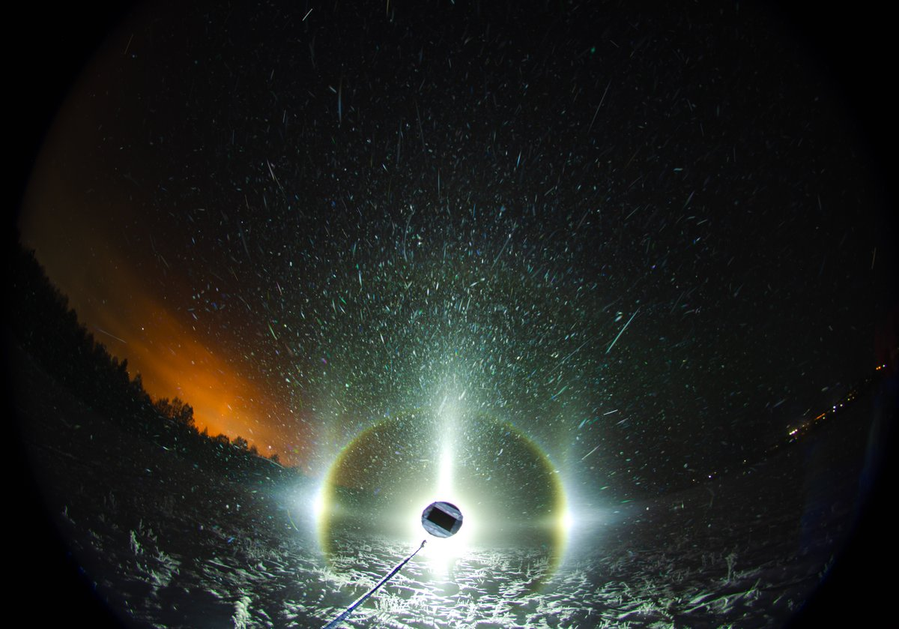

# Thread - 2025-11-16

**Original:** https://x.com/RiikonenMarko/status/1990014205802524982

---

### 1/3 - 2025-11-16 11:08 UTC

15/16 Nov 2025 Rovaniemi. Last night ice fog was present unusually in windy conditions. And the railway station was warmer than airport (about 1.5C), which normally means no conditions. Typical to windy conditions, the display was not much to go by, nothing in the back-hemisphere, no Lilje. This only stack I took (77 x 10s) was around 4 am at the Ylikylä snowdump. Ice fog continued, but was moving around. I decided best to get back to apartment to get some sleep.

The swarm was from the racetrack snow gun. At this point, ski center guns did not make any ice fog. Temp at railway station -9...-10C, Apukka -14C. Ylikylä snow dump temps are usually closer to Apukka.

---

### 2/3 - 2025-11-16 11:08 UTC

15/16 Nov 2025 Rovaniemi. The night's main feature was Mikkilä's Soul aka diffraction pillar (I like also "pillar glory"). It was not the best I have seen, but was special in that it was visible constantly. Although the phenomenon is not rare as such, I have only ever seen it making short visits – typically so short that if you want a photo, you need to be prepared.

---

### 3/3 - 2025-11-24 18:20 UTC

15/16 Nov 2025 Rovaniemi. Max stack of about 70 frames of the above display.

---

