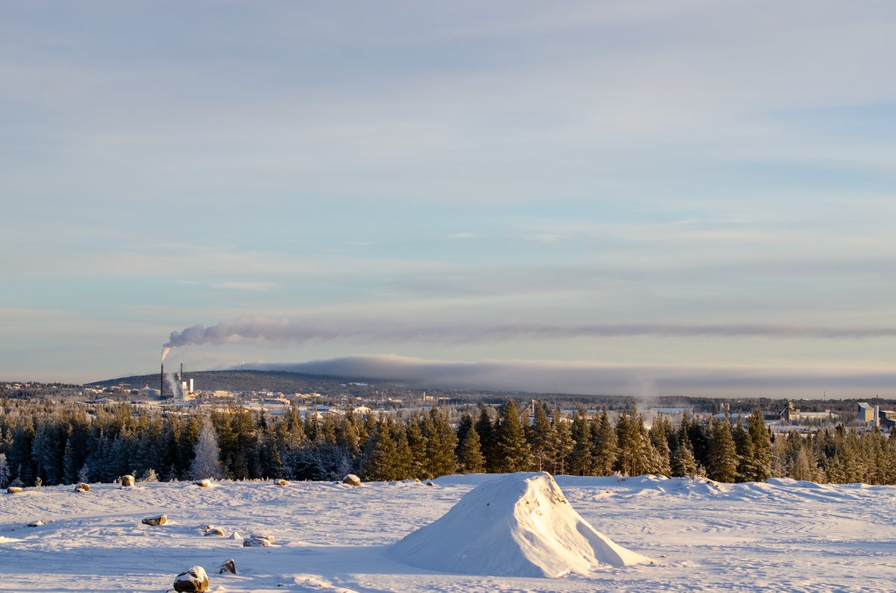
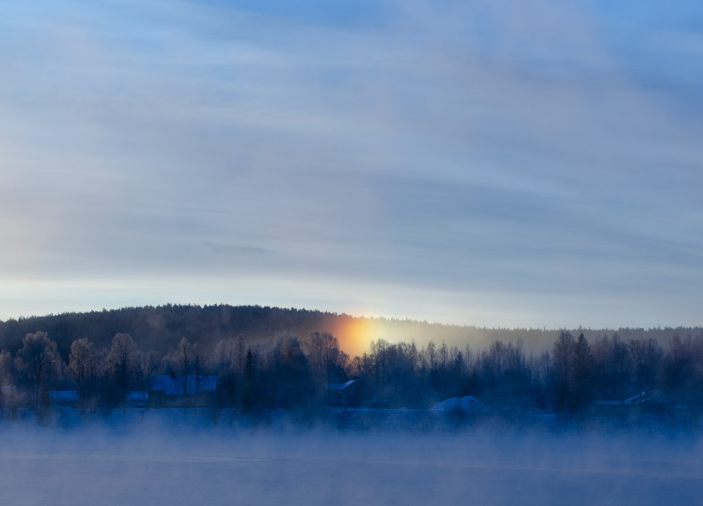
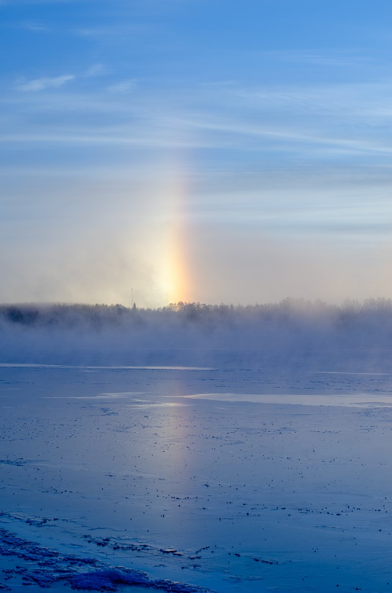

# Thread - 2025-11-16

**Original:** https://x.com/RiikonenMarko/status/1990019828984209527

---

### 1/1 - 2025-11-16 11:31 UTC

16 Nov 2025 Rovaniemi. Daytime halos continued on a similar track as the night halos – plate and maybe I saw also Moilanen arc at some point. I drove around some, but it was not much to photograph The third photo is from Anttilanvaara, the huge ice fog cloud from the slopes visible in the distance behind the Suosiola power plant plume. No cloud was coming from the racetrack, there was no gun running, wonder what's going on. Anyway, last night I realized that there is also snow making going on at the Santa Claus Village. This display was made by both the ski center and SCV swarms that collided around this area.

---

