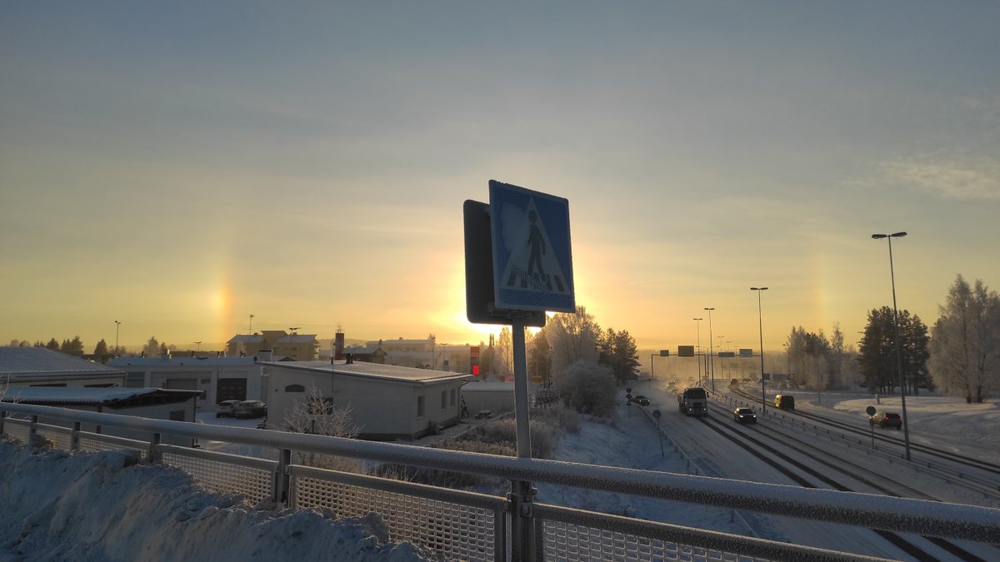

# Thread - 2025-11-17

**Original:** https://x.com/RiikonenMarko/status/1990397615276535894

---

### 1/1 - 2025-11-17 12:32 UTC

17 Nov 2025 Rovaniemi. I didn't expect much from today's halos given the last night's restrained action. Drove around some and it did not get any better than this. So it was pretty much the same as last night.

But the temp is now forecasted to rise quite a bit, to big display numbers, so coming night will be interesting. There is high probability in FMI forecast for snowing until 9pm, then <10% and low winds. That's the window for action until 4 am, when it may snow again. The lights  on the ski center bridge and around in the cross-country ski track will go off at 10 pm. There is certainly more to do from that bridge, but I might choose another nearby bridge where the slope lights (that are on all night) disturb less. It is a lower bridge, but I think the darker setting more than offsets the smaller distance.

---

