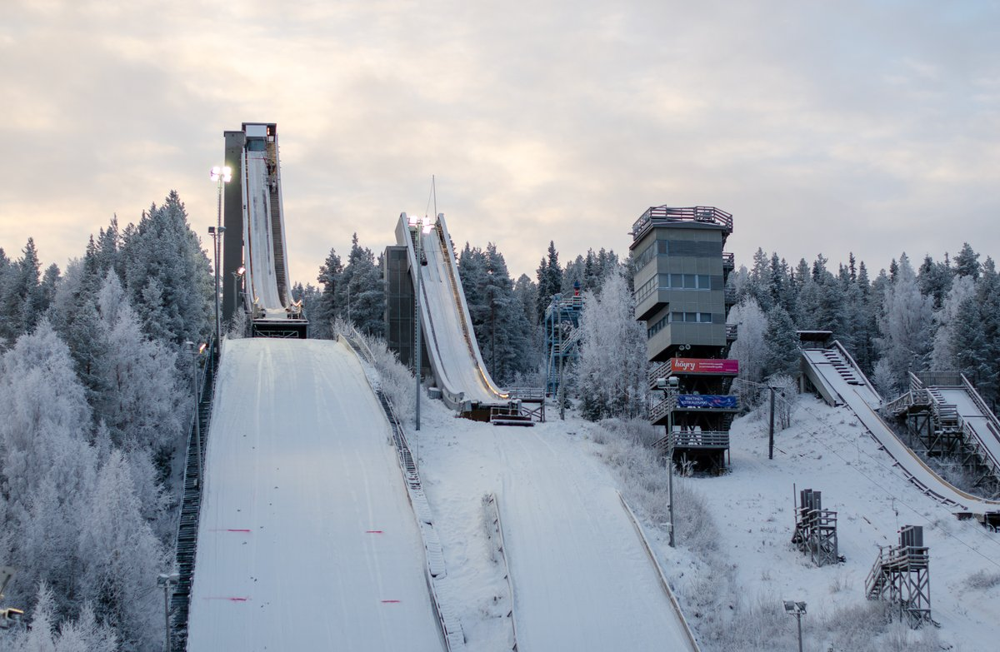
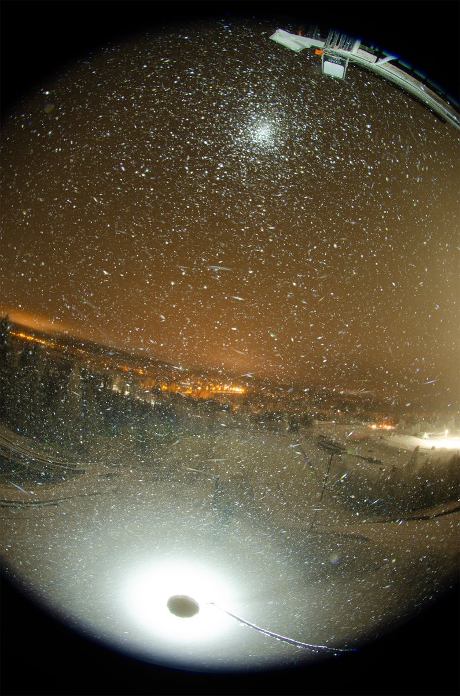
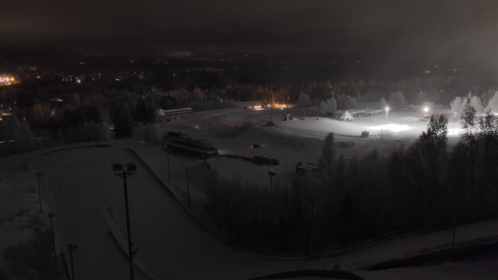
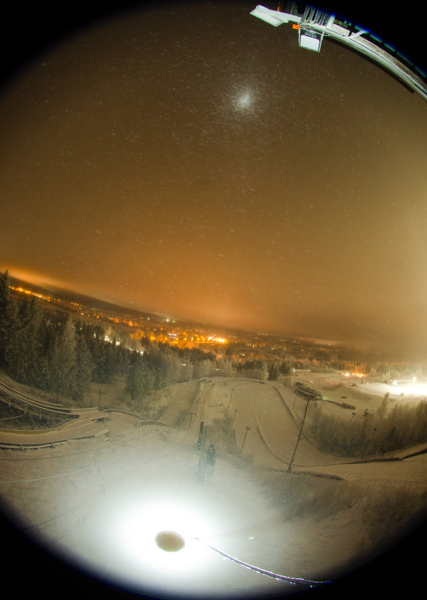

# Thread - 2025-11-18

**Original:** https://x.com/RiikonenMarko/status/1990740144685466002

---

### 1/1 - 2025-11-18 11:13 UTC

17/18 Nov 2025 Rovaniemi. On this night I left 6:30 pm and the plan was to continue the productive bridge photography from a week ago. But I had reckoned without the fog. Unless it is completely punch-holed, there will be horrid reflected light. And the smaller bridge in a bit darker location had traffic: trucks were passing underneath it, bringing loads of snow for whatever purpose to the ski center. So bridges were not going to cut it tonight.

Instead, I got an idea. I walked up to take a closer look at the tower seen in the first photo (that I took today on the 18th, no halos, cloudy), and immediately berated myself that a week ago didn't photograph from there. Even though the highest platform accessible is the below-center one with red placard, the throw that you get there is much longer than what you get from the bridges (the second photo is from this platform). And you can actually walk the stairs even one floor more up and photograph from the little platform on front of a locked door.

There is also another tower, seen between this tower and the smaller ski-jump (with a person in red pants). You could do relatively fine zenith-centered fisheye. But the tower wobbles a bit. Maybe that's not an issue, as it gets averaged in time exposure – halos is not exactly astrophotography. And if you manage to stay in place, wobbling probably stops.

I visited also the smaller ski jump, the door was open. There were doves there, one was hovering right on front of me, maybe mesmerized by the head-lamp. I could have extend my hand, picked it up, and ringed it. Anyway, this ski jump would be dangerous. It seemed like it would not be possible to safely do spotlight there.

The ice fog was nothing to go by this night, streetlights had only pillars. Temps were maybe a bit too low (-13...-14 C) and there was maybe a bit too much snow coming, snowing intensifying after 4 am when I left. But despite the poor ice fog scene, I managed a little proof of concept stack from the tower, the max version which shows the upper horizon arc in addition to upper flipsun and 22° halo. I saw that horizon arc also with my eyes.

---

