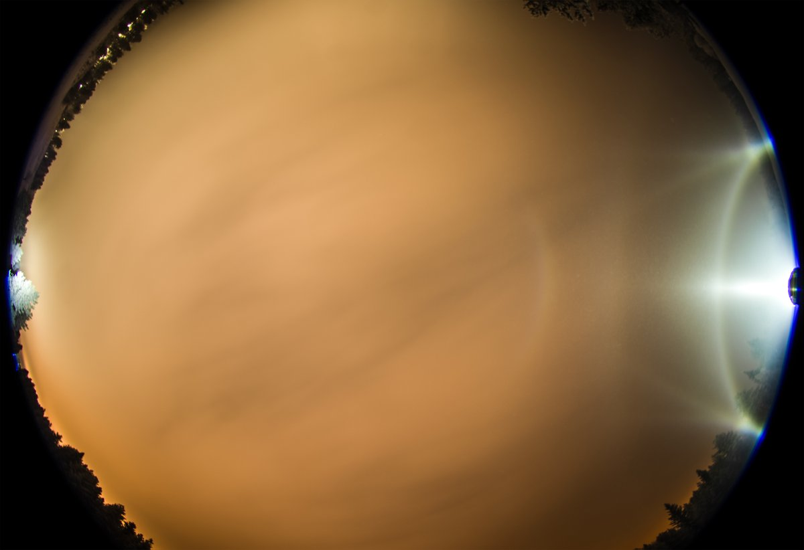
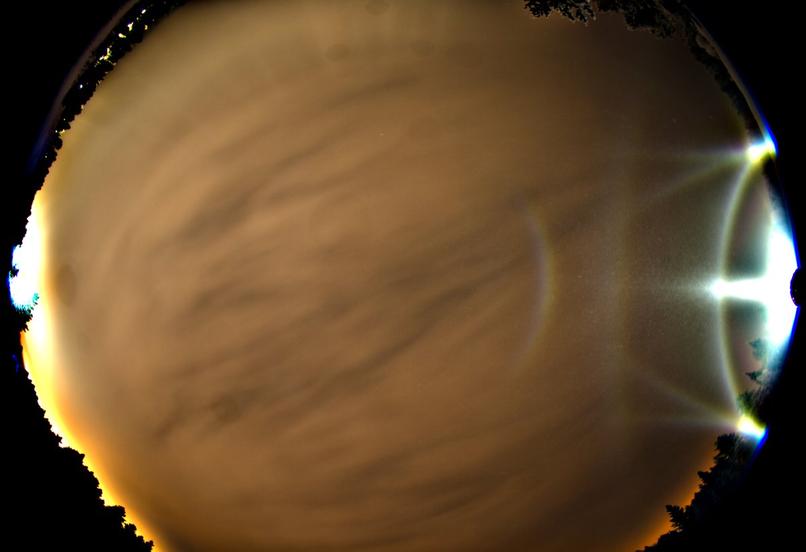
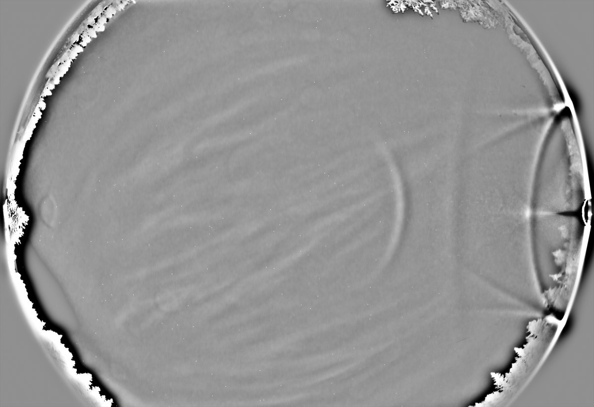
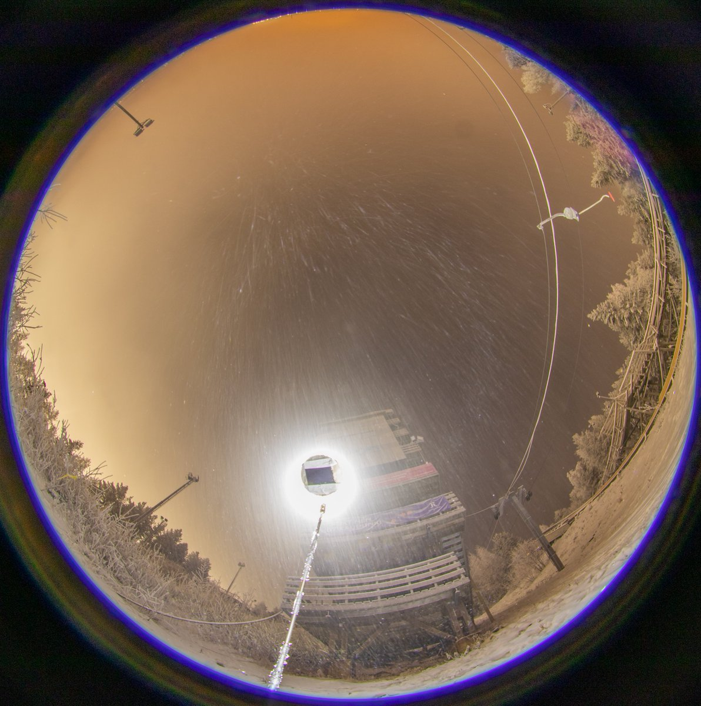
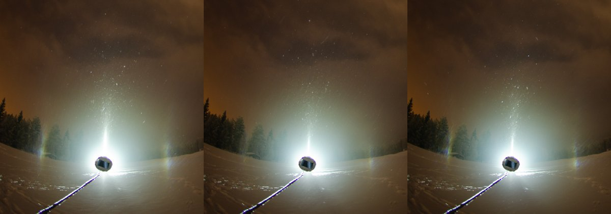
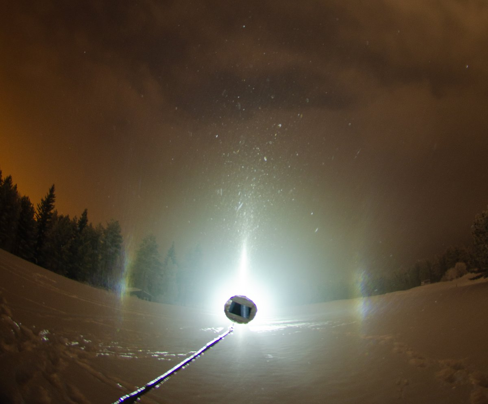
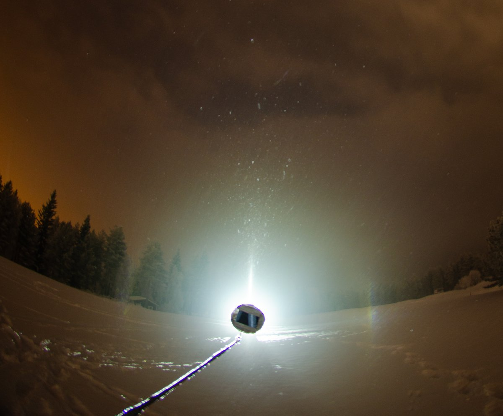

# Thread - 2025-11-19

**Original:** https://x.com/RiikonenMarko/status/1991134437229109383

---

### 1/4 - 2025-11-19 13:20 UTC

18/19 Nov 2025 Rovaniemi. 30 x 30s. The best set from last night. Temp in my personal thermometer on the ground -13 C.

---

### 2/4 - 2025-11-20 13:35 UTC

18/19 Nov 2025. After having photographed the Liljequist arcs (I prefer that name over Schulthess arc – halos should not be named after second observers. Tape, though, calls them subparhelic arcs), I went to the tower at the ski-jump. This time I set the lamp at the tower camera down, but got only this one short swarm, the best shot of which barely manages to show parhelic circle and horizon arc. Horrid light pollution, too. Anyway, a big clear-sky display is bound to yield good results in this place.

---

### 3/4 - 2025-11-20 14:55 UTC

18/19 Nov 2025 Rovaniemi. A curious detail in this night's photo set: in one shot, the left side parhelion is weakened in relation to the right side parhelion to a degree that stands out. These are three successive 15s exposures. Given spotlight displays form very close to the camera, having such anomaly in 15s frame bothers me a bit.

I don't think it is me blocking the parhelion. If I had just walked past, it would have had negligible effect. If I had stayed in place, I would be seen in the image (I think in that case the parhelion would anyway form in front of me). So I don't think I had a role in this. But I may not realize something obvious.

Anyway, I had an earlier case, from my Rovaniemi chase period of 2015-17, when a flip-parhelion was missing in one frame. Unfortunately, that series of photos was lost.

This was photographed in the same location as the Liljequist arcs above.

---

### 4/4 - 2025-11-20 14:56 UTC

18/19 Nov 2025 Rovaniemi. Here is br gif running those three frames back and forth.

[🎬 1991521132894384199-G6NN2HjXMAA6usl.mp4](media/1991521132894384199-G6NN2HjXMAA6usl.mp4)

---

