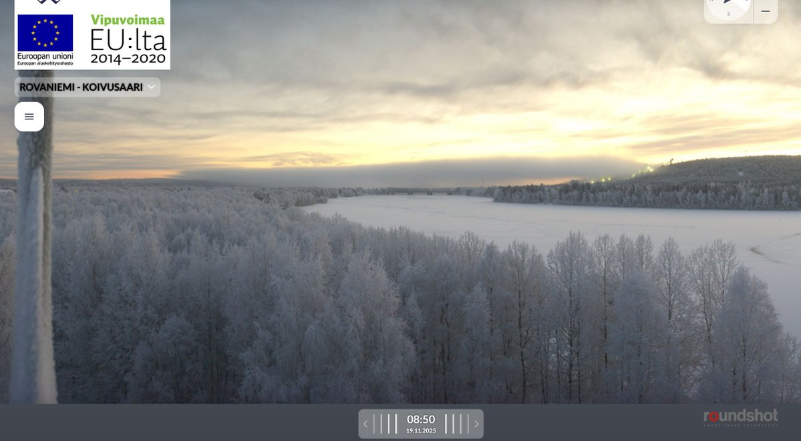
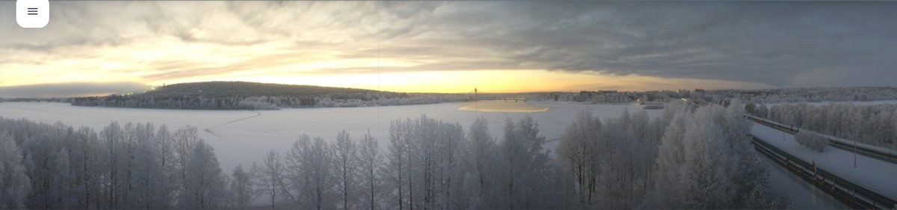
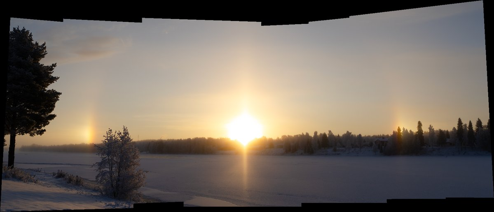
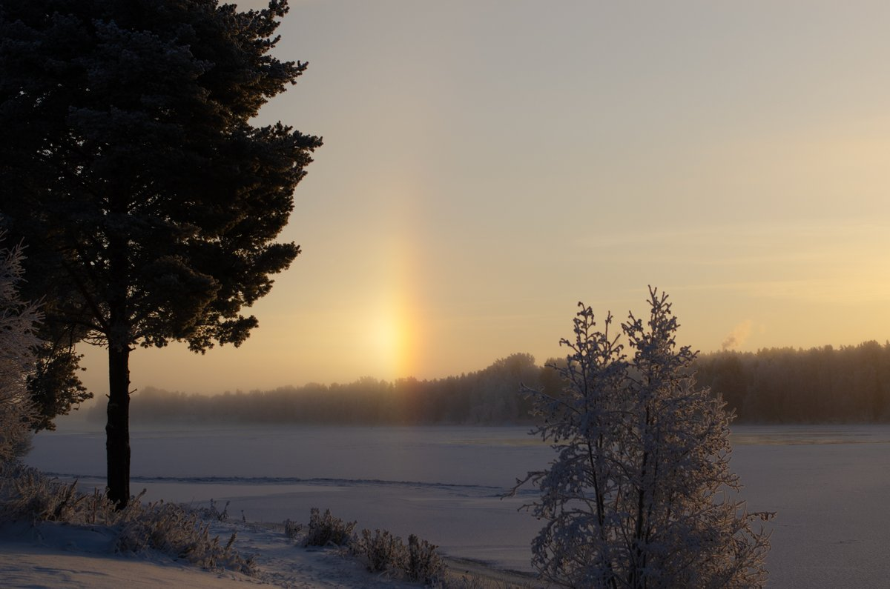
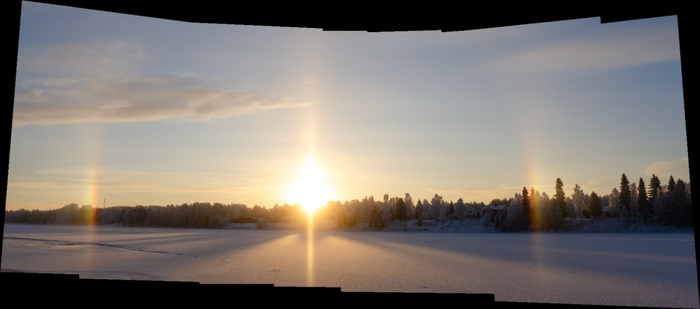

# Thread - 2025-11-19

**Original:** https://x.com/RiikonenMarko/status/1991046921255825889

---

### 1/2 - 2025-11-19 07:32 UTC

19 Nov 2025 Rovaniemi. A thick ice fog cloud from the slopes is seen in Koivusaari 360 camera. In the second, wider image, Suosiola plume spreads huge. But I don't expect much, temps are not good, railway station -17, Apukka -21. Sun is also making quite low arc in the sky by this time of year, making it more difficult to have display because trees etc are blocking.

Last night was disappointment, but got for a moment passable action and took also the first crystals samples. Will try to make a short post later.

---

### 2/2 - 2025-11-20 07:58 UTC

19 Nov 2025 Rovaniemi. So this was all I got. The ice fog was mainly too opaque, but on the perimeter, at the Vaarala swimming place by the river, a little display was on the offing.

---

