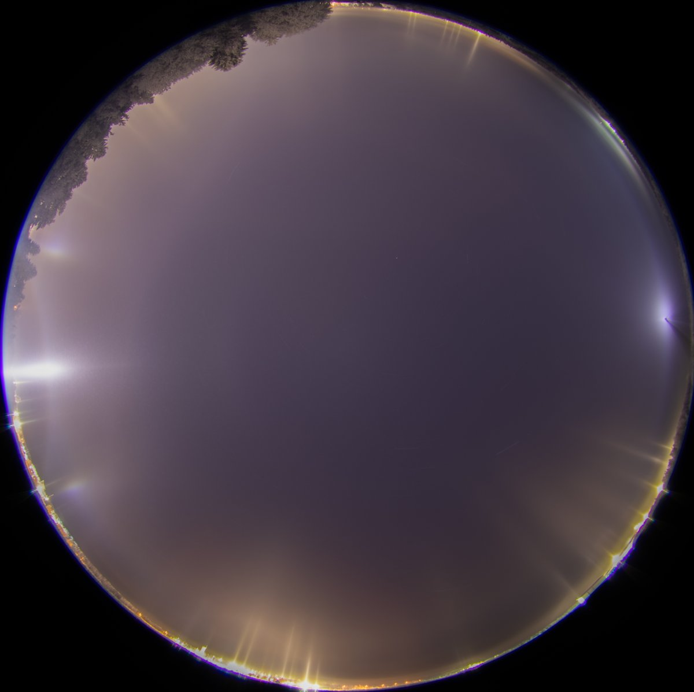
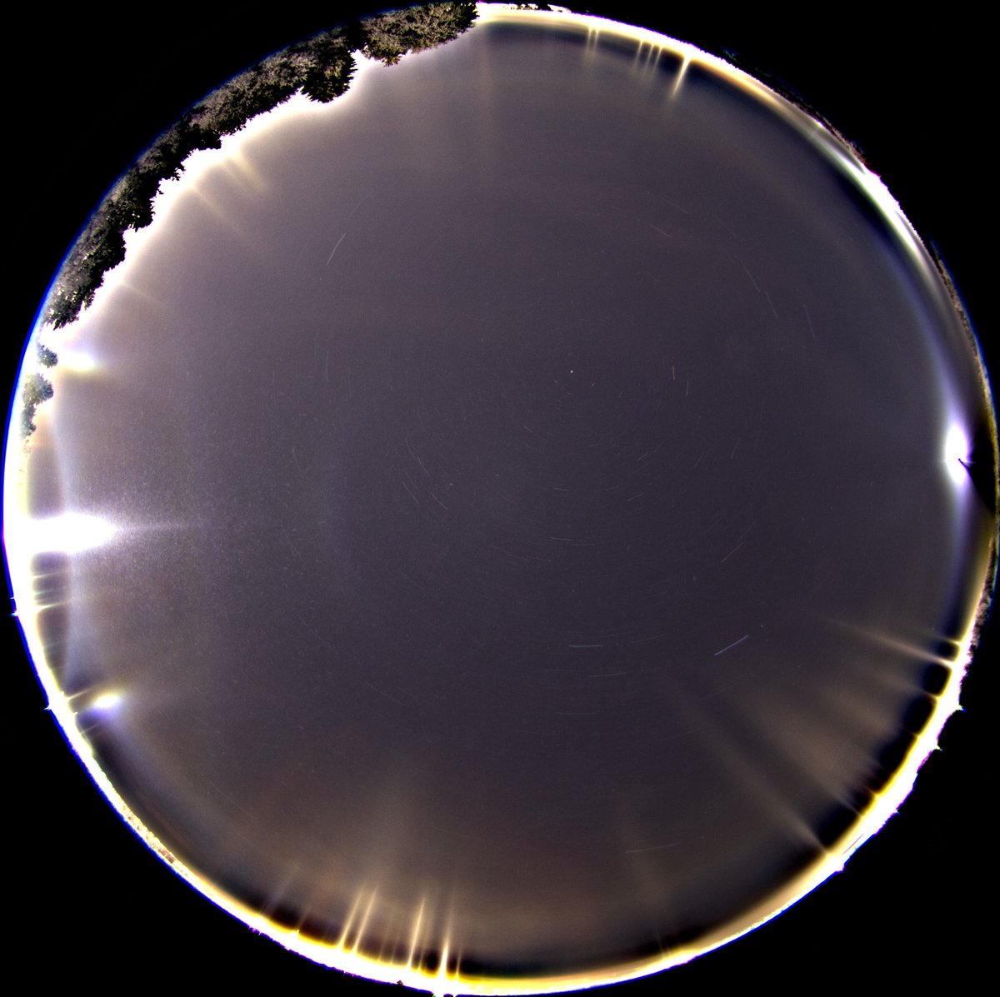
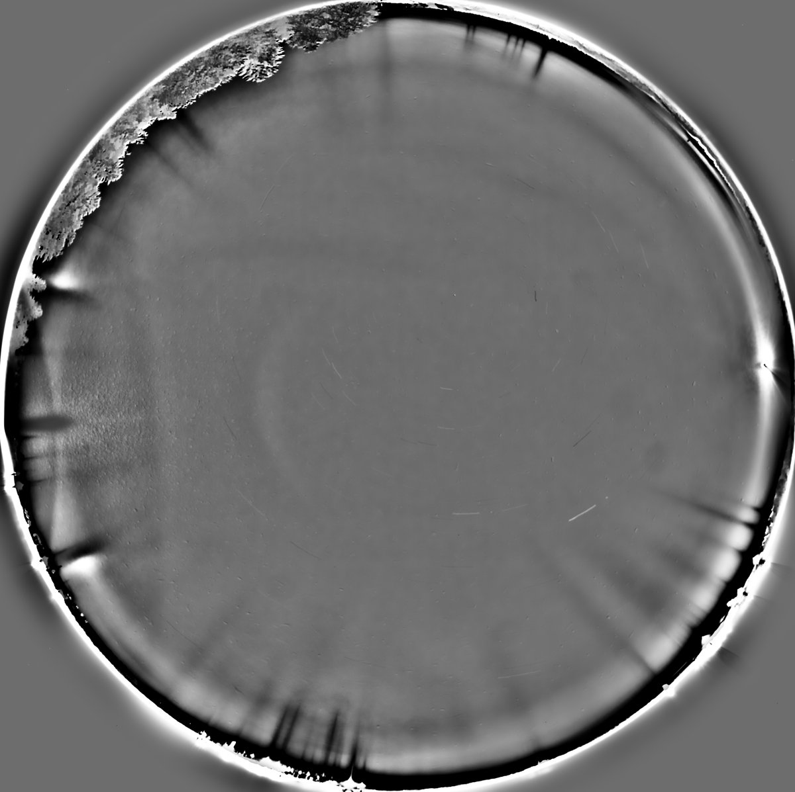
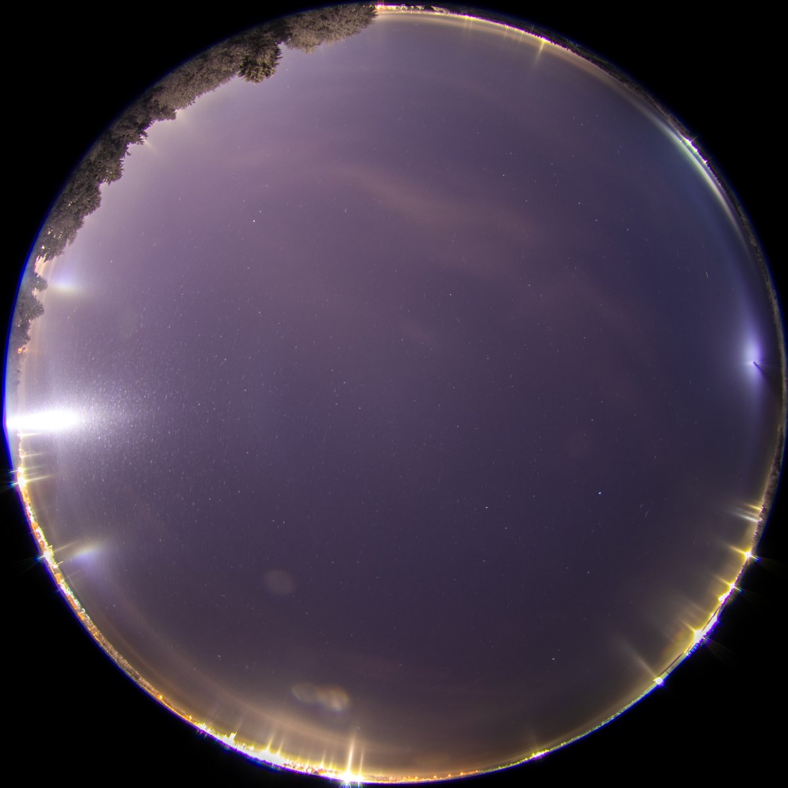
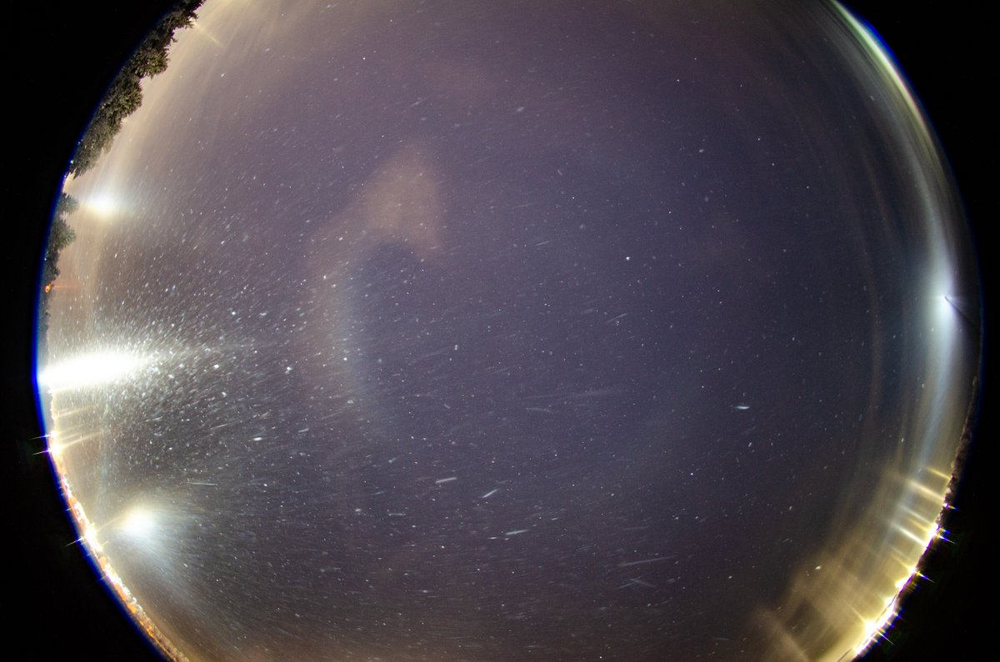
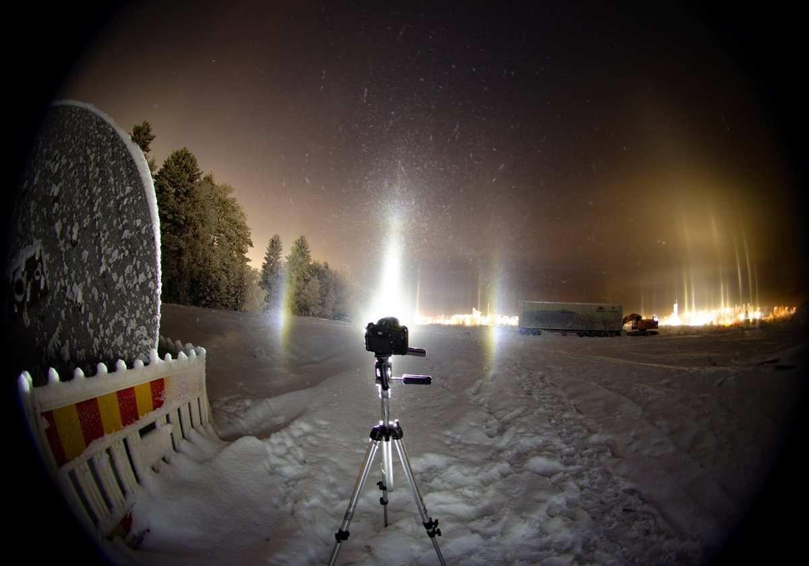

# Thread - 2025-11-20

**Original:** https://x.com/RiikonenMarko/status/1991496527982755998

---

### 1/3 - 2025-11-20 13:19 UTC

19/20 Nov 2025 Rovaniemi. Left after 6 pm and got this action around 7 pm at the industrial area amid heavy light pollution, which has become more and more – I could swear this place was darker last winter.

There was some flip-parhelic circle, and maybe flip-Lilje can be distinquished. And like 5 nights ago https://t.co/0NNvUZnk89 Mikkilä's Soul kept company to the halo chaser, best seen in the last image which is a 3 x 30s partial stack. 

The other images are versions of the full 60 x 30s stack. There is some weak V-shape above flipanthelic point. Diffuse arc? I don't see much tangent arc but a weak one is succumbed to the glare of flipsun. Shadow effect is out of question as this was uniform beamed Olight Javelot Turbo and nothing stood in the way of the beam. Temp in the car thermometer -22 C. 

I departed when the action fizzled out, headed to Ounasvaara golf course. It was in the thick of the ice fog and very poor display. Took a stack nevertheless. Will add here once I get to it. In all, a short night, was back at the apartment 23:30. The ice fog of course continued, but I considered it was not going to get better.

---

### 2/3 - 2025-11-23 09:02 UTC

19/20 Nov 2025 Rovaniemi. The first image I took and the only one with flip nadir arc extension. Not included in the stack above because moved the camera a bit. So once again I was late to the scene. This is so common a feature of the chase – happened more than half a dozen times already this winter – that we need an acronym in the style of MIA and AWOL. Make it simply LS – Late to the Scene, or TLS – Too Late to the Scene?

---

### 3/3 - 2025-11-23 09:12 UTC

19/20 Nov 2025 Rovaniemi. As to the weak diffuse arc like feature in the above stack, this little stack I took after the zenith centered images shows indeed tanarc. I had lost the blocker here, found it buried in the snow.

---

