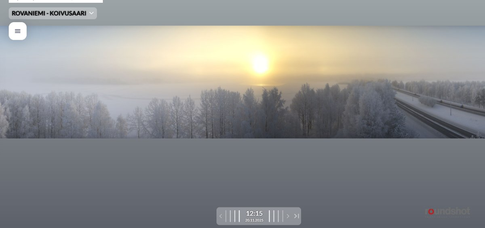
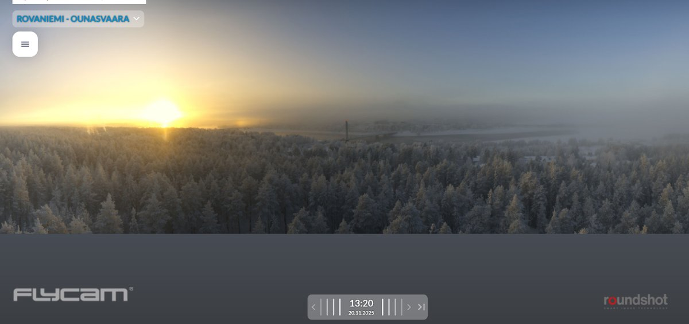
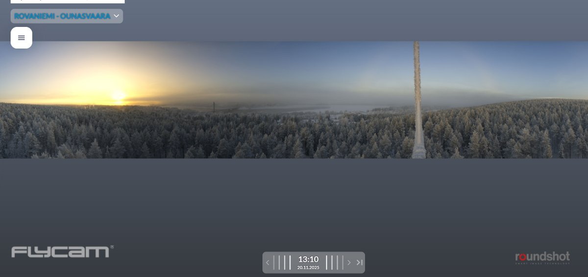

# Thread - 2025-11-20

**Original:** https://x.com/RiikonenMarko/status/1991476005467300318

---

### 1/1 - 2025-11-20 11:57 UTC

20 Nov 2025 Rovaniemi. Poor halos today as shown by the Koivusaari and Ounasvaara webcams. Also fogbow visible. Railway station -19 C, Apukka -21 C. It should warm up tonight, in FMI forecast at the morning hours -11 C. Let's see if it pans out, temps have been colder than forecasted during this cold snap.

---

