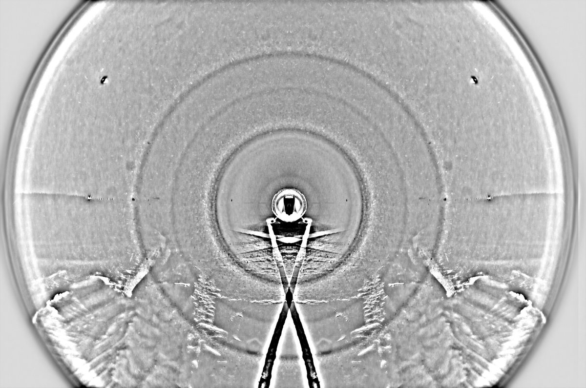

# Thread - 2025-11-21

**Original:** https://x.com/RiikonenMarko/status/1991775351819673779

---

### 1/1 - 2025-11-21 07:47 UTC

I am yet to do the winter's first snow pack display. But as a colleague asked about making these displays, I gathered him some links from my previous posts and thought I might as make them into an X post, too. Below the links are some additional points.

https://t.co/BAK1zE7DBY   about camera height

https://t.co/iekkXNL2ZJ   thin layer – more work

https://t.co/ftxJGV3ixn   about deeper stuff, being less floaty

https://t.co/fVtj3Ssh8I   how to get wide angular coverage, about too warm camera

https://t.co/rttbATekjS   camera height

https://t.co/UMSZEPcqIV   deeper layer

https://t.co/Sg620lepfq   making a snowbank to shadow the ground

https://t.co/CQHuQ1LqAp   daytime, here is seen the tray I use for shovelling

- Make sure the camera is cooled below freezing. I place just a smidgen of snow on the objective plastic to see if it starts to melt. But don't cool too much, because then the lens may frost. 
- You throw as high as you can, that gives you the widest curtain when it falls down. But it also tires you faster, so of course you limit it a bit, not going all out. 
- One time I tried for throwing the shovel which I use to gather the piles, but it was not good. Less control, I used used up the piles really quick. For me the plastic tray is the throwing tool.
- If you want a really long stack, you may need to move to a new place, because it is less work than collecting snow from ever wider area. It is good to place the light in the camera view in some easily defineable location (middle of course being the best) which is what you then use in the next spot.
- When you have lamp in the middle of the view, your objective lens is also in vertical position or a pointing a little downwards. This is good as it prevents snow piling up on the lens (don't use lens hood as it collects snow on the inside)
- The lamp is best placed right on the ground, because then you don't need high shadowing snow bank.
- The shadow must not be too high. If the shadow is right below the camera, then it is already limiting the light for the display.

---

