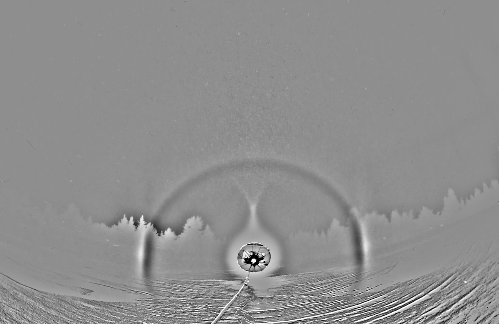
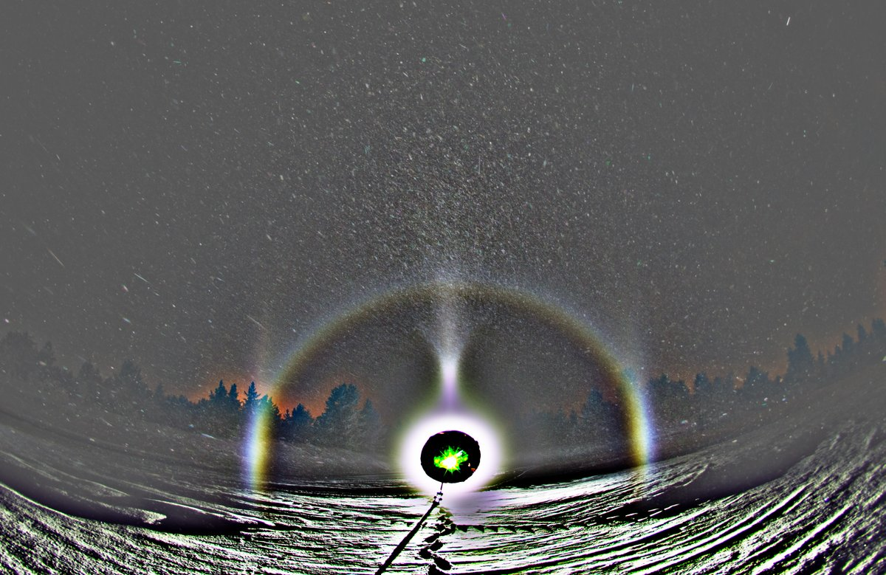
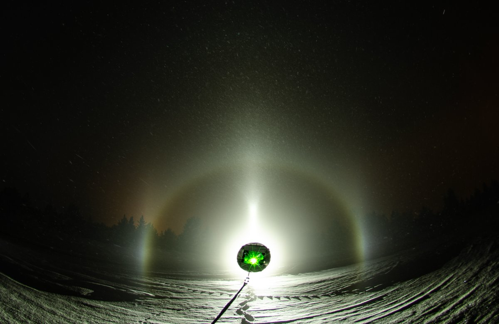
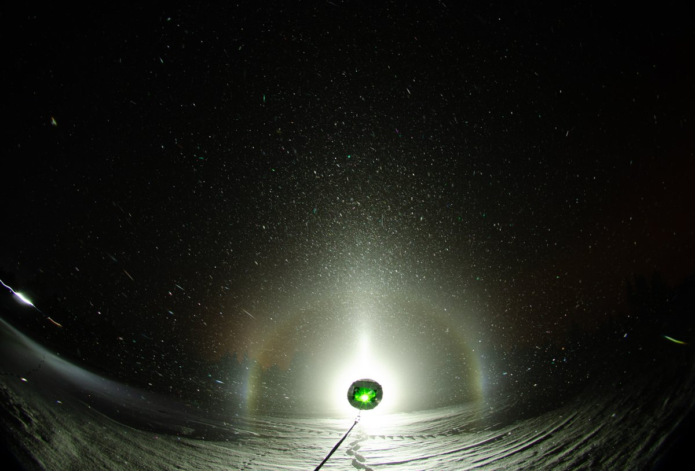
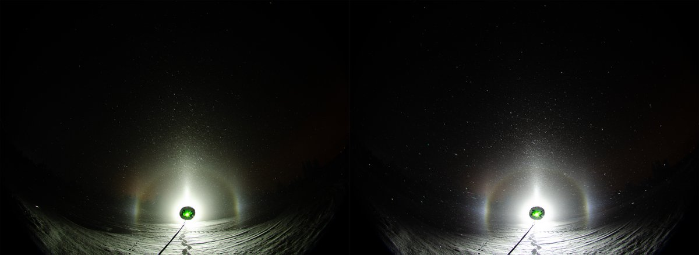
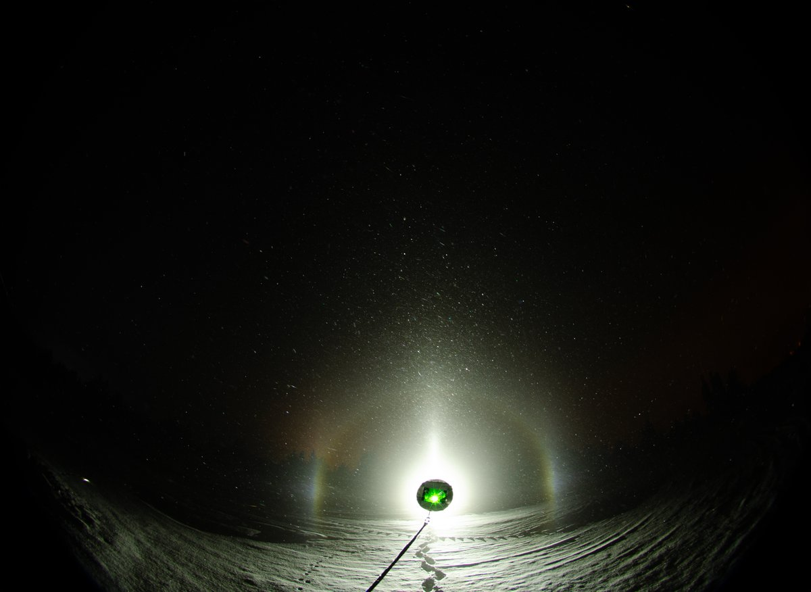
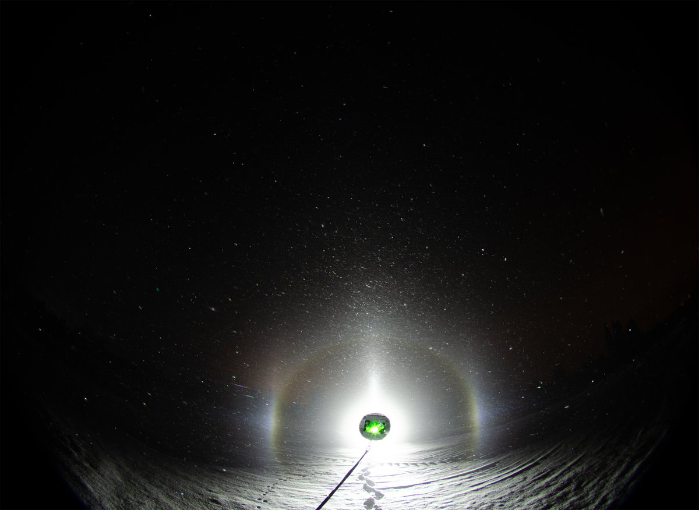
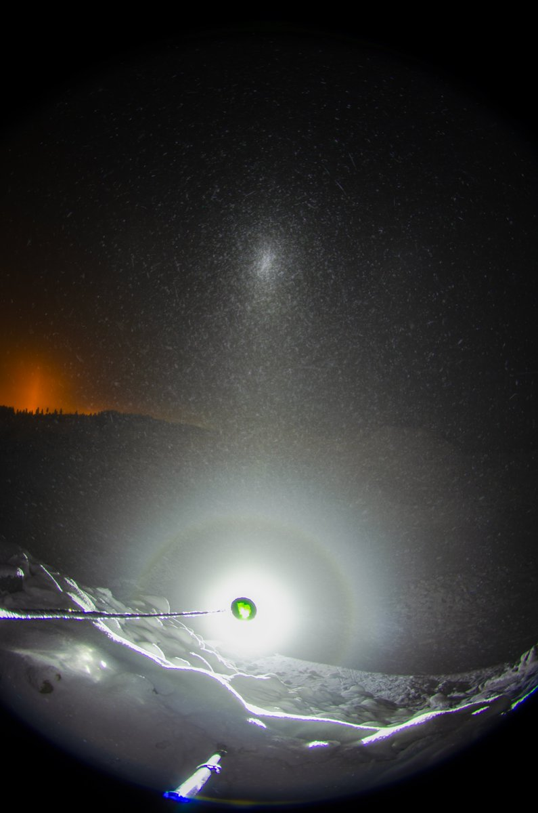
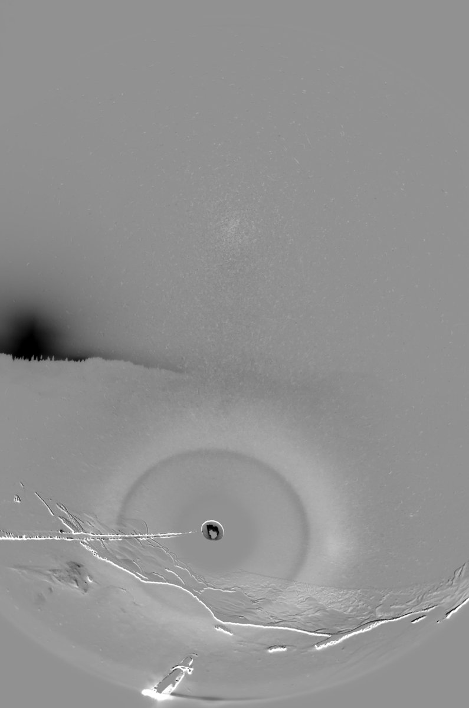
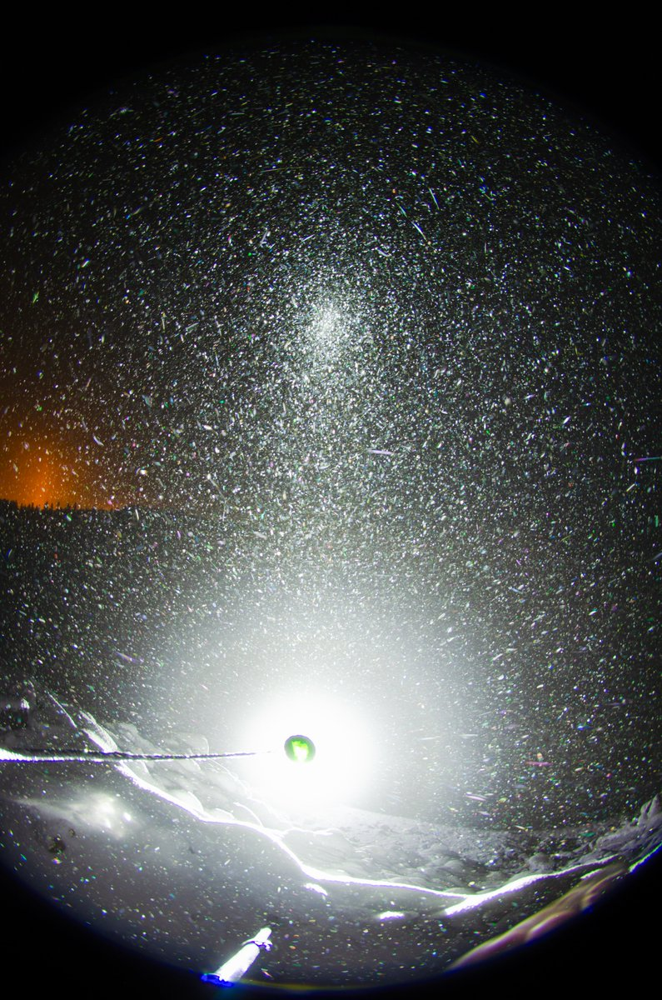

# Thread - 2025-11-22

**Original:** https://x.com/RiikonenMarko/status/1992324437031391637

---

### 1/3 - 2025-11-22 20:08 UTC

21/22 Nov 2025 Rovaniemi. Left apartment after 5 pm and headed all the way east to Jokkavaara gravel pits, because it was east that the plume from ski center was traveling. The only thing worth acknowledgement was this Moilanen arc, the swarm of which was right on as I arrived (temp around -25 C). Then it crapped. I waited, but as usual, it was just getting worse, so I left back towards the city, making a stop in one place along the way to check the situation.

In Rovaniemi I happened upon a surprise full-blooded plate swarm, but it disappeared while setting up the equipment. Decided to call it a wraps and was back at the apartment before midnight. What I looked out from the window upon waking up a couple of times during the night, I didn't see pillars anywhere, so I don't think I missed anything.

---

### 2/3 - 2025-11-22 20:39 UTC

21/22 Nov 2025 Rovaniemi. Flaslight comparison. When Moilanen arc was already phasing out, I changed the Acebeam L19 to Olight Javelot Turbo. The whiter light Olight seems to give a little better immersion. In tests against my apartment wall it was the brighter lamp. But then this real life test in Jokkavaara is not giving exactly comparable results because Acebeam the was shooting slightly above the camera, whereas Olight was pretty much centered. And of course there can be variation in ice fog itself, which can markedly affect how it would look. But it seems to me this time the situation stayed steady.

---

### 3/3 - 2025-11-22 21:06 UTC

21/22 Nov 2025 Rovaniemi. Let's add also this last set I took after Moilanen. I wanted to mainly test how much of a trouble it is to take the light down to the pit and then come back up to take photos. Too much. Two persons are needed here, one who stays at the bottom, moving the light to different elevations (you can get here steep enough angles for horizon arc), other one at the top operating the camera – or the other way around. The pit is really dark, so it's a good place to do spotlight

---

