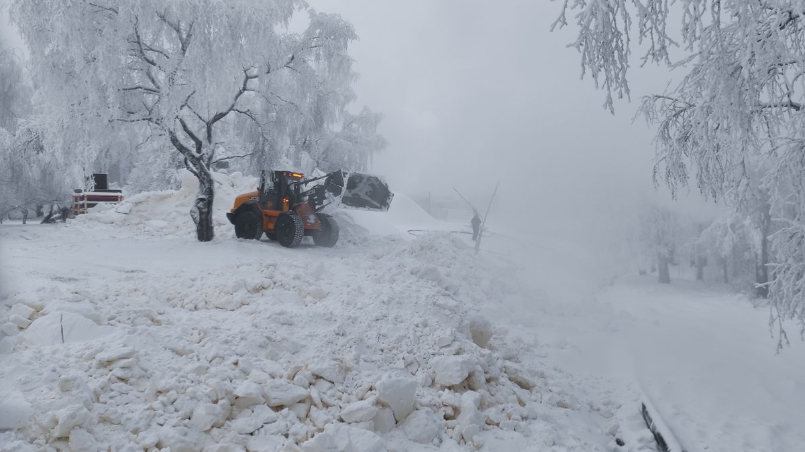
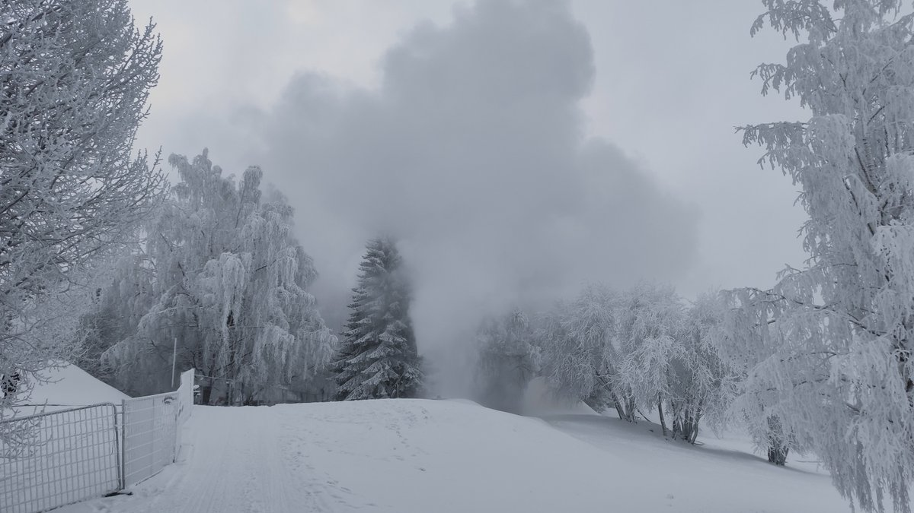
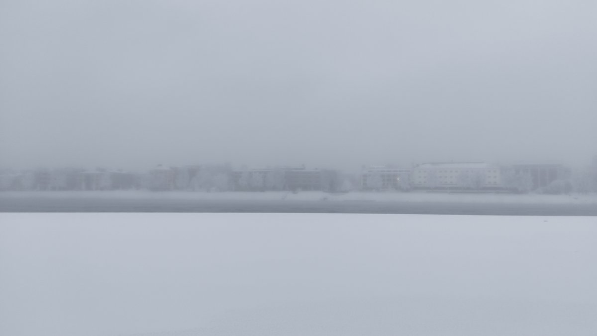
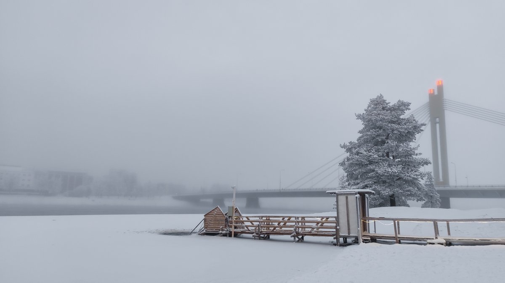

# Thread - 2025-11-22

**Original:** https://x.com/RiikonenMarko/status/1992133579321880586

---

### 1/2 - 2025-11-22 07:30 UTC

Another snow gun running in Rovaniemi? At around 13:50 yesterday, on 21 Nov, a huge cloud erupts from the vicinity of the Jätkänkynttilä bridge, as shown by Ounasvaara and Koivusaari 360 cameras.

[🎬 1992133579321880586-G6V6JRcXIAAp-0U.mp4](media/1992133579321880586-G6V6JRcXIAAp-0U.mp4)

---

### 2/2 - 2025-11-22 09:55 UTC

Went to investigate. They are making snow for some fantasy winterland, one of the workers told me. The festival opens after a week on Monday. Quite thick ice fog today, the buildings on the other side of river were shrouded. This did not seem to be water fog – I saw crystals glittering in the beam of my lamp and even little pillars from car lights here and there. Snowfall is arriving right as I write this and tonight there won't be chasing.

---

