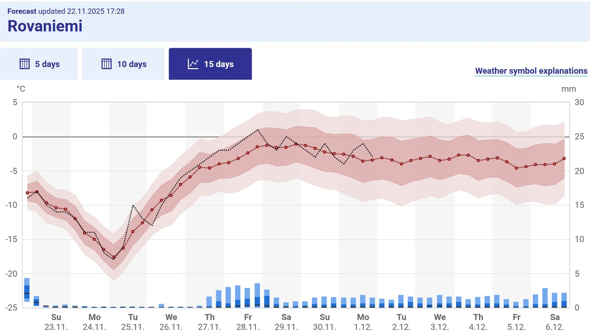

# Thread - 2025-11-22

**Original:** https://x.com/RiikonenMarko/status/1992276633911214571

---

### 1/1 - 2025-11-22 16:58 UTC

Looking back at the FMI forecast a week ago for one week onward https://t.co/EL0UntZ85M it delivered its promise of constant ice fog: the ground level ice clouds were in the scene pretty much 24/7, possibly there was no respite at all.

The action started before midnight on Saturday 15.11. and still today, Saturday 22.11. there was ice fog even if no halos could be seen in the sunlight due to overcast conditions (but I saw some short pillars in car lights). On seven successive nights I photographed at least a rudimentary display. What was not delivered, though, was the temps. It turned out markedly colder resulting in a lot of crappy ice fog.

Anyway, talking of pillars in car lights in the daytime, I would like to try how big a display one can get in the daytime (as defined by when sun is above the horizon) in spotlight beam. In sunny conditions this could be attempted in shadow, but then I would be photographing the sun halos. So it is something to try in overcast conditions. I believe in a high quality swarm more can be seen than just a pillar.

The image here is the recent FMI graph forecast, which does not show the winds. Tonight there is rest for the wicked, but looking at the more detailed forecast for coming days, there is quite a lot of calm weather and it is possible that starting Sun-Mon night even four successive nights of action are delivered. Temps, though, are mostly still a bit too low for the big stuff.

---

