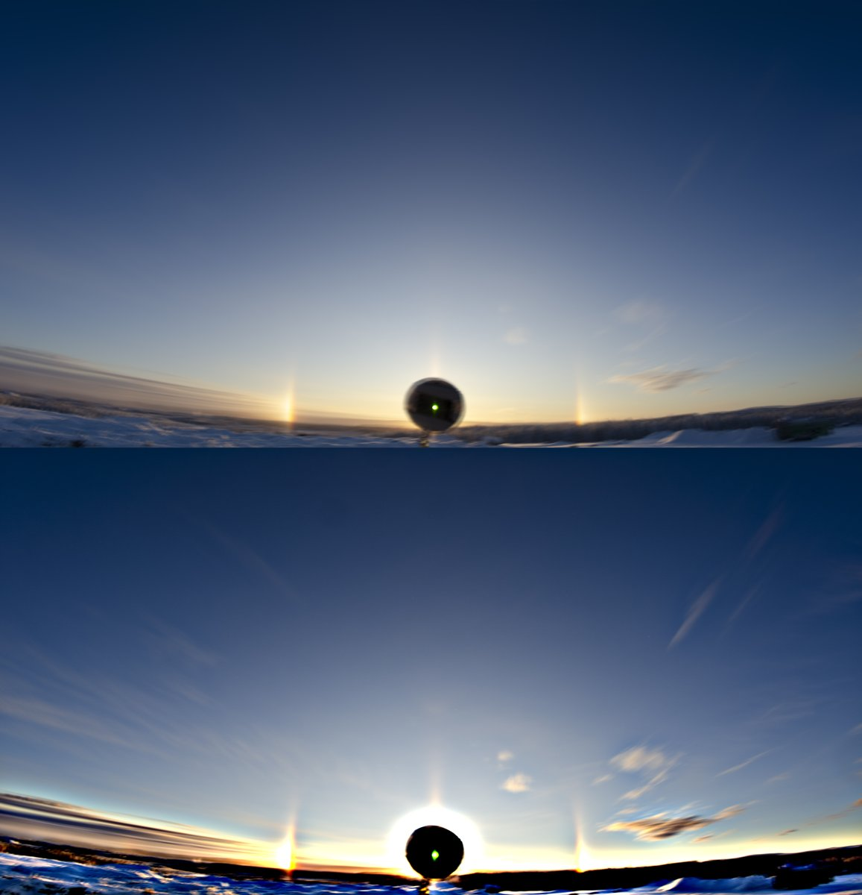
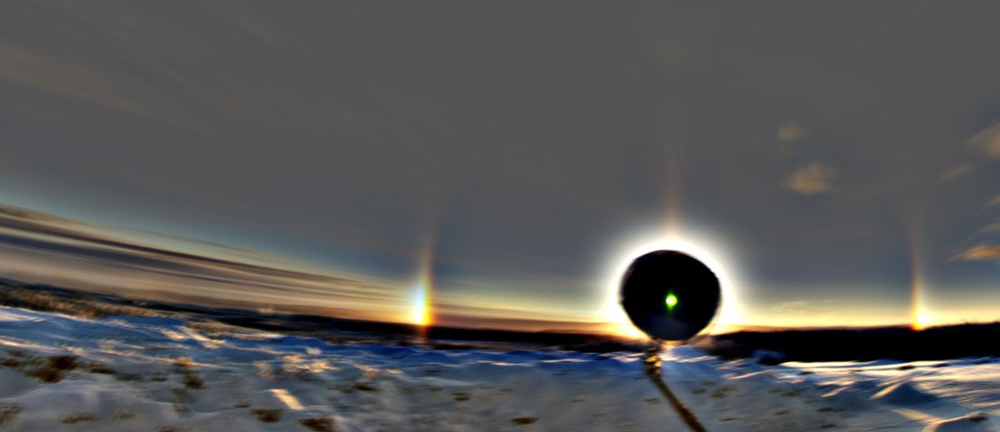
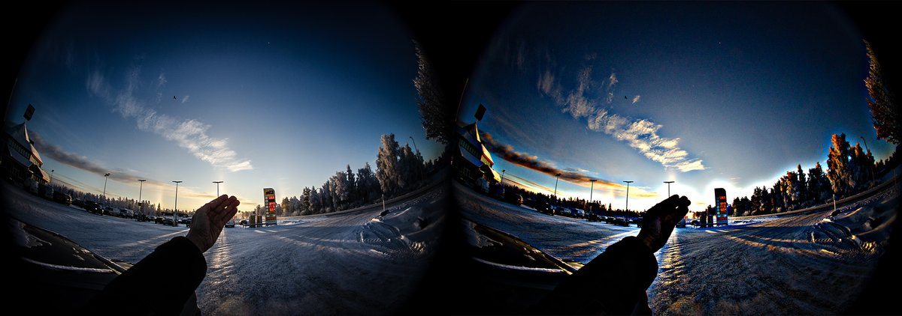
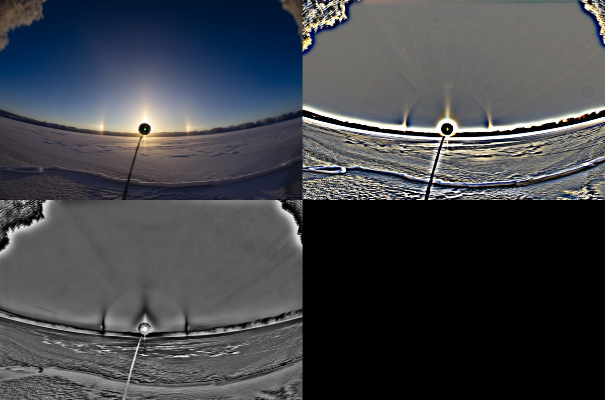

# Thread - 2025-11-22

**Original:** https://x.com/RiikonenMarko/status/1992316251138384198

---

### 1/1 - 2025-11-22 19:36 UTC

21 Nov 2025 Rovaniemi. I noticed in Anttilanvaara a very weak halo at about 46 degree distance from the sun at the parhelia level, seen weakly in the second image which is an enhanced close-up of the first (stacked of some frames). However, I considered the parhelia not enough bright to warrant for 44° parhelion.

I was at the edge of the ice fog cloud so I hopped into car to drive deeper in to it to see if the more likely explanation, i.e. just a segment of 46° infralateral arc, will hold. Indeed, in a photo I took at the gas station (third image) 46° lateral arc of the supra type is seen, so clearly the segment at the horizon was nothing more than infralatarc. But actually already in the Anttilanvaara 22° tangent arc was present, which indirectly favours infralateral arc explanation due to the orientation relationship of these halos. I didn't see it with my eyes, but it is present in the first two images. The fourth image is 94 frame stack (4s interval) later by the river, showing also tanarc, cza and some Liljequist arcs.

This observation has say on what I thought as a potential 44° parhelion in one display last year: https://t.co/8a5PvqGOJg Most likely it was like this case – nothing exotic. Had I driven into the thick of the ice fog, lateral arcs would have appeared.

---

