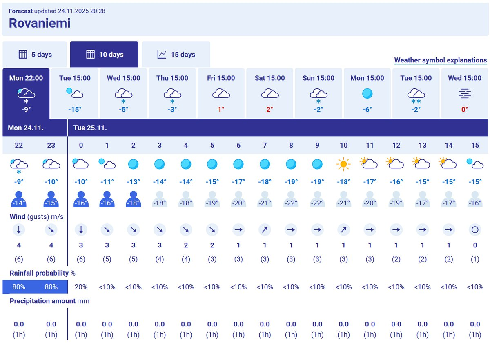

# Thread - 2025-11-24

**Original:** https://x.com/RiikonenMarko/status/1993047974042378640

---

### 1/1 - 2025-11-24 20:04 UTC

Last night, 23/24, was snowing. Yet November ice fog statistics got another check-mark thanks to a shotlived swarm where I live in Korkalovaara before the snowfall. The ongoing night is too windy in FMI forecast, except for one or two hours before the crack of dawn. Not sure if I will bother. But the next night looks solid.

---

