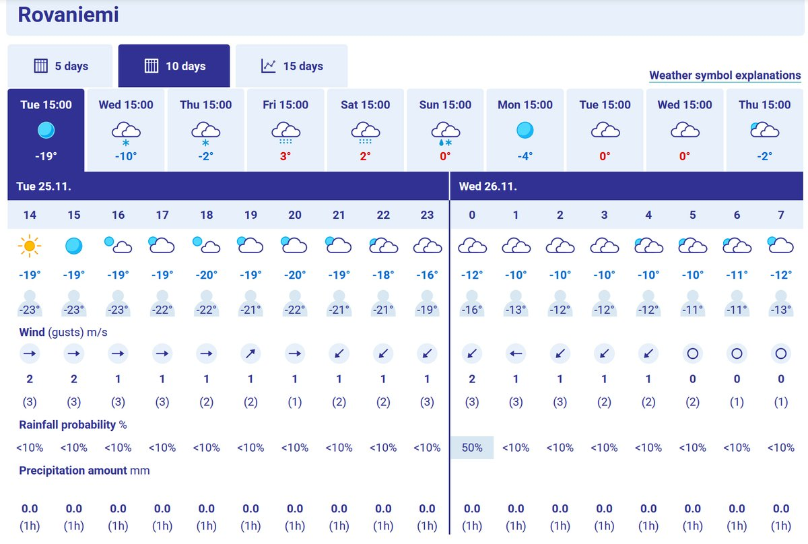
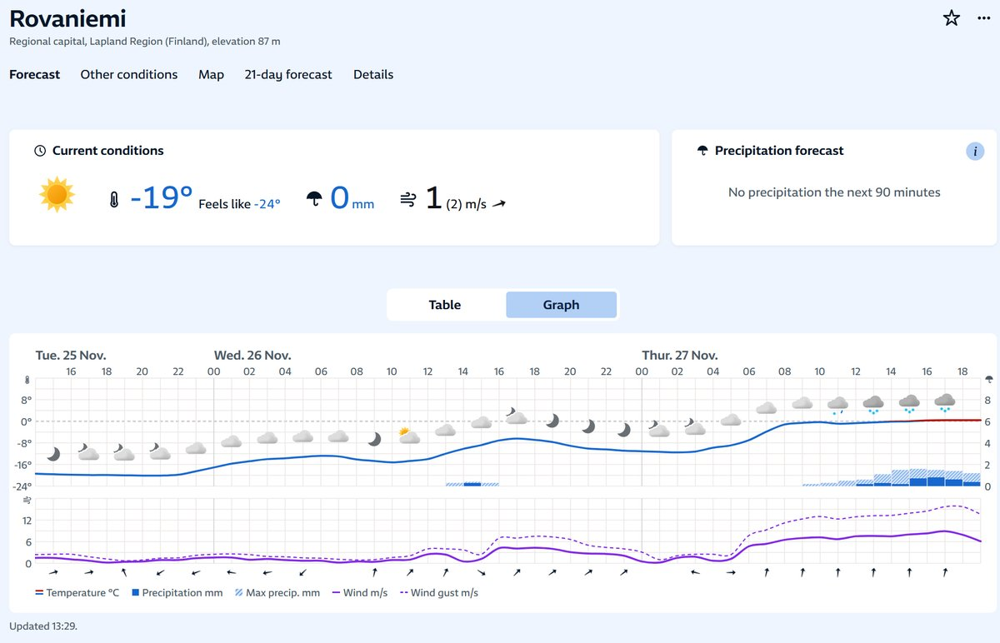
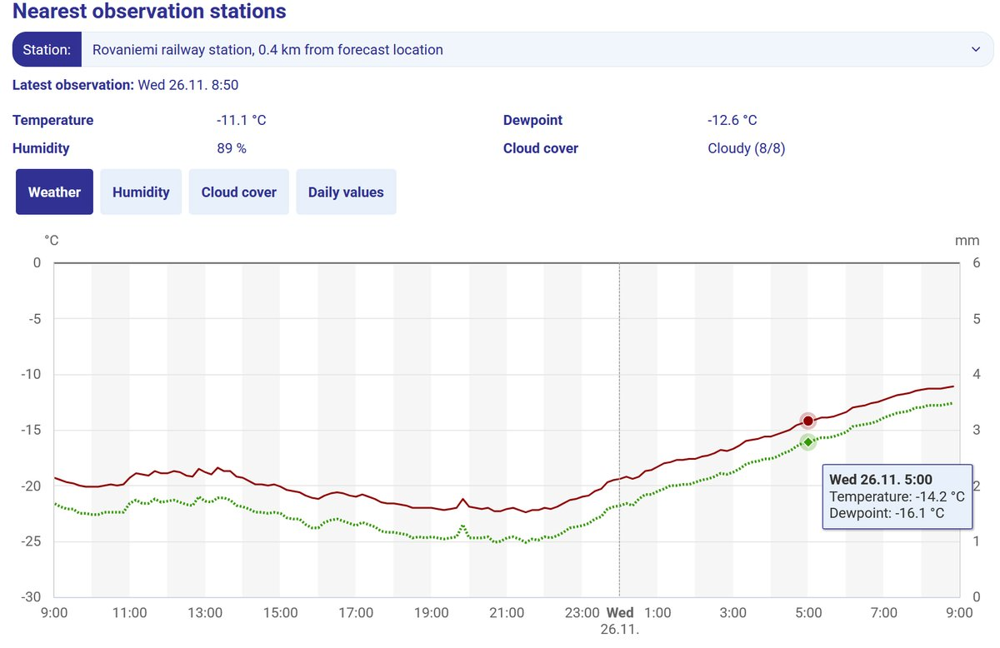
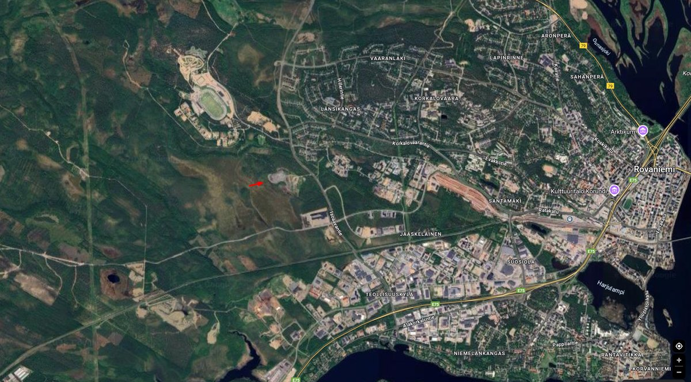

# Thread - 2025-11-25

**Original:** https://x.com/RiikonenMarko/status/1993299167406440635

---

### 1/2 - 2025-11-25 12:42 UTC

Norwegian Yr has a nice graph for the next days. Coming night it will cloud up and also warm up. According to Meteoblue this is fog. At 5 am, which is one hour from the ski center lights coming on: 

FMI -10 C
Yr -13 C
Meteoblue -12 C

I would bet on Yr and Meteoblue having it right. The following night looks business from midnight onwards in Yr and FMI forecasts, but not in Meteoblue.

Last night I was not hunting. There was ice fog, at least in the morning just before and during twilight. Saw pillars and weak parhelia on streetlights. Was this already 10th night of ice fog in November? Today solar display was visible, but poor.

---

### 2/2 - 2025-11-26 07:48 UTC

Yr got the closest. The forecast is for the city center, so railway station is the nearest official weather station and it stood at -14.2 C (I see they have forecast also specifically for the railway station). Apukka, the cold area, was at -15.5 C.

Yesterday 25 Nov, I left early, around 5 pm, but came back to apartment before 8 pm because ice fog was matte, snow-fall like everywhere. Left again after 9 pm when it looked better. Sky had cleared up and I got a little display with Parry in Anttilanvaara, but it was once again TLHS (Too Late to the Halo Scene). Then a quite thick fog descended and I took some photos of fogbow. But fogbows do not stir the poet in halo man. Hopped into car to drive around some. Here and there were pillars but nothing else, no parhelia, no tangent arc. Got demoralized and headed back to apartment 2 am, the temp -17 C. When I woke up at 7 am it was -12 C and there were pillars and medium strength parhelia stripes on the lights outside my apartment.

At the ski center the yellow lights on the bridges were on when I visited there around 1 am, and also two very bright lights on the ground. These light used to be off at 10 pm and back on at 6 am. Well, I have anyway moved to utilize the ski jump area, but these lights add to the general light pollution. It is increasing all the time. One place with no lights near the industrial area, where I sometimes take photos, is having some construction project (map), which no doubt will spawn more leds. This will also add to the light pollution at the horizon in Anttilanvaara.

---

