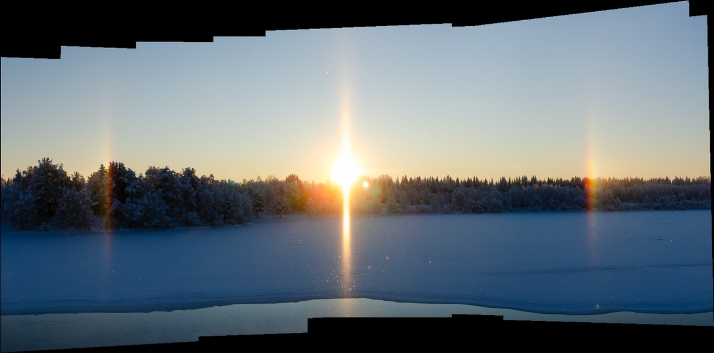

# Thread - 2025-11-26

**Original:** https://x.com/RiikonenMarko/status/1993685074156335410

---

### 1/1 - 2025-11-26 14:15 UTC

25 Nov 2025 Rovaniemi. The ski center snow gunning enshrouded the scenery in ice fog starting some 6 kilometers east. In Oikarainen it was possible to see the sun, where I took photos from the bridge crossing the river. Lot's of glitter in the air, which is not conveyed well by these single shots. Temp around -22 C. It is quite normal that snow gunning at such low temps does not make ice fog at the site, but only kilometers away.

---

