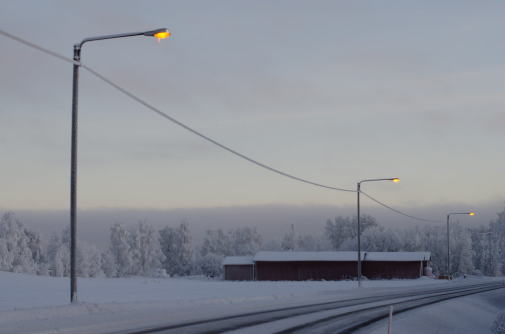
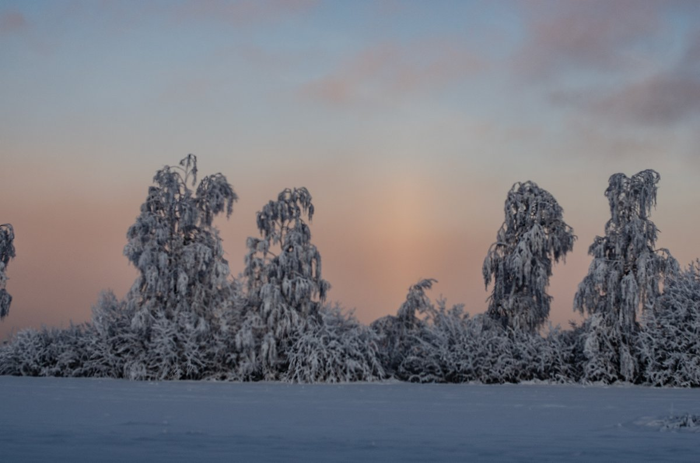
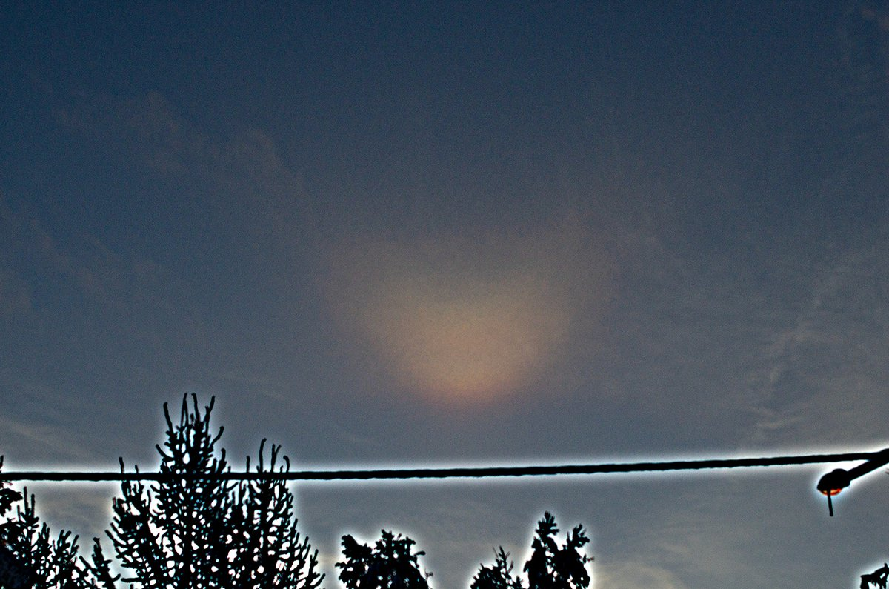
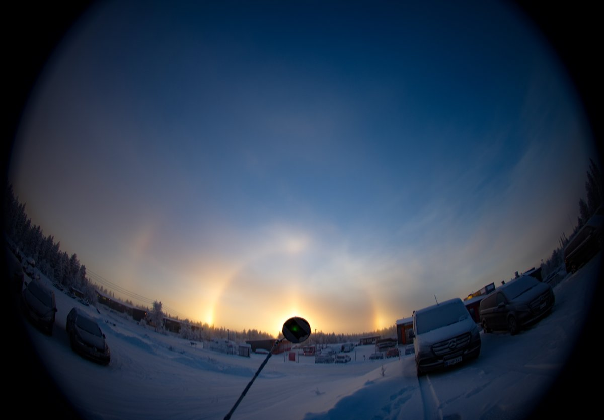

# Thread - 2025-11-26

**Original:** https://x.com/RiikonenMarko/status/1993674406271304164

---

### 1/1 - 2025-11-26 13:33 UTC

26 Nov 2025 Rovaniemi. Winter's first punch cloud ice fog. But it was hopeless to try to find a place where to photograph. Sun is too low. And the display was not of large area, limiting possibilities further.

At first, before I saw any halos, I took a photo of the characteristic edge of the fog wall surrounding the punch hole. Right after I notice diffuse arc, which was the sole halo in the sky. I wonder could it be mixed with Mikkilä's Soul? Don't see any color fringe.

Anyway, I started driving around trying find a place. At some point I snap a photo of tanarc + upper vex Parry combo above the trees. When I manage to find a place near airport, it is already TLHS. From the car renting company on which lot I am photographing, a young guy walks in, we chat some and then he shows photos from his phone that he had taken just a little earlier of a full-blooded display at the same spot.

This is about the last possible days for solar. From now on only lunar and spotlight until at the turn of February solar becomes prospect again.

Around 11 am when I took the photos, temps at railway station -11 C, airport -8 C.

---

