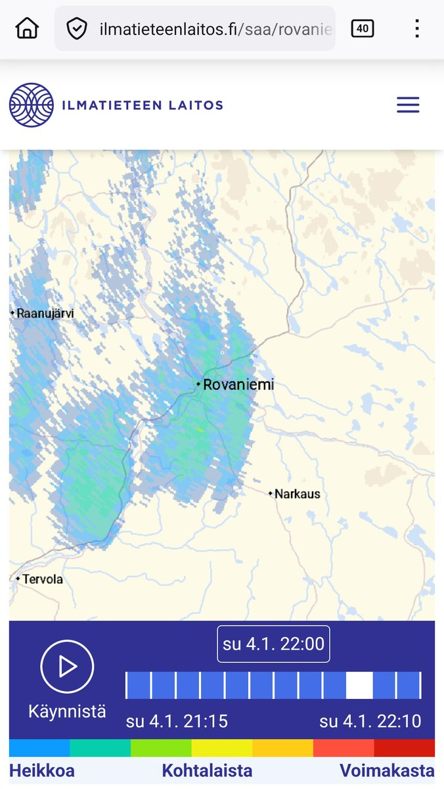
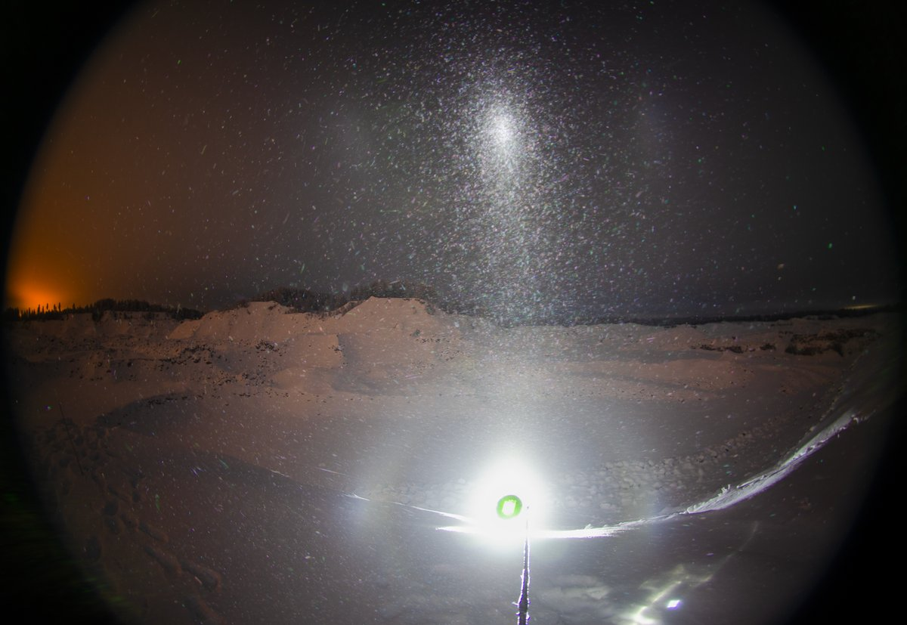
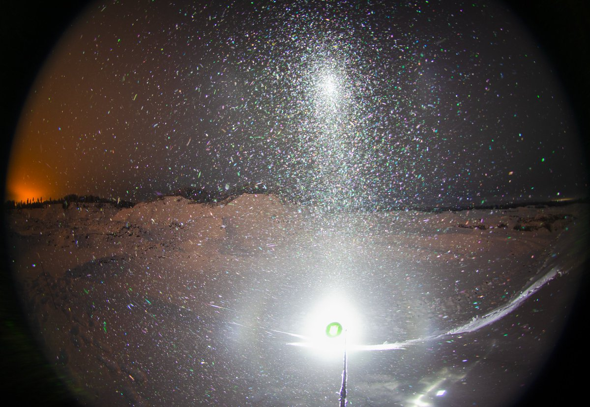
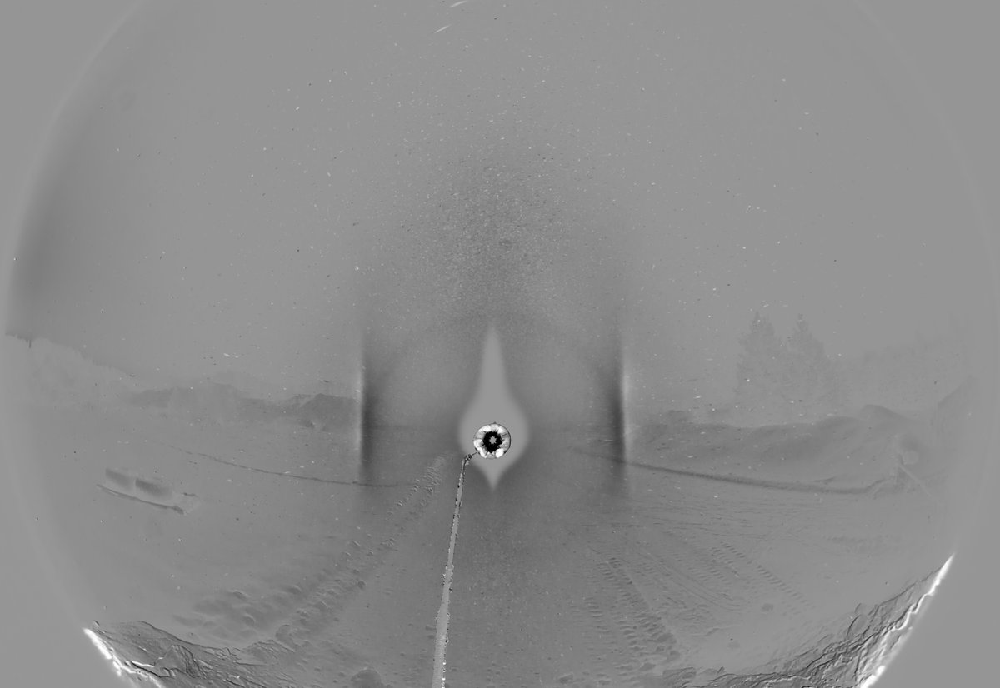
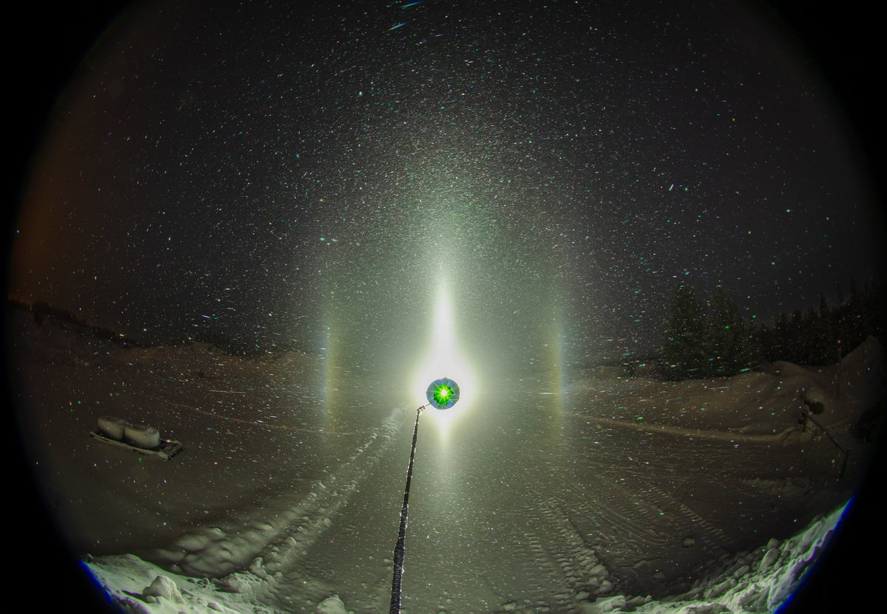
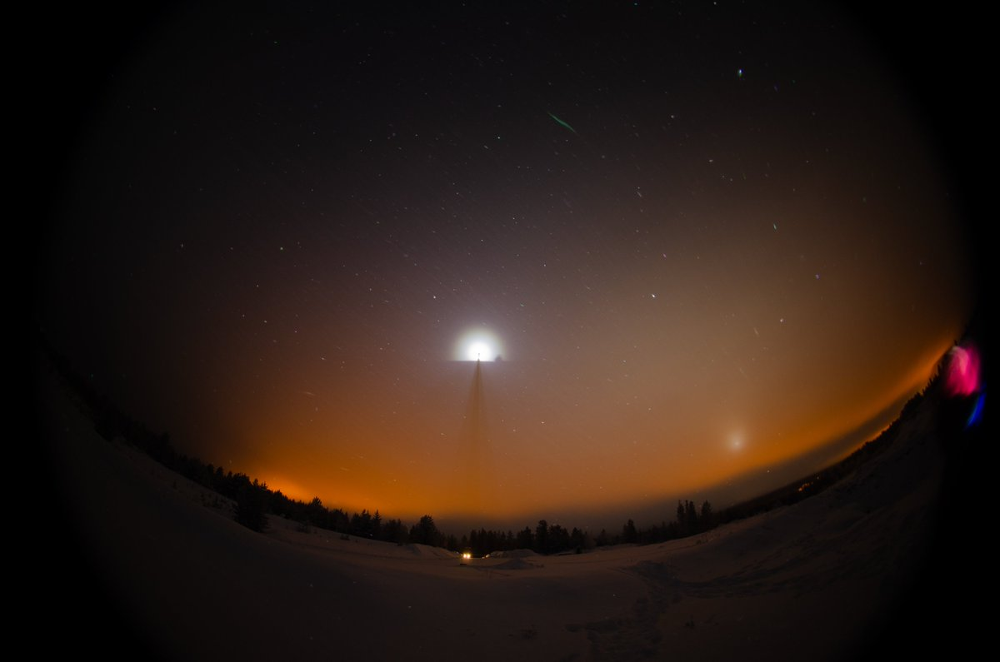
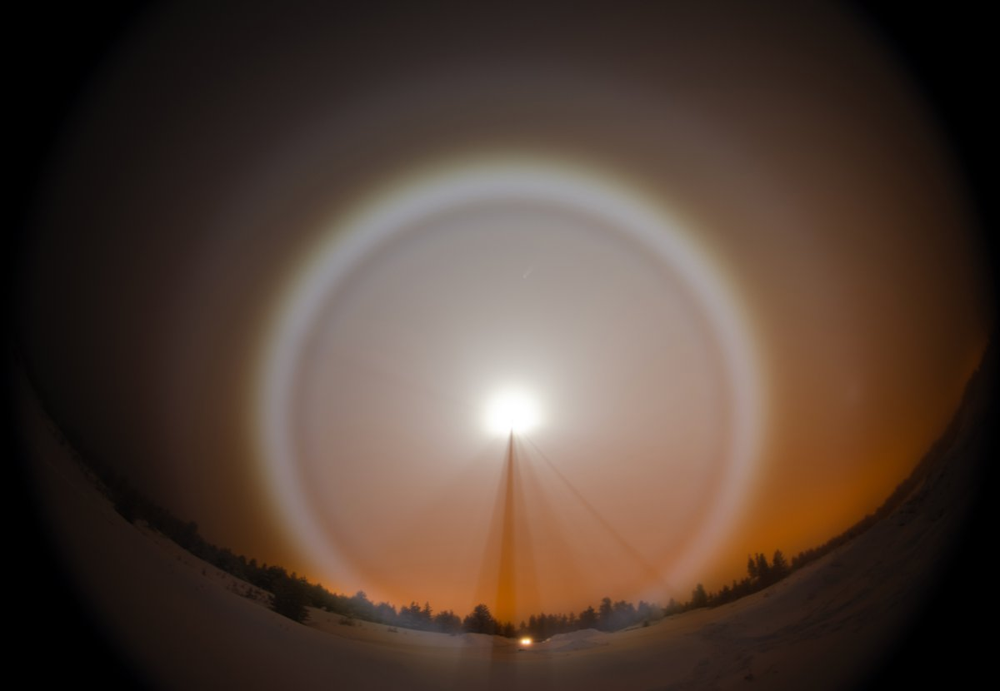
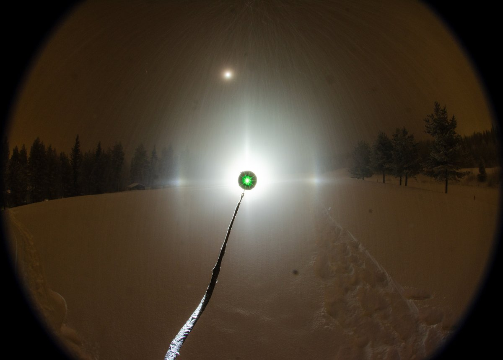

# Thread - 2026-01-06

**Original:** https://x.com/RiikonenMarko/status/2008486981232197916

---

### 1/4 - 2026-01-06 10:33 UTC

4/5 Jan 2026, Rovaniemi. The highlight of the night was the enduring parhelia in snowfall at the Ounasvaara golf track. My experience has been that when is starts to snow, it is always bad news for diamond dust. But this time snowing actually boosted diamond dust and its resultant parhelia (snowflakes themselves made no halos). As snowing peaked to these big fluffy flakes coming down in the video taken at 22:01, the parhelia weakened a bit, but became better again after it became lighter. Temp -22 C. In the next post down is a screen-grab of FMI precipitation radar for 22:00.

Original better quality video:
https://t.co/SEf2rTfGcW

So yeah, after a period of contemplation I decided to return to X despite its hiding posts. I have been publishing to the drawer in a meanwhile, so I though I might as well publish here and can still make pdfs of the threads to the drawer.

We have a cold snap ongoing with below -30 C temps, but ice fogs have been crap. I botched the last night (5/6 January), though. It looked like it's gonna be cloudy and light snow all night, but it had cleared at 3 AM. I was soundly sleeping. Gotta shape up.

[🎬 2008486981232197916-sD3nvzSr8GsV_qEx.mp4](media/2008486981232197916-sD3nvzSr8GsV_qEx.mp4)

---

### 2/4 - 2026-01-06 10:33 UTC

4/5 Jan 2026, Rovaniemi. FMI Precipitation radar at 22:00.

---

### 3/4 - 2026-01-06 10:51 UTC

4/5 Jan 2026, Rovaniemi. Some other photos from the night. I started at Jokkavaara gravel pits, where I first took these stacks of 5 x 30s. There is some psychedelic colors, visible to the eye as well, but this is small beer. Still waiting for those awe-inspiring mighty all-sky psychedelics. They are rare. The last two winters didn't turn up any, I saw one during the two winters 2015-17 in Rovaniemi.

---

### 4/4 - 2026-01-06 11:14 UTC

4/5 Jan 2026, Rovaniemi. Diamond dust was on the wane in Jokkavaara and I turned to camera to photograph the weak glory visible in a little bit elevated cloud layer. Then the cloud descended to the ground so that also fogbow became lit by the beam. The third photo is from the snowfall & parhelia display at the golftrack (where I headed next), the snowflakes drawing vertical lines across the image.

---

