# Thread - 2026-01-07

**Original:** https://x.com/RiikonenMarko/status/2008771691653079533

---

### 1/4 - 2026-01-07 05:24 UTC

6/7 Jan 2025, Rovaniemi. At last odd radii. But didn't last long, have only a couple of short series to stack. For now this single 30s exposure must do, gotta sleep, was out from 10 pm to 6 am. The lowest in my thermometer at this location was -34 C. Forecast is for three more cold nights, so possibly another odd radii is on the cards.

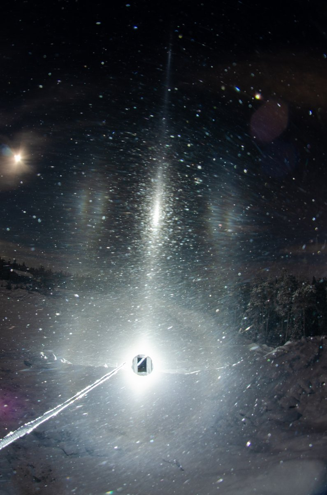

---

### 2/4 - 2026-01-07 14:45 UTC

6/7 Jan 2025, Rovaniemi. Should be going already, but forgot the turn on the car motor heater. It is best to heat it up some before starting at -30 C (in Apukka it is -33 C right now). So I had time to do this stack of the first set, 6 x 30s.

When the ice fog descended and I quick-checked it with Acebeam on the car roof, I immediately saw a slightly red spot above the light that seemed too close to the lamp to be Moilanen arc, meaning, it was the common upper 9° plate arc 13-6. So I got really busy to get photography going because in such a situation the other upper arc from raypath 3-16 should be visible with enough below horizon lamp. It has not been photographed and catching it has been on my mind constantly and probably I have written about it in some of my posts.

So yeah, when I got the set-up ready and was standing next to the camera on top of an earthen mound, I saw it was still there. And luckily I did not overexpose it. But now, looking at the stack, I am thinking it is too far from the light – that it is Moilanen arc after all. Concerning measurements, unfortunately I had just blocked the blocker because the lamp was shining too brightly through the welding glass, possibly making lens reflections.

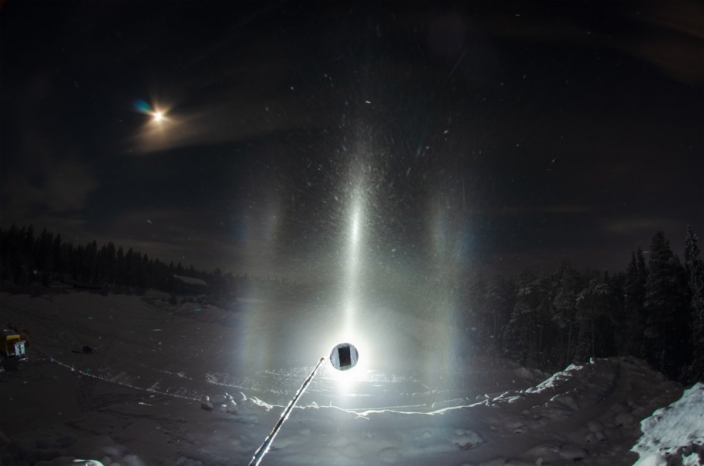

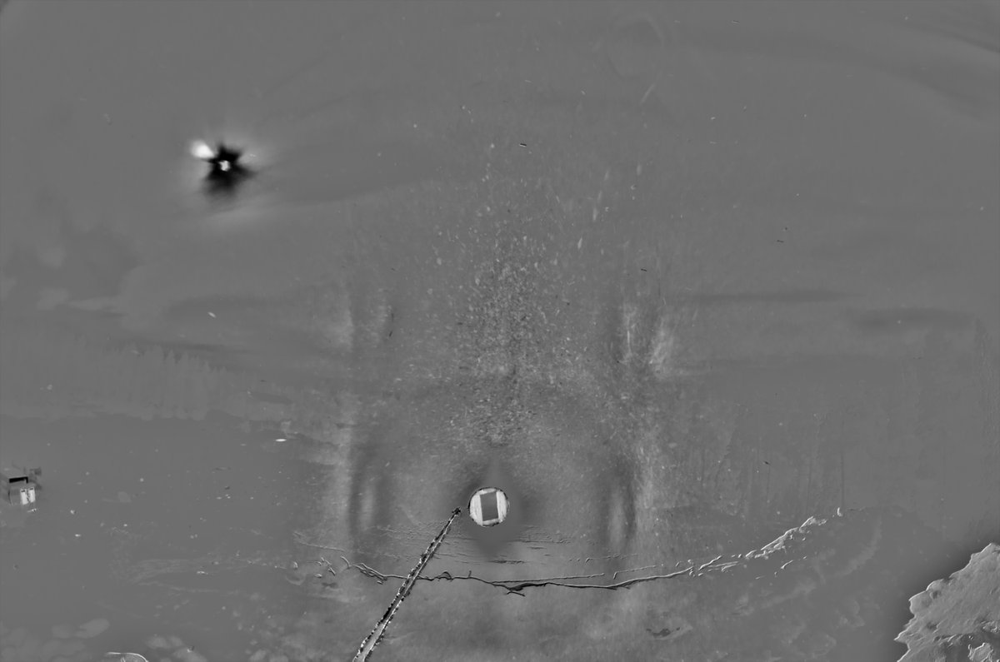

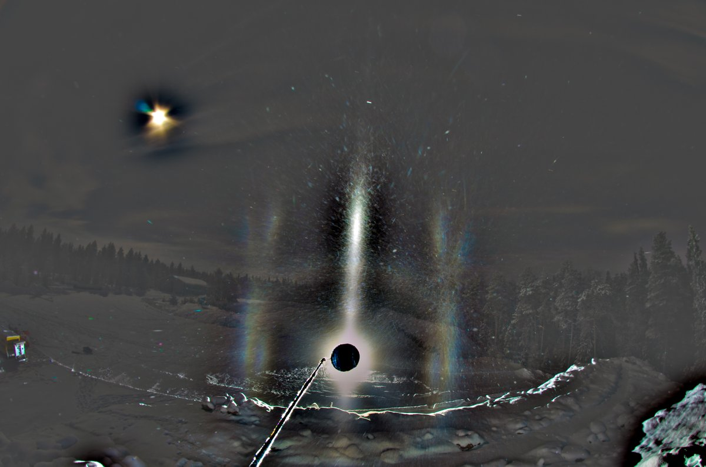

---

### 3/4 - 2026-01-09 11:24 UTC

6/7 Jan 2025, Rovaniemi. Lamp more down, 7 x 30s. The grayscale are b-g and b-r.

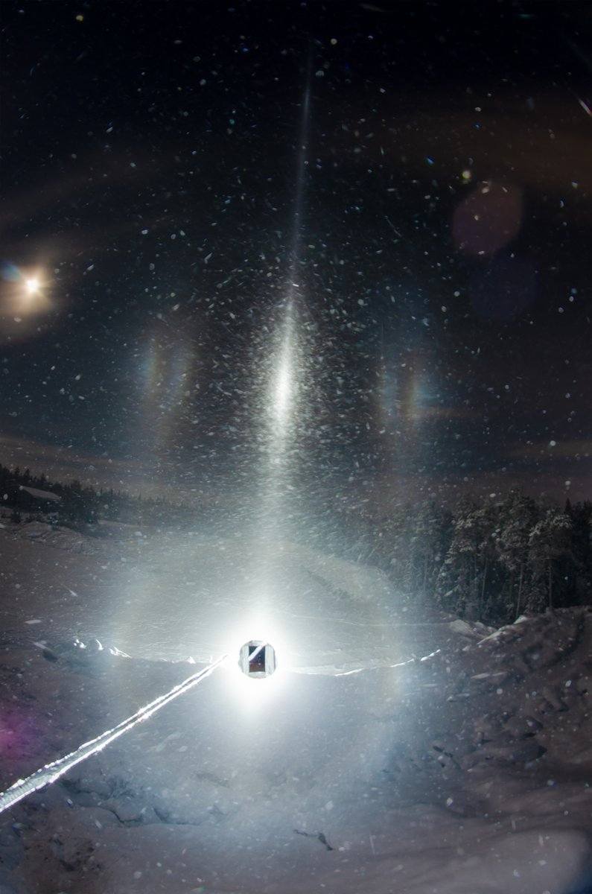

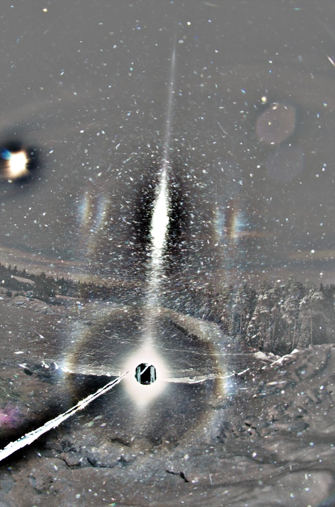

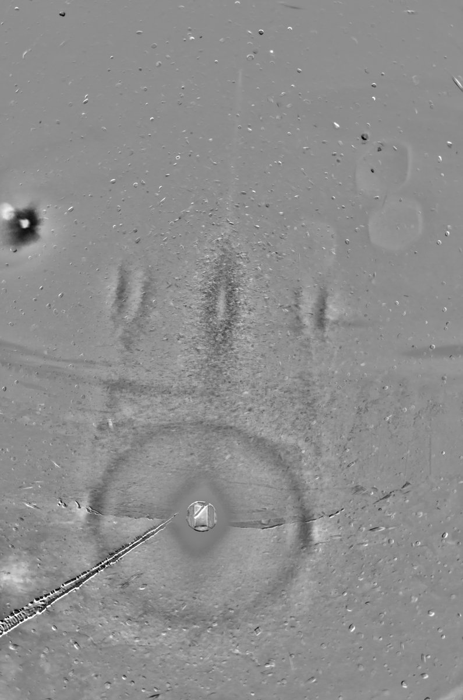

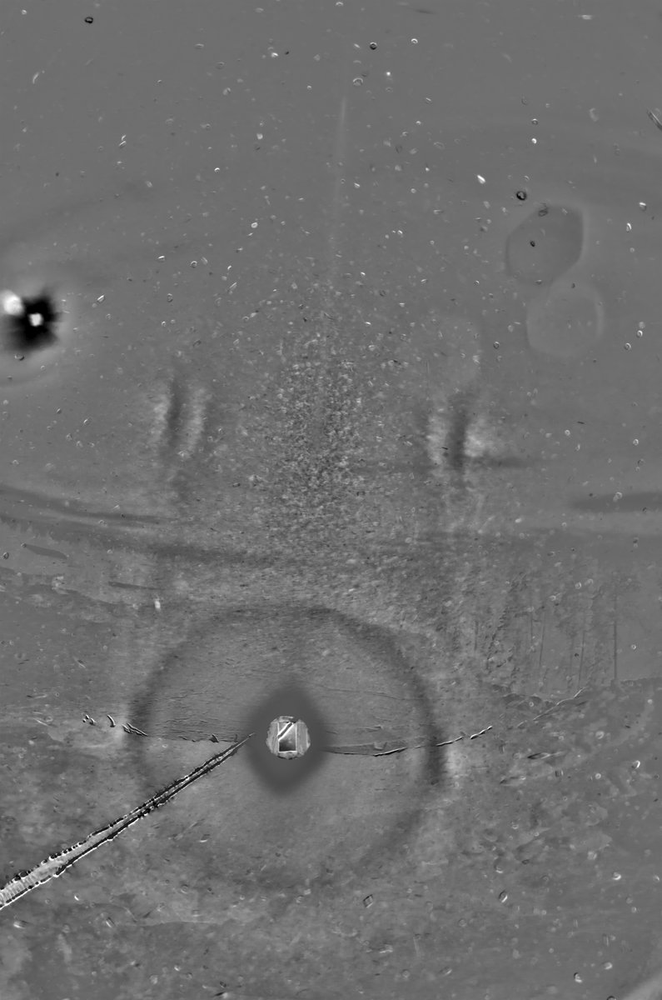

---

### 4/4 - 2026-01-09 12:55 UTC

6/7 Jan 2025, Rovaniemi. 6 x 30s. Do I see here the lower 24° plate arcs? You would most of all expect the upper ones when the light is this far below horizon, but if there is not upper pyramid then they are not formed. Mind you, at this low elevation both the upper and lower 24° plate are of the 3-16 and 23-6 type, not the usual upper and lower arcs that are seen in solar displays.

I sort of botched this one by the changing the set-up two times. But then I wouldn't have liked to stick to the first set of the nearer-horizon elevation. But at this further elevation I should have left the last change undone, from landscape to portrait (this is the second set, previous post has the third and last set).

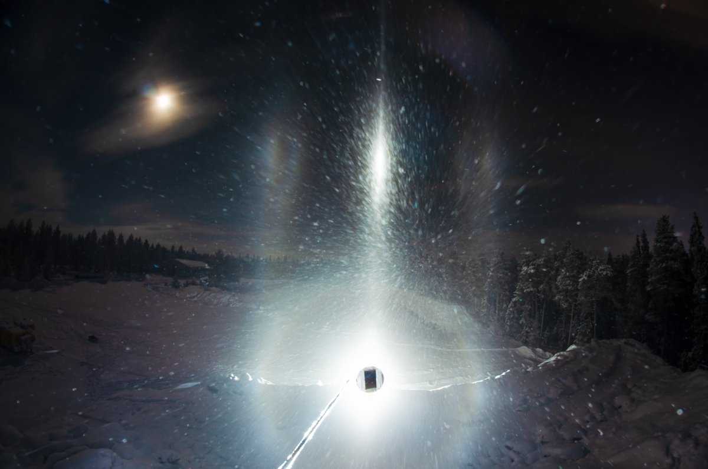

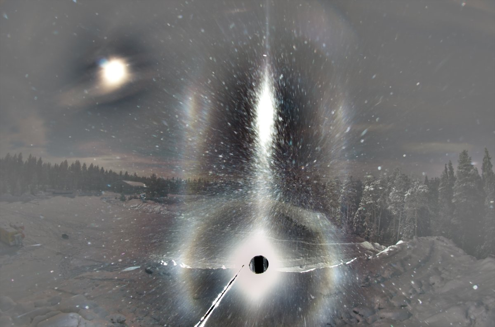

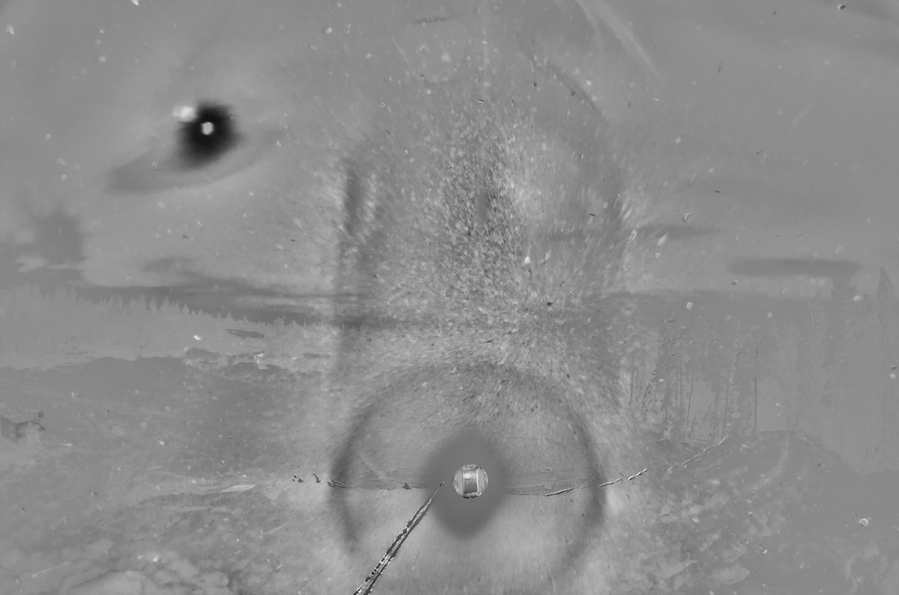

---

