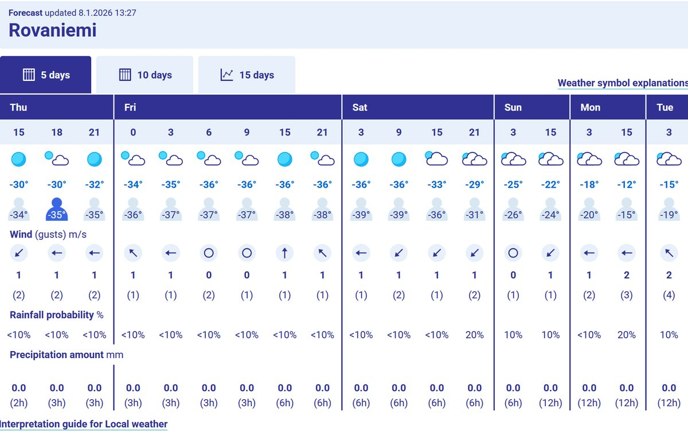
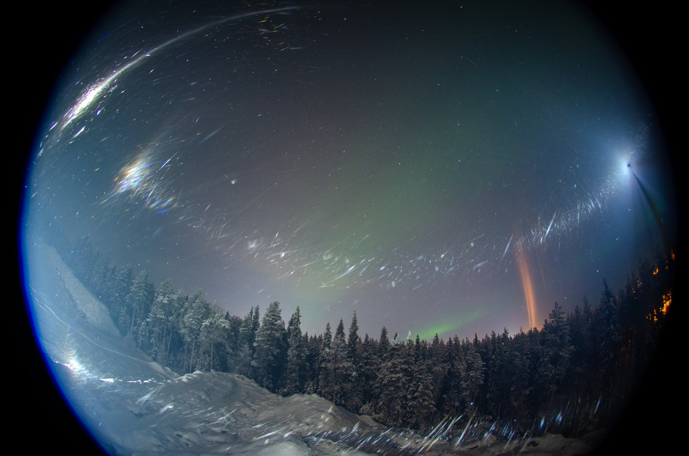
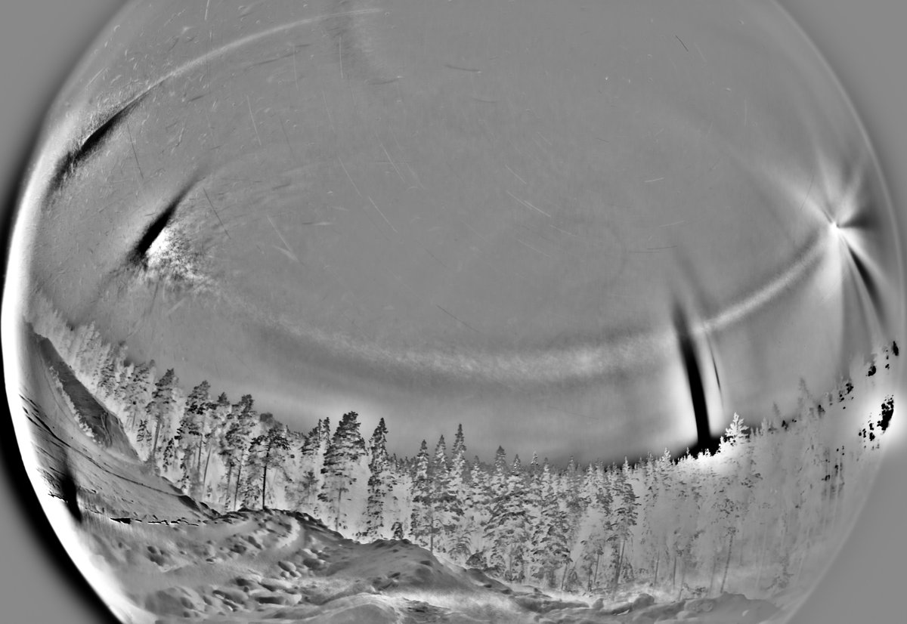
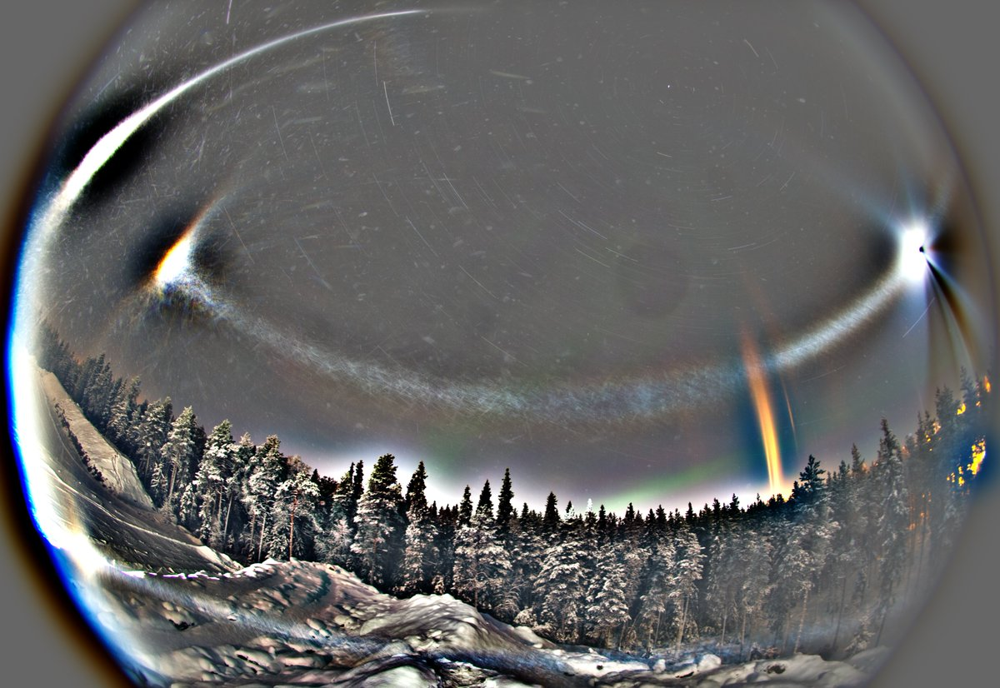
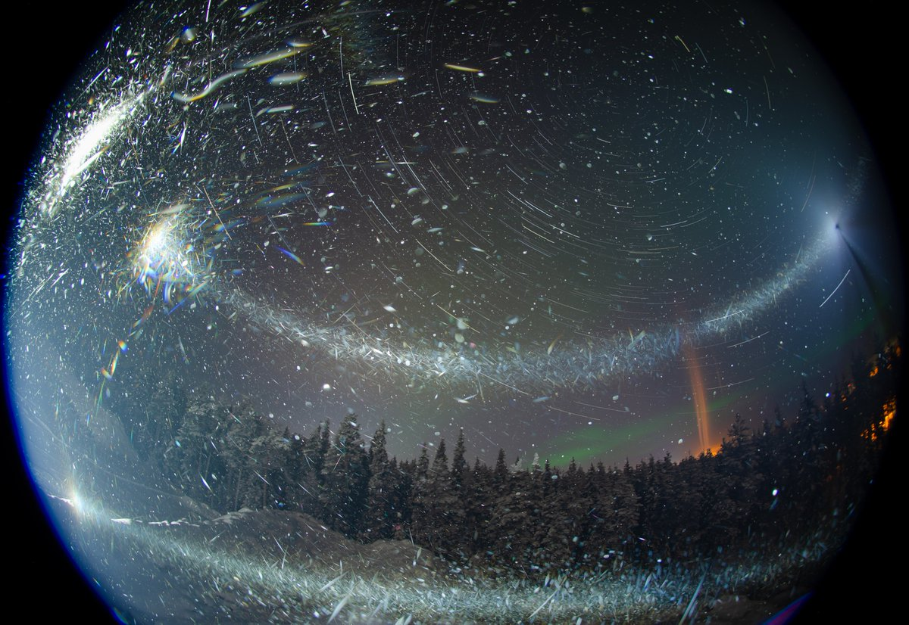
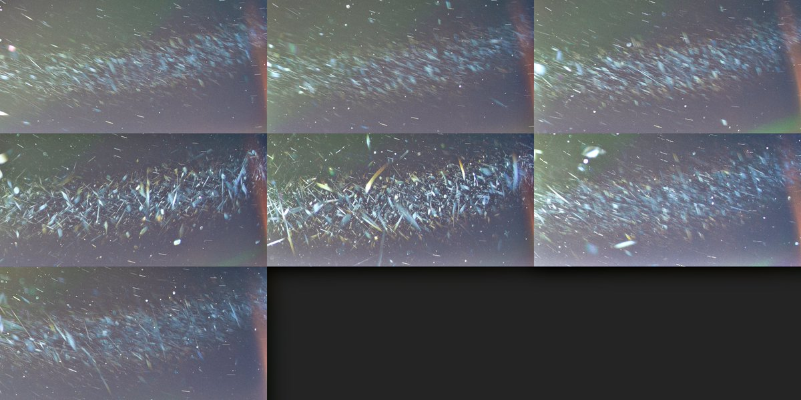
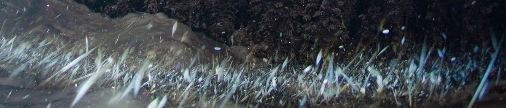
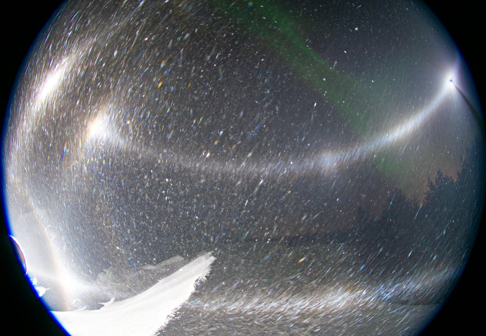
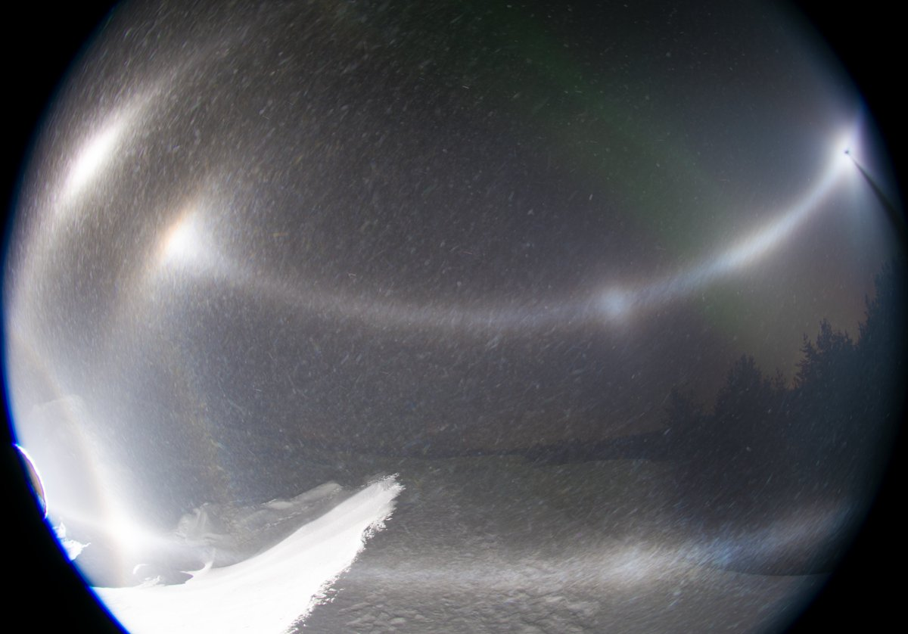

# Thread - 2026-01-08

**Original:** https://x.com/RiikonenMarko/status/2009246975166673279

---

### 1/4 - 2026-01-08 12:53 UTC

7/8 Jan 2026, Rovaniemi. This night I fully adopted a new doctrine of not looking up to be in the thick of the main plumes when it is really cold. So I forwent the gunning and Suosiola plume, and instead settled in upwind direction in the Sierijärvi area in the place of the last night. It had worked good by giving the odd radius display. I'll explain in more detail the new doctrine later.

No odd radii this time, though. There was quite steady, sparse glitter display in big plate crystals and I got a long side-view series for stacking. But maybe the single images, two of which are shown here, will prove more interesting. That's because there are red glints in the parhelic circle far from parhelia. Are these from the colored three-hit parhelic circle raypaths? I have dabbled with the issue earlier https://t.co/JqUI8MWRNF In hindsight, of course it should have occurred to me that it may be possible to see those raypaths also in single crystals in ice fog. Parhelic circle segments from three-hit refraction raypaths are comparable to parhelion tail, which is likewise a white refraction raypath segment.

The night was a bit colder than the last one, temp in my portable thermometer -37 C when broke camp at around 3 am. So it was about 9 hours chase, but actually I was mostly squatting in this one location. In the city it was full-blown ice fog everywhere and great pillars. But I was done for.

Soon it is dark again and gotta be going. The forecast is promising four more nights of action, then the wind pics up.

---

### 2/4 - 2026-01-08 13:09 UTC

7/8 Jan 2026, Rovaniemi. Before I could get going, I had to document this 22 and 46° halo on my car windows. From deposited diamond dust, not frost. I could just wipe the stuff off with a brush. In the side-window 22° halo was visible also in reflected light, will publish that later. This video is of the windscreen and I was not able to see the reflection version in it. Maybe because of the thicker deposition. Or maybe I just didn't check properly, it was weak in the side-window.

[🎬 2009250992471040059-kHmX-ZVINEjOvD8F.mp4](media/2009250992471040059-kHmX-ZVINEjOvD8F.mp4)

---

### 3/4 - 2026-01-28 13:24 UTC

7/8 Jan 2026, Rovaniemi. So the red glints on parhelic circle turned out to be just the common diffraction feature lining this halo – no refraction parhelic circle raypath. Actually, the color is seen better on counterparhelic circle. Shown are versions of the full 80 x 30s stack (bgr, b-r and max). The last image has seven successive 10 frame max stacks of a section of counterparhelic circle.

---

### 4/4 - 2026-01-28 14:08 UTC

7/8 Jan 2026, Rovaniemi. Here is a 10 frame max stack detail of the parhelic circle. 

Of course I should of known. I had this coloring in single crystals already on the night of 4/5 January 2017 in Rovaniemi, as shown by two other images – a single frame and a 10 frame stack. I am not sure if I have published ever this particular view from this night. Couldn't find what I quickly looked.

Eresmaa has a great case showing the red lining in b-r in a high cloud display on 11 June 2024 in Lahti: https://t.co/N6noVwURZm

A huge red surrounding the 120° parhelion on 3 July 2019 in Lieto by Matti Helin: https://t.co/6CaQMQWYgk

On the night of 9/10 January 2026 in Rovaniemi the red lining was visible on the parhelic circle segment inside the parhelia: https://t.co/b1C0FwNnLo

---

