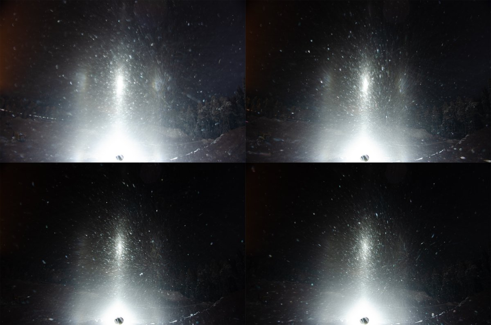
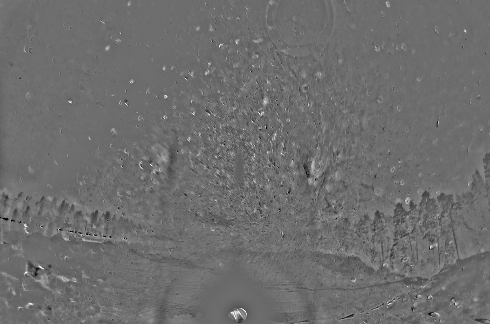
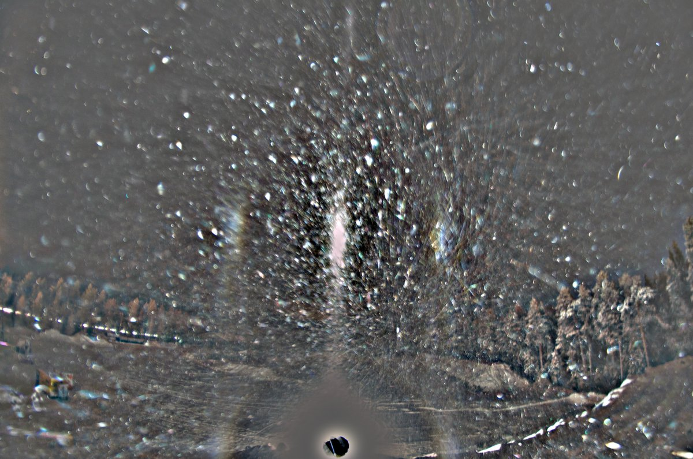
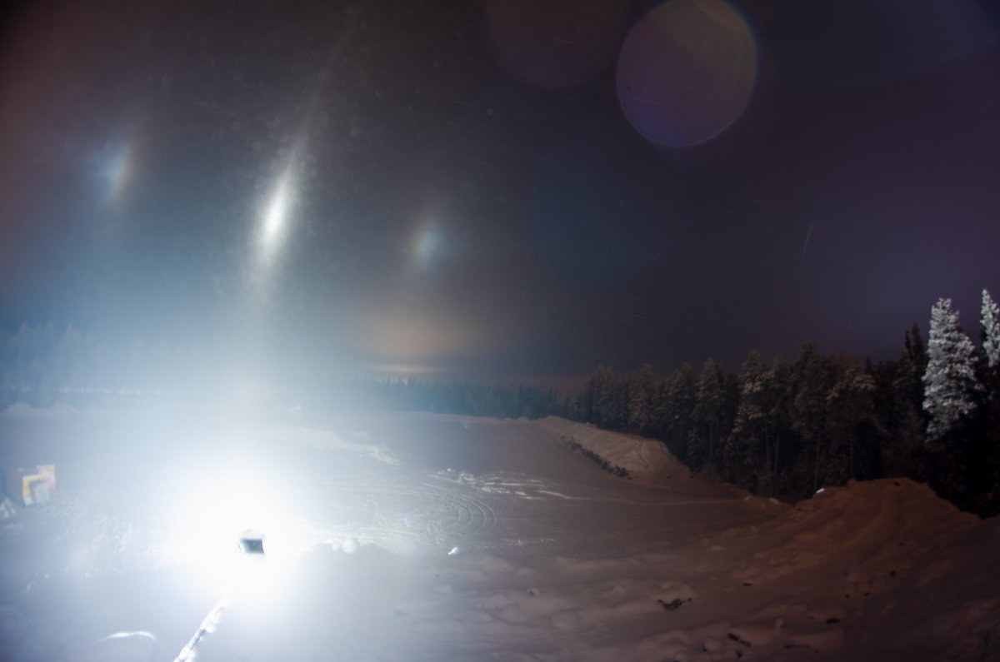

# Thread - 2026-01-09

**Original:** https://x.com/RiikonenMarko/status/2009567761249280461

---

### 1/1 - 2026-01-09 10:07 UTC

8/9 Jan 2026, Rovaniemi. TLHS. Would have been interesting as there seem to be Liljequist arcs between parhelia and flip-parhelia, but it was decline from the first shot on, as shown by the 4 image collage of successive frames.

A bit later it was again bit better, but no Lilje arcs (last image). Then a thin fog layer settled maybe only some 20 meters or so above the ground and it crapped totally. I had arrived at 5 pm and waited until 1 am, but the fog and its lunar corona remained, so I called it a night. Even in the city no pillars were seen. At 3 am when I was ready to sleep the corona was still there.

-37 C in my portable thermometer at the location (the same as the previous night near Sierijärvi) but I think it gives two or so degrees too low temps. When the fog layer came it warmed up some. Right now sun is up and Apukka is at -37 C. Another cold night ahead, then, hopefully with better results.

---

