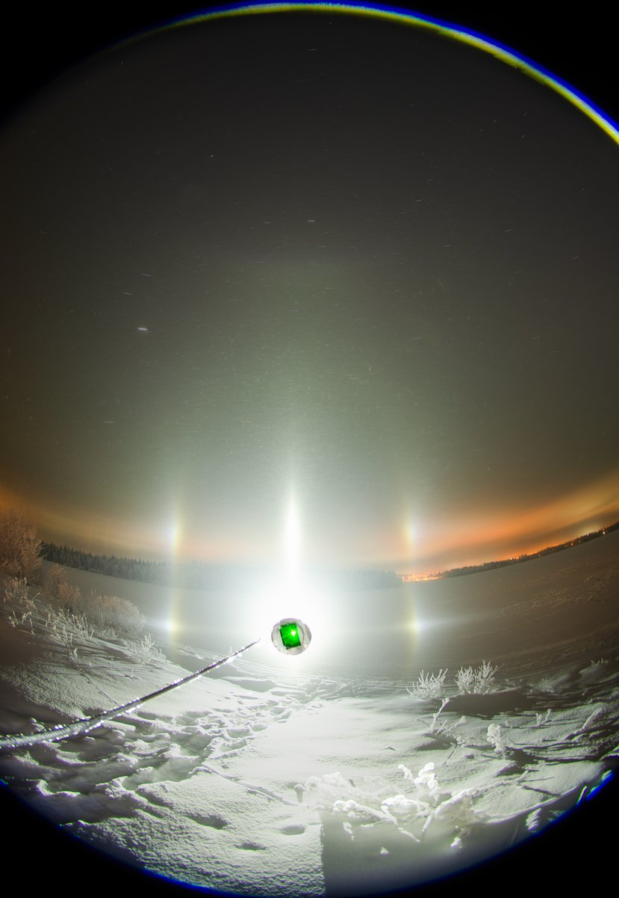
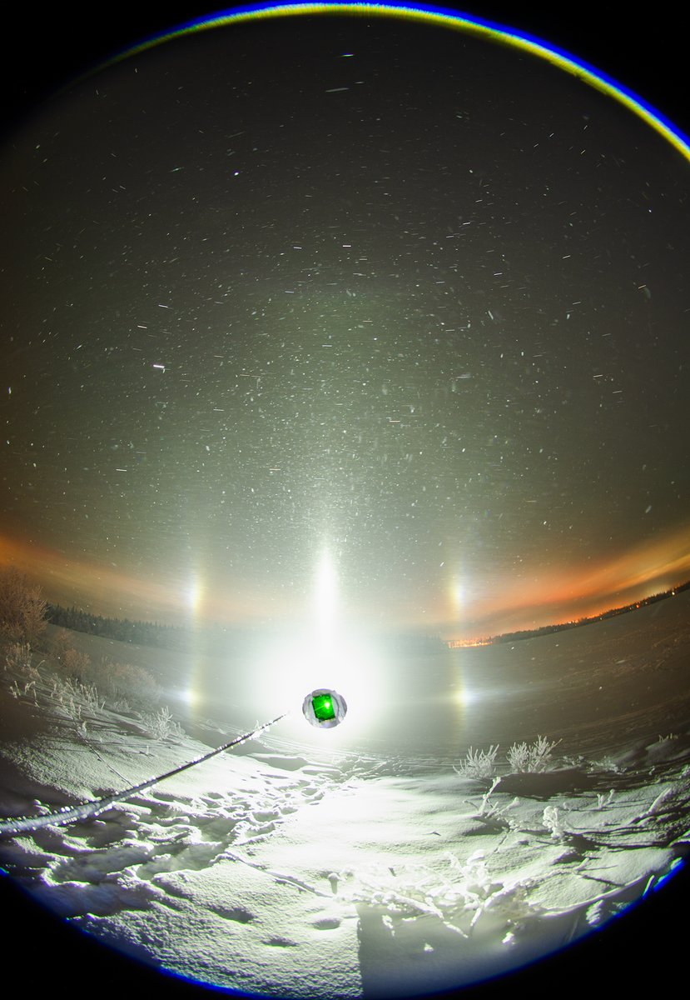
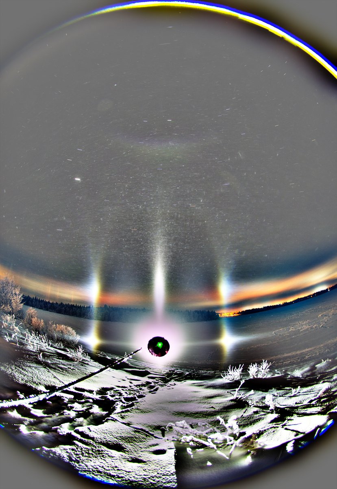
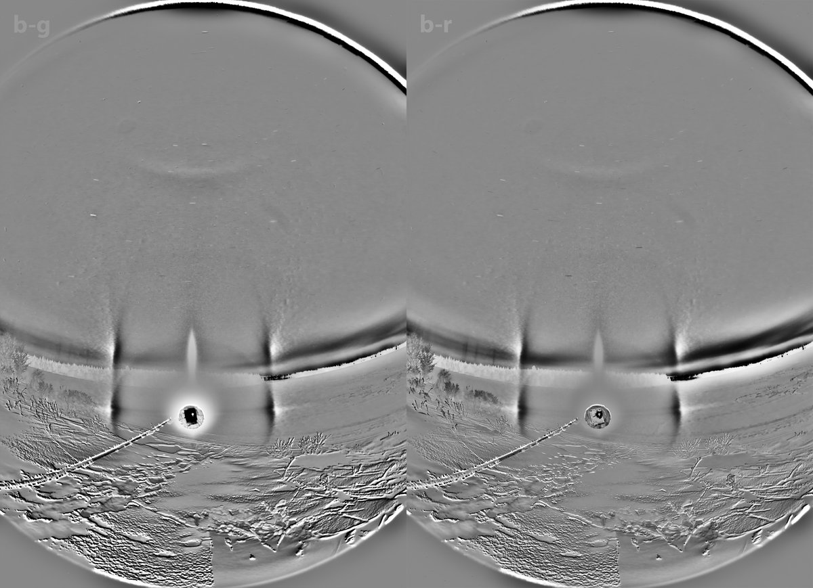

# Thread - 2026-01-11

**Original:** https://x.com/RiikonenMarko/status/2010311933405147422

---

### 1/1 - 2026-01-11 11:24 UTC

10/11 Jan 2026, Rovaniemi. Saddled up around 6 pm, driving around. Suosiola plume made ice fog in the industrial area and some parhelia were visible on outdoor lights. But Anttilanvaara was no more in the plume. After waiting for some time I continued patrolling. Drove again through the Suosiola plume. No more parhelia, instead experienced the thickest ice fog I have been in. Visibility was really restricted in a small core part of the plume, so thick that on the main highway it would have required to reduce speed.

Snow gun plume seemed to be going to Toramo pit direction but these days you can't photograph there because it is full of aurora watchers. And it is anyway flat ground there, which I am not so excited about anymore. But on the periphery at the east end of lake Salmijärvi I got this short lived plate on Acebeam L19, 13 x 30s stack. Big crystals. Of the greyscale versions, b-g is rather better than b-r. The parhelic circle has red edges.

Didn't feel like waiting for things to get better and at 1 am headed back to apartment – I had slept only 2.5 after the previous night. On the way back, Suosiola plume was still coming down in the same spot in the indistrial area, but now it had turned into snowfall. There was an accumulation of thin powdery snow on the ground.

Coming night is the last <-30 C night. Then it doesn't look so good anymore, more wind and more precipitation probability. Gotta get that Gaffer tape today, the only shop that sells it in Rovaniemi was already closed yesterday when I was about go. As an interim solution I used last night duct tape to cover the crocodile clip metal.

---

