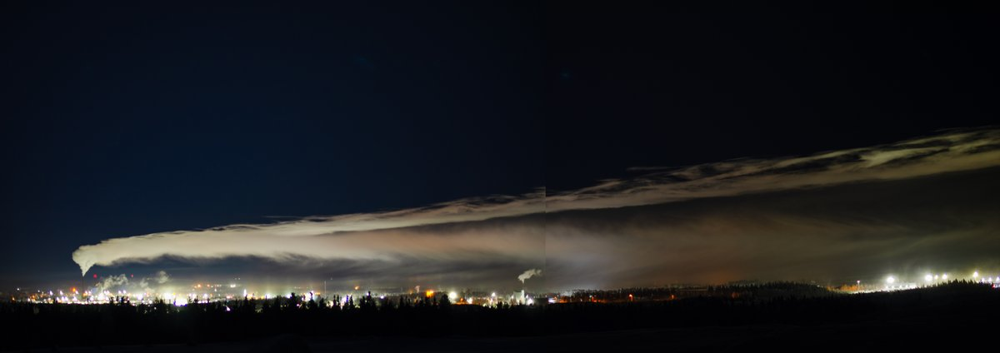
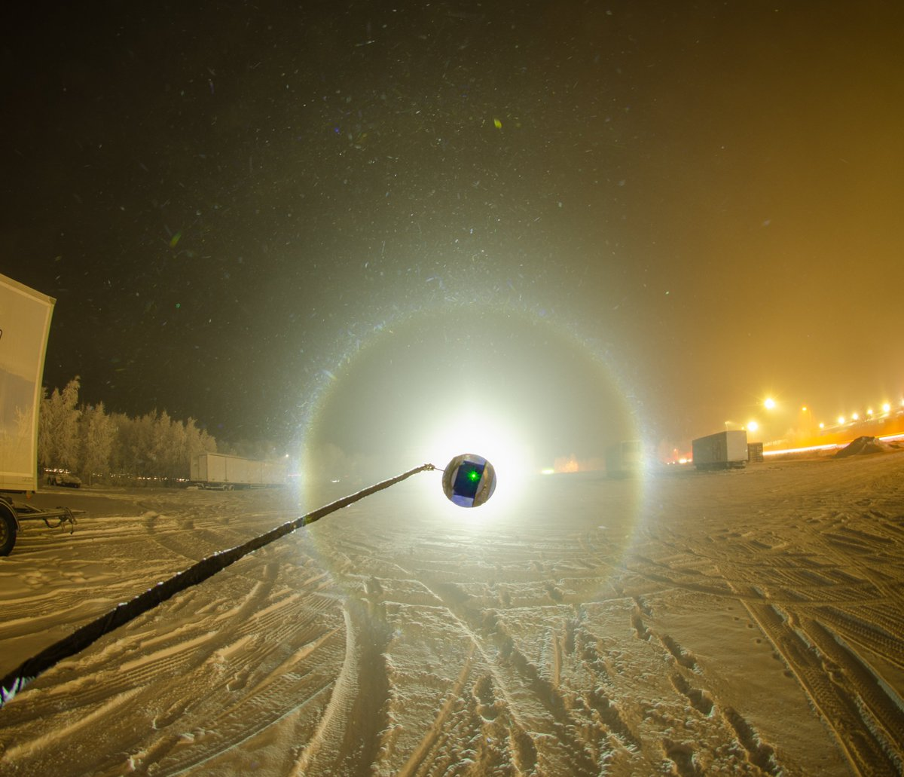
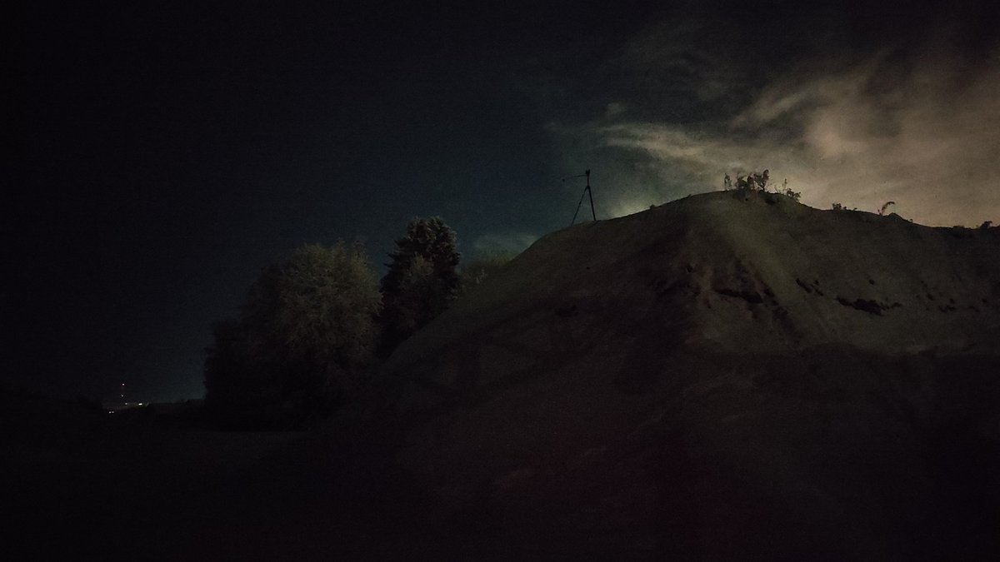
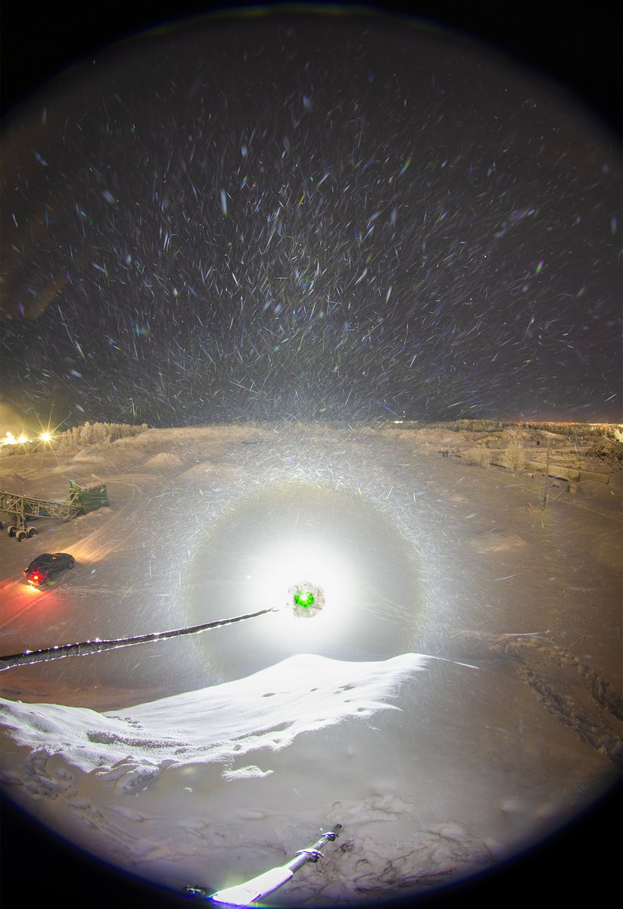
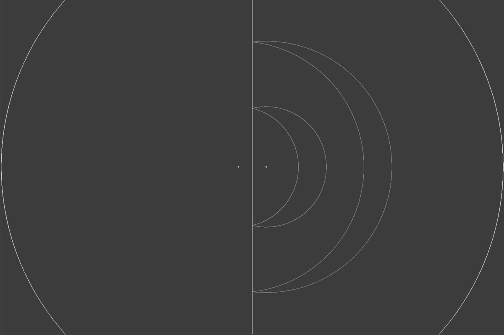

# Thread - 2026-01-12

**Original:** https://x.com/RiikonenMarko/status/2010704434351759548

---

### 1/5 - 2026-01-12 13:24 UTC

11/12 Jan 2026, Rovaniemi. Last night pressure air was not on, so was on the mercy of the Suosiola plume. And it was not good. First of all the plume was dropping its load on the same exact area as the previous night (also in daytime on 11th when I drove through the area), the Post terminal area, which is heavily light polluted. And second, the material was not that good.

I hit the road 5 pm and waited in Anttilanvaara (1.5 km from Post terminal) for the plume to shift, but it was forlorn hope, the plume's bearing was super-steady. A photo of the plume is shown from Anttilanvaara. It had this two pronged structure, the lower smoother stuff is the ice fog. At this particular moment, however, it was not making any heavy landing, Post terminal lights are on the right.

At one point I took photos in the Post terminal area (max stack provided, video in the next post) and later on moved to the landfill site on road Betonitie, which is not as good as Anttilanvaara but was closer to the action. There was sparse ice fog but the core never came over – it was frustrating to watch streetlights being in full ice fog just 300 meters away. Then again, as hardly even pillars were visible, I didn't miss anything.

At the Post terminal I took also photos and video of 22° halo in the windshield from the deposited ice fog, will publish later. I documented it both in transmitted light and reflected light. Quite some difference. This should help us to judge better in bigger displays from oriented crystals whether a halo is, in a situation where the observer and the lamp are on the same side of the glass, from direct lamp light or reflected light. For example, whether the parhelia are to be understood either as flip-parhelia or parhelia, respectively.

This Betonitie place itself is better than before, the earthen mound (photo shown) is higher now and has quite steep slopes, on one side maybe even so steep as to try horizon arc. But it was also steaming from two holes in the snow. This made it impossible to photograph when the little breeze calmed down and the moisture clouds started coming up instead of going horizontally under the camera.

At 3 am I decided it was enough. The night had been basically just hours of waiting. Upon leaving temp in Apukka -35 C, railway station -30 C.

---

### 2/5 - 2026-01-12 13:26 UTC

11/12 Jan 2026, Rovaniemi. The display in the Post terminal.

[🎬 2010704926997922146-mUsjTihVysAYmb_z.mp4](media/2010704926997922146-mUsjTihVysAYmb_z.mp4)

---

### 3/5 - 2026-01-12 21:11 UTC

11/12 Jan 2026, Rovaniemi. Short max stack from the top of the earthen mound on Betonitie. There was a little breeze and the exhalations from the mound's innards were not a problem yet.

---

### 4/5 - 2026-01-31 16:44 UTC

11/12 Jan 2026, Rovaniemi. Here is the transmitted vs. reflection view 22° halo I promised in the opening post. The details of the operation are already murky, but judging by the video, I must have all the time had the lamp in the other hand, first holding it on the opposite side of the screen, then on the same side (these operations would be so much easier with a colleague).

This shows that lamp reflection from the windscreen is weak. So when you have in a reflection view the parhelia, they are more contributed by direct rays from the lamp than by reflected rays from the glass. In other words, they are rather counterparhelia of the lamp than parhelia of the glass-reflected light. Same with helic arc vs counterhelic arc, etc.

Of course the angle of incidence affects the reflection intensity. Once the opportunity presents itself again, I try to take low incidence angle shot of the reflection view. Such a shot should have simultaneously visible the 22° halo (or 46° halo for that matter) from reflection and direct light as separate entities.

[🎬 2017640219671998720-Ket5FDXIOTbKJmY5.mp4](media/2017640219671998720-Ket5FDXIOTbKJmY5.mp4)

---

### 5/5 - 2026-01-31 16:47 UTC

11/12 Jan 2026, Rovaniemi. The reflected and direct light 22 and 46° halos at light elevation of 5 degrees.

---

