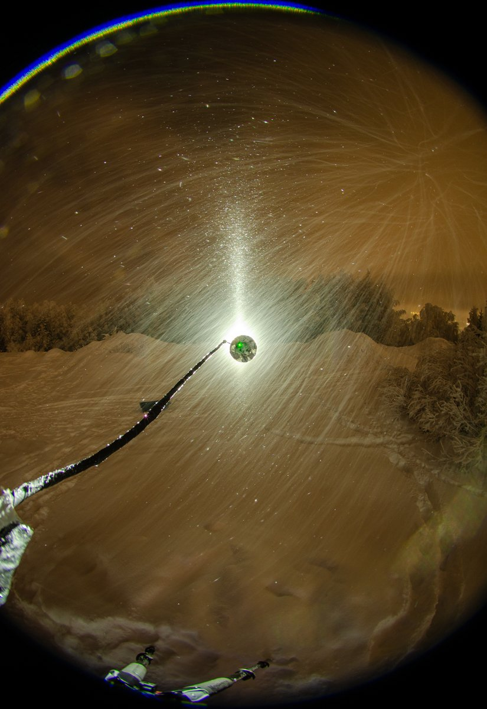
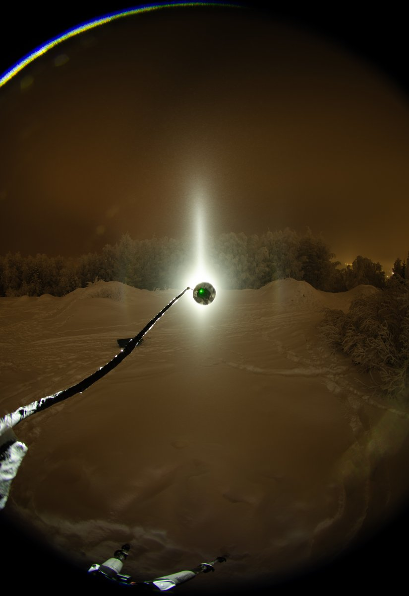
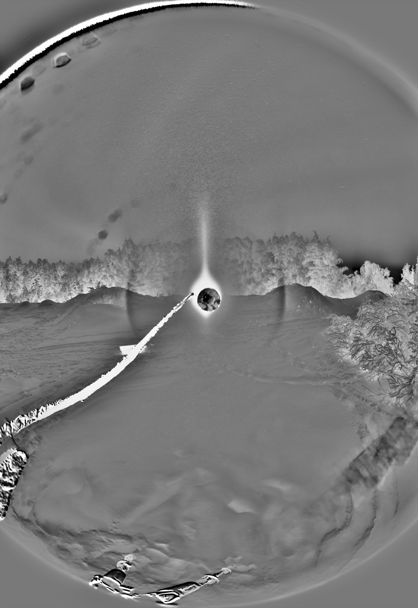
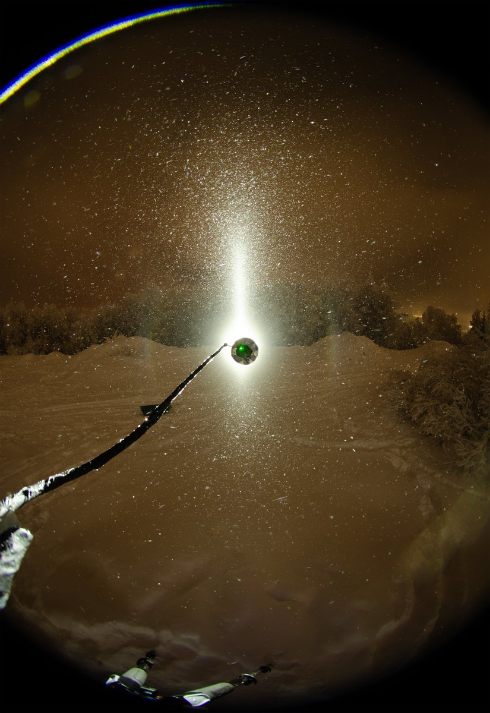

# Thread - 2026-01-12

**Original:** https://x.com/RiikonenMarko/status/2010836071282512175

---

### 1/1 - 2026-01-12 22:07 UTC

12/13 Jan 2026, Rovaniemi. Pressure air is back in pipes and in the daytime large areas were enveloped in ice fog. After dark it started to snow but the display endured quite well at first. The display was not much to go by, though, as shown by the images, which are 100 x 8s ave (natural and b-g), 12 x 8s max and a single frame. The single frame is from the heaviest snowfall, the stage of which is not included in the stack.

Photos are taken in the little bike park in Korkalovaara, a location where I have previously photographed halos only in summer. It is not a good location, trees are too close.

The blocker is covered with gaffer tape now. No lens reflection anymore from the crocodile jaws (at the lower left corner) or any other part. Temp about -20 C. It felt warm.

Increasing snowing killed the ice fog completely, pillars disappearing from the sky. So it was a quick in and out this time, was back at the apartment already around 7 pm. No need for another round, looks like it's gonna snow all night.

---

