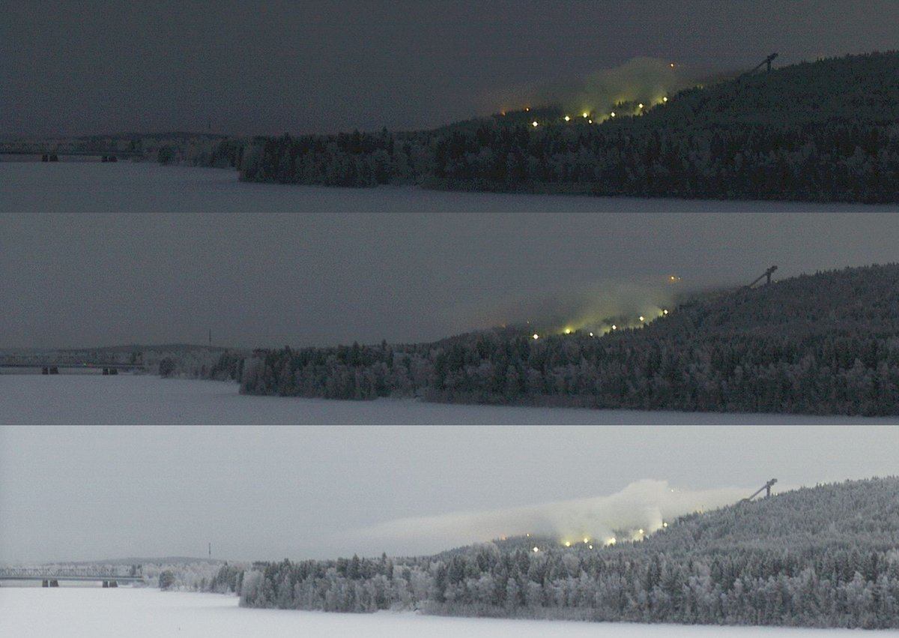
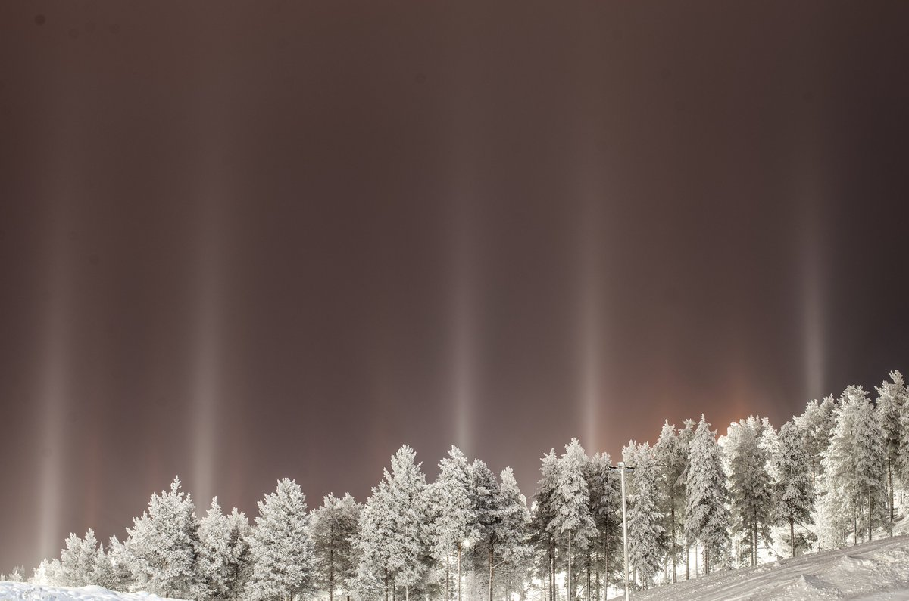
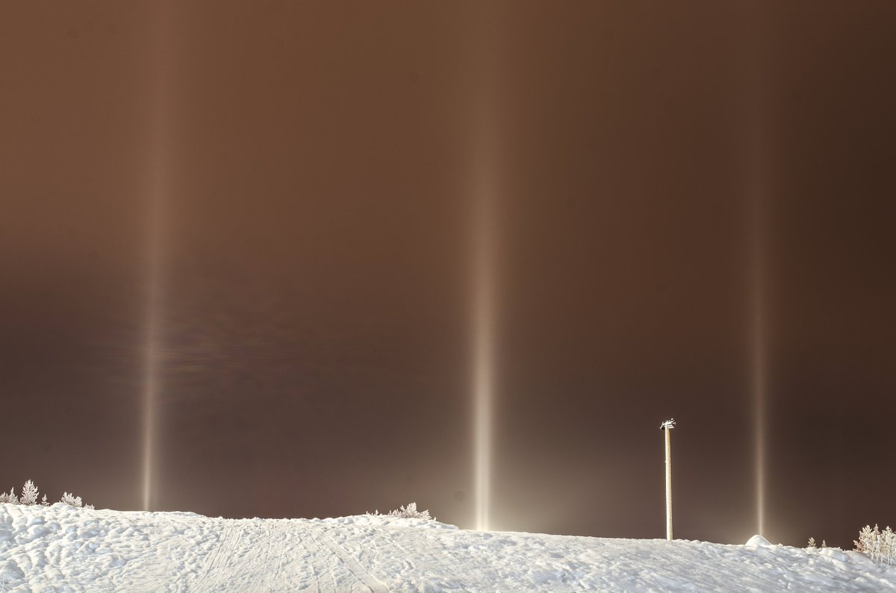

# Thread - 2026-01-13

**Original:** https://x.com/RiikonenMarko/status/2011135960696652069

---

### 1/1 - 2026-01-13 17:59 UTC

13/14 Jan 2026, Rovaniemi. The wind has calmed down but it's snowing at -13 C. Made a visit to the ski center and was surprised to find snow guns not running. Nevertheless, pillars were created in the slopes' lights from the snowfall.

So does this mark the end of the ice fog period which started on 30/31 Dec 2025 night? I was chasing every night except for 5/6 Jan when I slept, not being alert to the snowing stopping and skies clearing at 3am. Most likely there was ice fog also that night. At least at dawn on the 6th it looks very much so in the Koivusaari camera shots, three of which are provided here for 0940, 0950 and 1010 (sunrise at 1047). If that is accepted as evidence, then we can enter a note of record of 13 nights straight of diamond dust in Rovaniemi.

---

