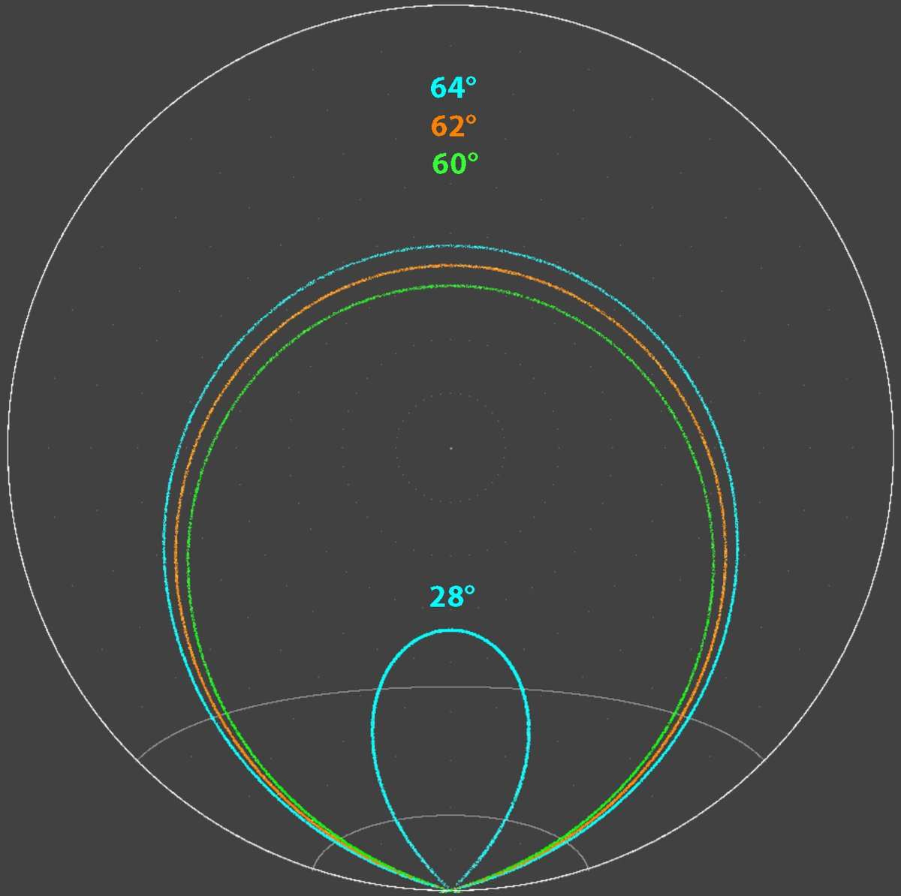
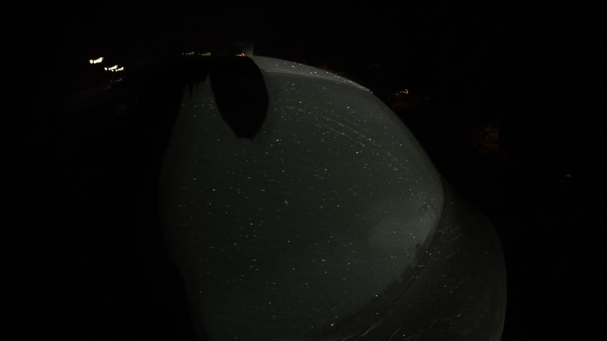
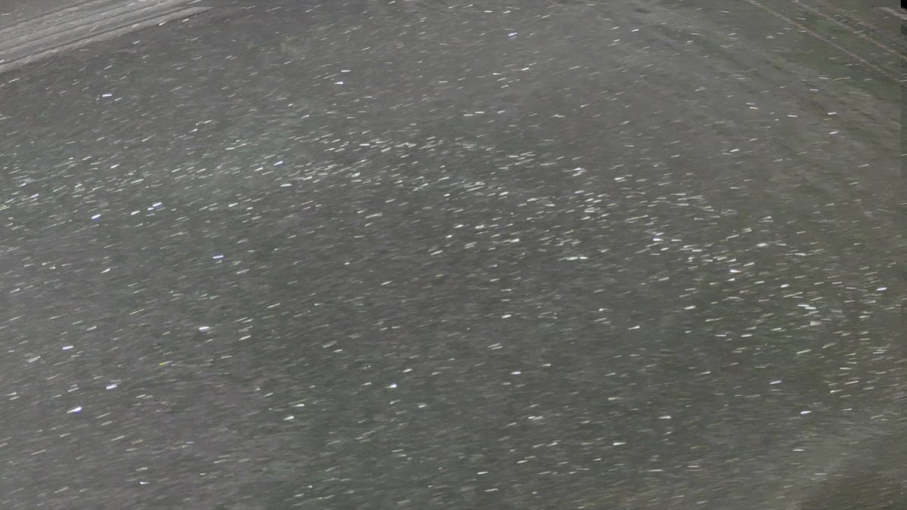
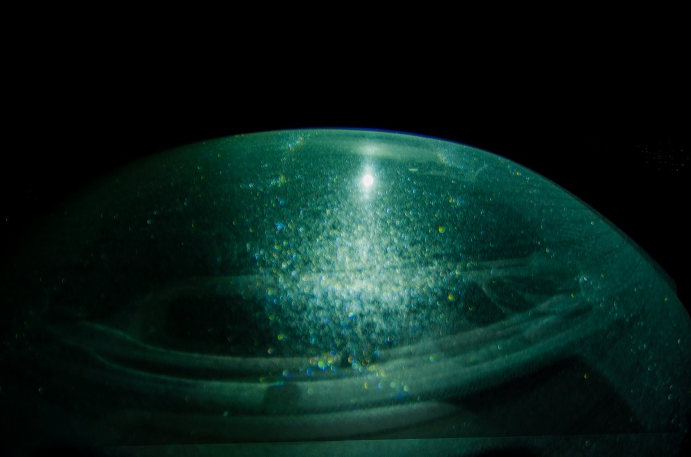
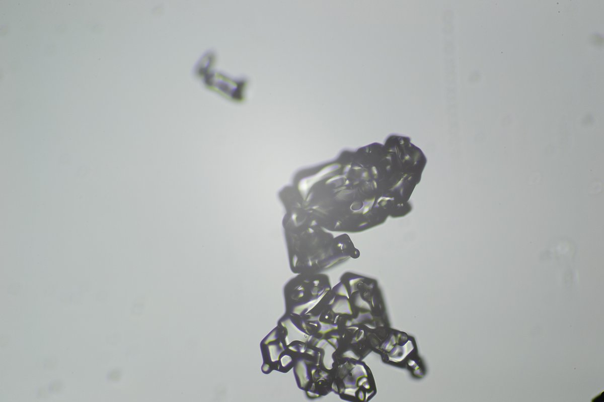
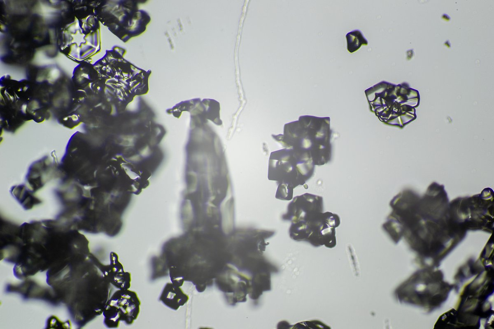
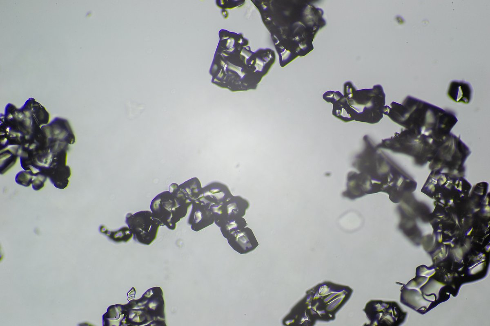

# Thread - 2026-01-18

**Original:** https://x.com/RiikonenMarko/status/2013004079962734704

---

### 1/17 - 2026-01-18 21:42 UTC

17/18 Jan 2026, Rovaniemi. It's foggy, perfect temps but the guns are not on. Demoralizes the halo man. But now I think I should be happy about that. Because it allowed to catch an interesting display on my car back window.

So are we at last having a car window odd radius display? I can't quite else explain those hooks – they must be 24° plate arcs. And am I seeing something 9°-like on the sides of the lamp? So is this odd radius plate arc or odd radius Parry arc display? Or both? Something 20°-like would seem to be above the lamp when I am shooting from inside the car.

There was also a tripled white arc. First it was only doubled, but intensified as I photographed and became tripled.

I had to come inside to charge both my phone and the Armytek flood flashlight. But the display is going nowhere and the night is long. The front window was not well frosted because I had been driving in the daytime, but maybe it will grow a good frost as night progresses.

What to look on the second round? 23° arc / Parry I have already documented, but I didn't notice 35° arcs. Gotta pay more attention also to that possible 20°.

A note to self: scrape off those window defogger lines. And I should use the camera only outside the car because windows will fog even if I am holding breath while inside.

[🎬 2013004079962734704-1D_swzhYfkarkVmZ.mp4](media/2013004079962734704-1D_swzhYfkarkVmZ.mp4)

---

### 2/17 - 2026-01-19 11:15 UTC

18/19 Jan 2026, Rovaniemi. First, let's note that the starting post's date 17/18 is wrong, should be 18/19.

So after having charged the phone, on the second round I was able to cajole more stuff confidently into view. On this video (0:40) the 9 and 20° plate arc stand out good together with the 24° arc. A little bit of something also on the sides at 9 degrees. 

At the beginning the focus is on the tripled white arc seen in configuration where the observer and the lamp are on the same side of the glass. The center arc is flanked on both sides by a fainter arc. Somewhat suffered on video, visually the tripe-form was striking, getting better over the hours with the glass frosting more. It seemed to continue to the lamp, so we are talking about either parhelic circle or helic arc. I'd say it is rather the latter because in another configuration it was crossing the parhelic circle from the reflected lamp image. If so, are we then having here both the 60° or 62° types (normal or pyramid)? But what about the remaining arc? 64° helic arc from Parry pyramids? In the next post a simulation clarifies the issue. 

The original quality video: https://t.co/q1RJjNZMp0

I have a singly occurring 60° helic arc documented on a windshield display two winters back, on the night of 19/20 January 2024. Will make a post at some point. There are also many more videos of the triple helic arc, hopefully in some of them the feature is seen more clearly.

[🎬 2013208739256455254-p67uf_rL7JjZUira.mp4](media/2013208739256455254-p67uf_rL7JjZUira.mp4)

---

### 3/17 - 2026-01-19 11:21 UTC

18/19 Jan 2026, Rovaniemi. A simulation showing the triple helic arc. Parry oriented pyramid faces make also another helic arc, of 28° type. Too bad I did not have the presence of the mind to understand at the heat of the situation what I was looking at. It only came to me today when writing the above post.

---

### 4/17 - 2026-01-19 22:17 UTC

18/19 Jan 2026, Rovaniemi. Another video of the triple helic arc. This is one of the first session's videos, at the beginning of which I perceived it only as two arcs. That's how it looks here, too, but at the end of the video the tripled arc can perhaps be sensed. At the end also another white arc is coming at and angle to the helic arcs. This is the parhelic circle of the lamp reflection.

Should go pro and get some matte black blanket to cover the insides of the car. 

Original: https://t.co/yFwPkroKIo

[🎬 2013375299203817719-e12ZsTNi4CwLEKZY.mp4](media/2013375299203817719-e12ZsTNi4CwLEKZY.mp4)

---

### 5/17 - 2026-01-19 23:23 UTC

18/19 Jan 2026, Rovaniemi. This video has 35° arcs in addition to 20° and 24° arcs. Looks like there is also a weak Tape arc.

Original: https://drive.google.com/file/d/1MXj5CpPBLsgxTO8_92TtU1B42RDmaOde/view?usp=sharing

[🎬 2013392021080179088-P6AiQ6yU_iriBsLd.mp4](media/2013392021080179088-P6AiQ6yU_iriBsLd.mp4)

---

### 6/17 - 2026-01-19 23:35 UTC

18/19 Jan 2026, Rovaniemi. Both upper and lower 24° arcs are visible. Helic arc coming up from the lamp outside the parhelia.

Original: https://drive.google.com/file/d/10mX5HwmsZBf7aI2LctvTv-uJR0KTdiKU/view?usp=sharing

[🎬 2013395039230071015-YjUpejhZknN9y-1v.mp4](media/2013395039230071015-YjUpejhZknN9y-1v.mp4)

---

### 7/17 - 2026-01-20 01:26 UTC

18/19 Jan 2026, Rovaniemi. Oh well, I had taken so much video of the odd radius plate arcs and so little of the most important thing, the triple helic arc. Somebody send a halo expert to Rovaniemi to do things properly!

With Nikon D7000 I didn't do the triple helic arc much because the video came either too dark or too light. This is due to the limited video options the camera offers (should have probably used my Canon 80D). I gave the attempts up short, like with the video shown here.

But I should have just continued. Even if the video is dark, it is not that bad – the triple structure can be sensed there. Would have been good material for stacking had I given it more time.

No can do but to work with what little there is. I extracted the frames and managed to stack 10 of them. To my surprise the triple structure emerged in it vaguely (or at least I like to think so), as shown in the next post.

Original: https://t.co/UhlXz8SJj9

[🎬 2013422900947145147-TTldiAvtxP7m1sun.mp4](media/2013422900947145147-TTldiAvtxP7m1sun.mp4)

---

### 8/17 - 2026-01-20 01:35 UTC

18/19 Jan 2026, Rovaniemi. 10 frame stack of the above video, showing vaguely the three helic arcs. The lighter image is an attempt at a stack from the phone camera video frames. It is not quite as good.

---

### 9/17 - 2026-01-20 19:38 UTC

18/19 Jan 2026, Rovaniemi. Here the light is at a quite steep angle to the rear window. 23 plate + Parry arc combo, both shallowcave and deepcave, are seen. Also 24° plate arcs come into view when the camera is at the left extreme, the deepcave arc in turn disappearing. Horizon arc is visible in the upper right corner. 

Original: https://t.co/7APW5dSHGs

[🎬 2013697721161351212-r-WVew0vvGavqncq.mp4](media/2013697721161351212-r-WVew0vvGavqncq.mp4)

---

### 10/17 - 2026-01-20 20:29 UTC

18/19 Jan 2026, Rovaniemi. Looks like deepcave is better than shallowcave when the lamp is outside and camera inside. This should tell something about the crystal shapes & how they are attached, but it's complicated by both Parry and 23° plate contribution. Compare with the previous video.

 Original: https://t.co/EylyXkmTOD

[🎬 2013710483669283213-gXDQoB4l0PKjUi1f.mp4](media/2013710483669283213-gXDQoB4l0PKjUi1f.mp4)

---

### 11/17 - 2026-01-20 21:13 UTC

18/19 Jan 2026, Rovaniemi. Two helic arcs, the outer one being the stronger. I believe it is the plate pyramid one, which makes the inner one the normal helic arc. This is the first session during which I could see only two arcs at first, towards the end the third arc appeared. The arc crossing at an angle to the helic arcs is parhelic circle of the lamp reflection.

Should this kind of display ever repeat, I have learned the lesson now. 1) just like is done here, use spotlight placed far away, not divergent headlamp nearby. The display distorts less less as you move the camera and makes for easier stacking. 2) stacking is also helped by keeping distance to window –  the view will be smaller but the halos more compressed. 3) use a camera that has better video. 4) if the camera video is bad, take photos, particularly if you aim to stack.

Original: https://t.co/oDo0NuYGz0

[🎬 2013721492647801310-WCHxYHZUNb47oB8E.mp4](media/2013721492647801310-WCHxYHZUNb47oB8E.mp4)

---

### 12/17 - 2026-01-21 07:30 UTC

18/19 Jan 2026, Rovaniemi. Two frame ave stack from the few photos I took. Visible are 9, 24 and 23° plate arcs, parhelia, zenith arc and Tape arc. The D7000 photos are much more better quality compared to its video, which has really poor dynamic range. In the future displays I'll put more effort on taking photos.

Given the third helic arc which I presume to be from Parry oriented pyramids, it is interesting how "rare" the 9° Parry arcs are in the videos. They are visible in the video of the starting post of this thread, but in most videos I don't see them. Then again I don't see 9° plate arc in many videos even if I see 24° arcs. As to the other odd radius Parry arcs, some of them mix up with plate arc, but I would still like to see something more than the 9° arcs and the helic arc.

---

### 13/17 - 2026-01-21 07:54 UTC

18/19 Jan 2026, Rovaniemi. Another video from the phone showing the odd radius Parry arc. Tape arc on the right.  

Original: https://drive.google.com/file/d/1IgJgEGyP1R0l8pSqJXdzoolMZYM2e_kH/view?usp=drive_link

[🎬 2013882922130968721-1mlWy42j6QRnscmA.mp4](media/2013882922130968721-1mlWy42j6QRnscmA.mp4)

---

### 14/17 - 2026-01-21 09:00 UTC

18/19 Jan 2026, Rovaniemi. I had overlooked this video which I think is the best one showing the three helic arcs. Tried stacking but it was hard.

But I definitely have to get some black stuff to cover the insides of the car. The large black trash bags reflect too much. I think I'll visit a second hand store to look for some black fabric.  

Original: https://t.co/JicGpseiWJ

[🎬 2013899420283118048-dZsVlRLeQMH-Z4E0.mp4](media/2013899420283118048-dZsVlRLeQMH-Z4E0.mp4)

---

### 15/17 - 2026-01-21 21:22 UTC

18/19 Jan 2026, Rovaniemi. 9°,  20°, 24° and 35° arcs and also Tape arc.

Original: https://drive.google.com/file/d/1NbY2Ur3ZXO3WfCWIMAcKRV_h3t7JTK47/view?usp=drive_link

[🎬 2014086184041922566-qqJRdT4McAKdYm_a.mp4](media/2014086184041922566-qqJRdT4McAKdYm_a.mp4)

---

### 16/17 - 2026-01-21 21:51 UTC

18/19 Jan 2026, Rovaniemi. This is the only video I took of the windscreen. I have no clear memory of it, but it may be that there was no odd radii at all, and if there was, it was not nearly as good as in the rear window. Consequently, the deepcave arc must be mainly Parry. The better colored arc is horizon arc. Additionally a weak shallowcave arc was visible, barely seen in the video.

Original: https://t.co/CgyFJcdnC9

[🎬 2014093523184656404-TLCIYZuB94BJTGEN.mp4](media/2014093523184656404-TLCIYZuB94BJTGEN.mp4)

---

### 17/17 - 2026-01-22 20:33 UTC

18/19 Jan 2026, Rovaniemi. The crystal photos failed, as shown by the examples here. Contrast is too high and crystals seem also rounded even if I inspected them immediately and the equipment was cooled. Maybe there is a suggestion of pyramids in the first one.

---

