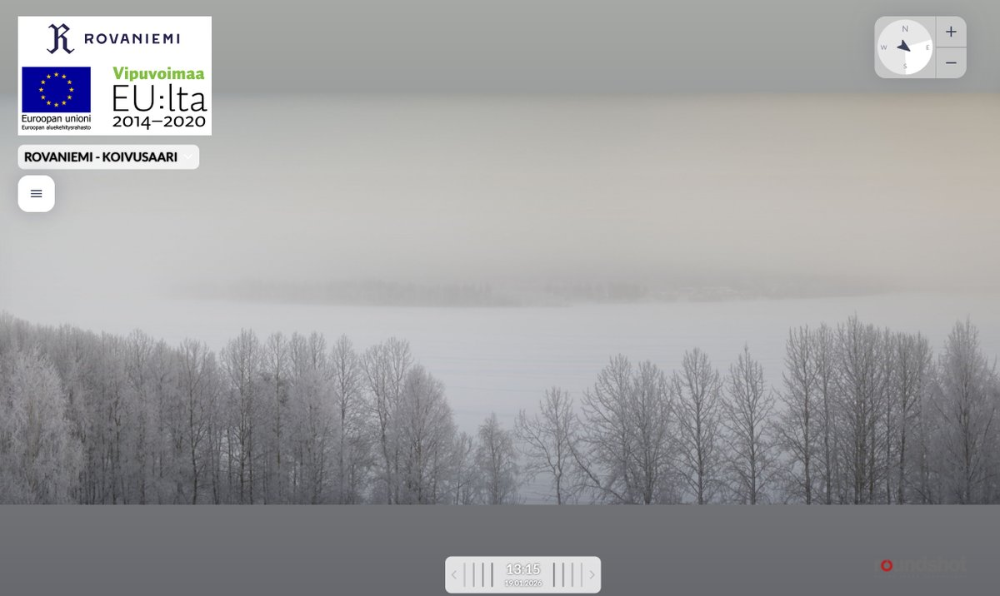
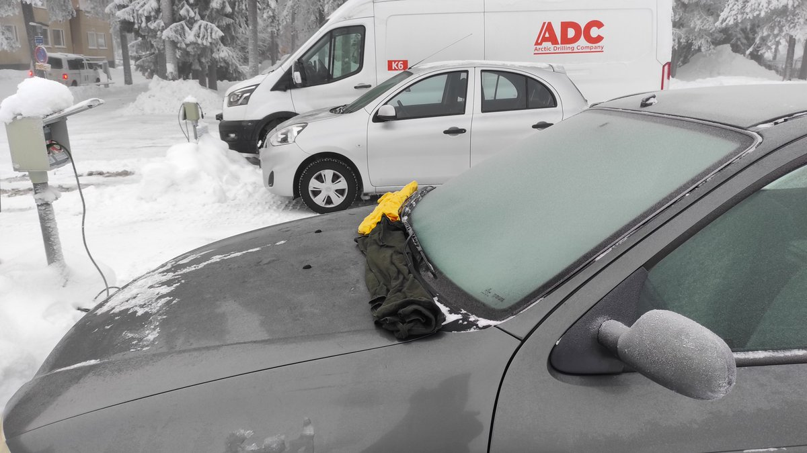
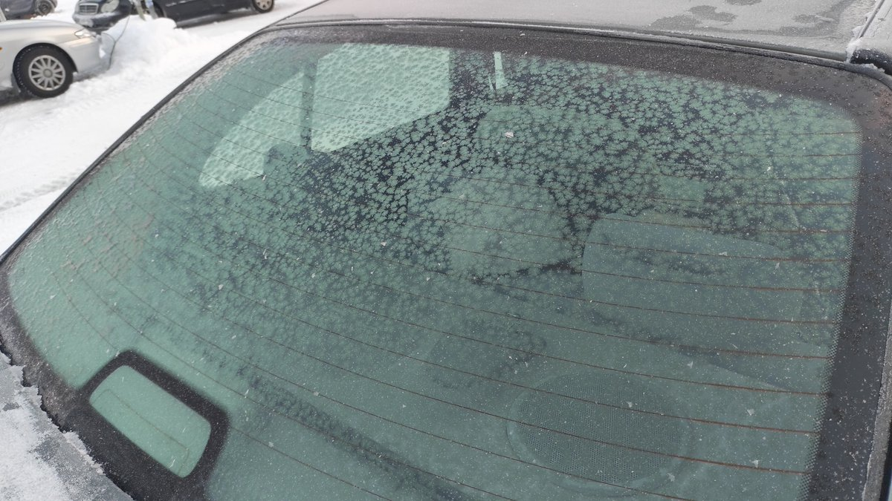
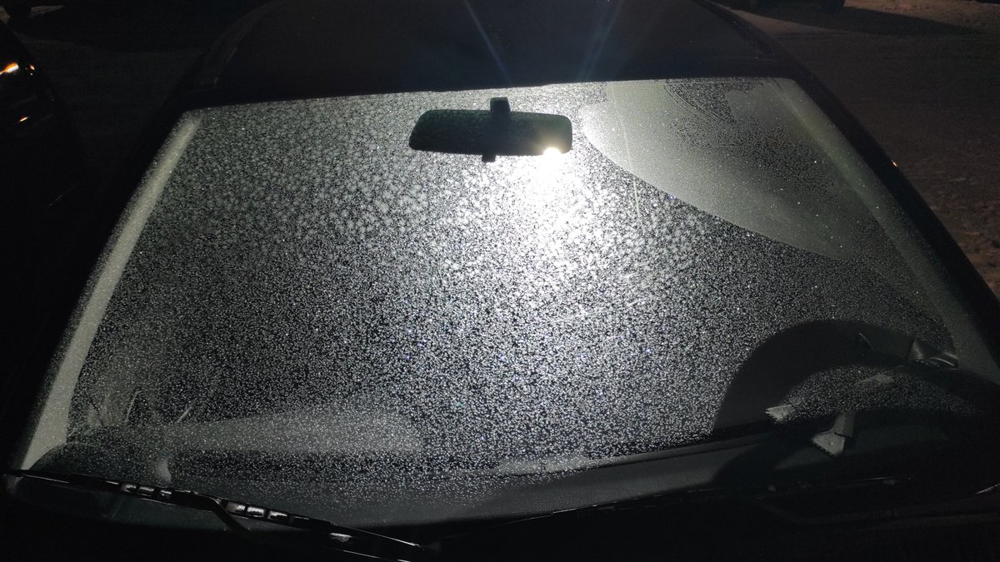

# Thread - 2026-01-19

**Original:** https://x.com/RiikonenMarko/status/2013215705626210402

---

### 1/4 - 2026-01-19 11:43 UTC

The fog just continues, -12 C, and guns are silent. I quit last night at 2:30, scraped the windows and let the car warm up to evaporate any residue in order to have clean start for the next evening. I was concerned that if I leave the frost be, it will become too thick. We'll see. Maybe there is nothing this time. But if it is odd radii again, I'll try to catch that 28° helic arc.

---

### 2/4 - 2026-01-19 13:20 UTC

Checked out the frost accumulation. Maybe too much, the windshield is rather opaque (side windows better though). Should have started anew again in the morning.

But who knows. I turned on the motor heating and covered the grilles with t-shirts to prevent heat sublimating the frost. Because of heating, last night the windscreen was not good – the bottom part was without frost and and the frosted part had no odd radii. Even if I was not going for a ride, the motor has to be heated because I have to move the car some 30 meters, away from the parking lot light pollution. It's a special operation because you are not allowed to breathe. I have no stamina to do it in one go, have to stop and jump out to take breath. 

Anyway, if the frost is no good now – soon it is dark enough to check – I scrape it all off and hope a fresh start will bring fruits to reap.

---

### 3/4 - 2026-01-20 13:29 UTC

The frost was too thick (see the previous post). Only very weak halos were seen in the side windows. I heated up the car to remove the frost. But the new growth about 6 hours later was no better. It was like an ice film spread over the glass. Again I removed it off. This time the new growth was these little ferns seen in the image. No halos in them, of course.

I think the 18/19 January odd radius display was a highly exceptional event. Never before I have seen foggy conditions to make displays on car windows. Not waiting for a repeat any time soon.

---

### 4/4 - 2026-01-21 06:41 UTC

This photo shows how sensitive the frost growth is to touching the glass. Before there was any growth, I wiped off with my jacket sleeve some fibers that had been left on the surface from my earlier cleaning using t-shirt soaked with warm water. Once the frosting got going, this part, in the upper right area, had different growth to the rest of the windshield.

---

