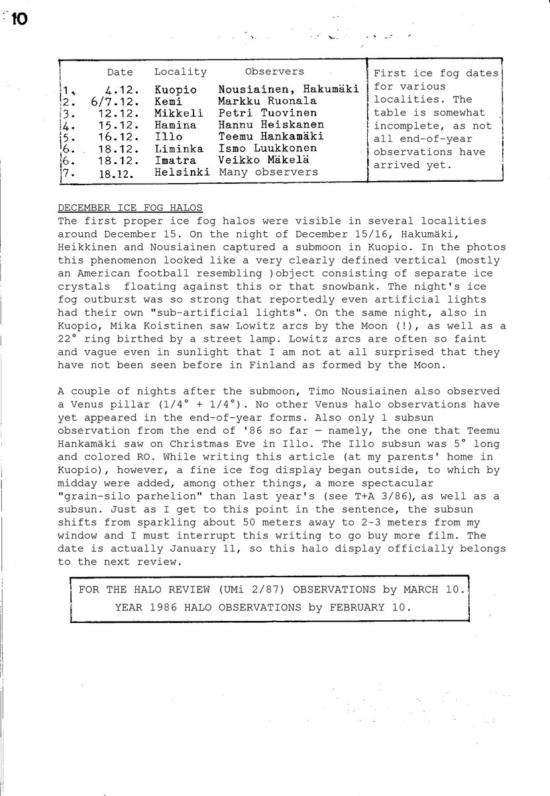
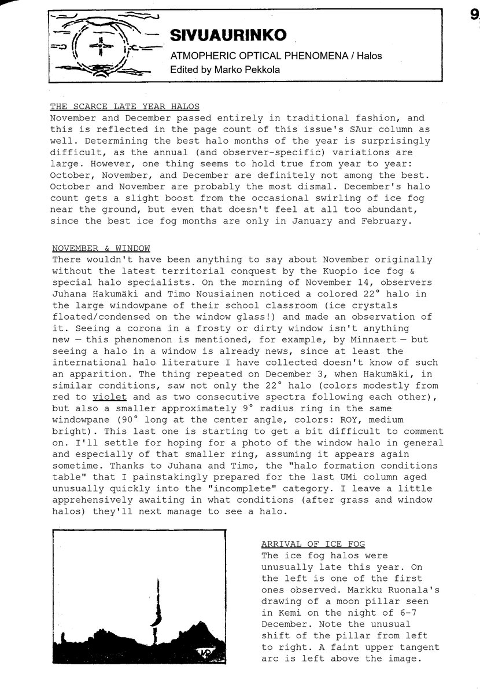

# Thread - 2026-01-20

**Original:** https://x.com/RiikonenMarko/status/2013621864271081926

---

### 1/1 - 2026-01-20 14:37 UTC

So given the odd radius display on my car window on 18/19 January 2026, how common is odd radii on glass surfaces in general? I know only one earlier observation: in Kuopio, Finland, Juhana Hakumäki reported of a display of 9 and 22° halos in his school classroom large window on 3 December 1986. Moreover, he mentioned the 22° halo consisting of two successive spectra, so 24° halo was there as well. In November of the same year he had seen with Timo Nousiainen 22° halo in the same window.

This must have been some special window. I rarely see frosted windows in warm buildings in the first place, and if I do see them, it's fern frost – no halos. And even if halo crystals would form, they should be oriented – no circular halos. Circular halos have been visible on my car windows many times, but those are from heavy diamond dust precipitation events that quickly dump a layer on the inclined glass surfaces, the windscreen and rear windows. I wonder how long it's gonna be until we have a repeat observation of the Kuopio window pane displays.

The observations appear in Ursa Minor circular 1/1987 Sivuaurinko section, written by Marko Pekkola. The two images here are an English facsimile translation, done under my oversight by Grok. The original: https://t.co/Icf2Pyba5X

---

