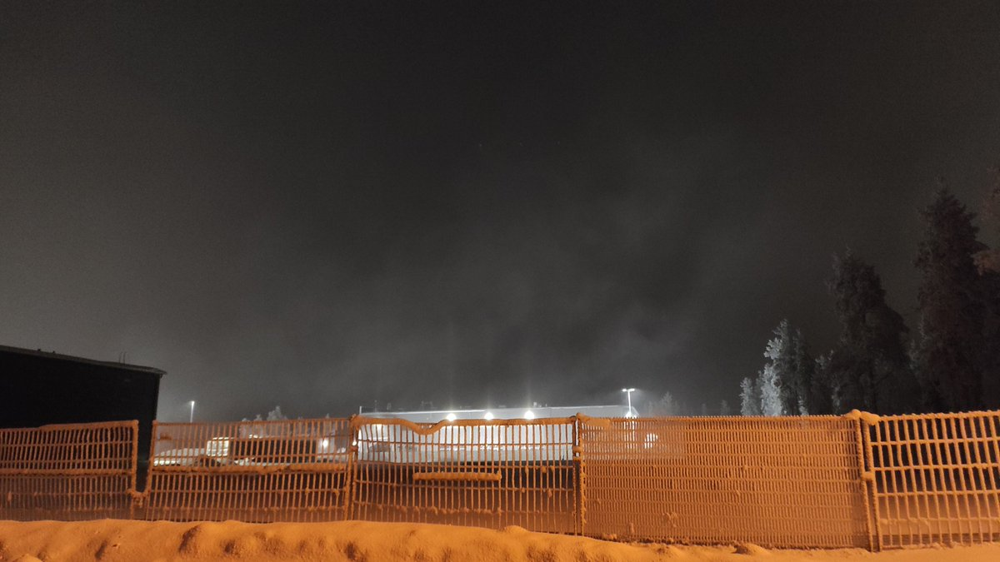

# Thread - 2026-01-21

**Original:** https://x.com/RiikonenMarko/status/2014076213506040238

---

### 1/2 - 2026-01-21 20:42 UTC

20/21 Jan 2026, Rovaniemi. The ways to make ice fog. We can add to the list also a liquefied gas station. There must be some very cold surfaces low down, pipes perhaps, which nucleated the water fog and caused this cloud of ice fog. But it was a feeble, local affair, fizzling away after a hundred or two hundred meters. No pillars were seen downwind at the nearby Post terminal.

What's happening here is the same thing that would happen if you wave a piece of dry ice in the air. I have suggested flying dry ice with a drone, but seeing this I am not so sure how well it would work. Yet with drone you would be nucleating from on high and I like to think it allows the reaction to spread better than from ground.

I also sprayed from the air spray can I have for dusting off the computer. It indeed caused an an incipient expanding ice fog cloud, but it got absorbed away. No pillars downwind.

It is the fourth consecutive night of fog in Rovaniemi. -10 C at the railway station. This would have been the halo fest like no other if the guns were running.

[🎬 2014076213506040238-Z2wnebYxaQpUDgIK.mp4](media/2014076213506040238-Z2wnebYxaQpUDgIK.mp4)

---

### 2/2 - 2026-01-21 21:01 UTC

20/21 Jan 2026, Rovaniemi. Another view of the Gasum station ice fog cloud, making weak pillars. The station is behind the dark building on the left.

---

