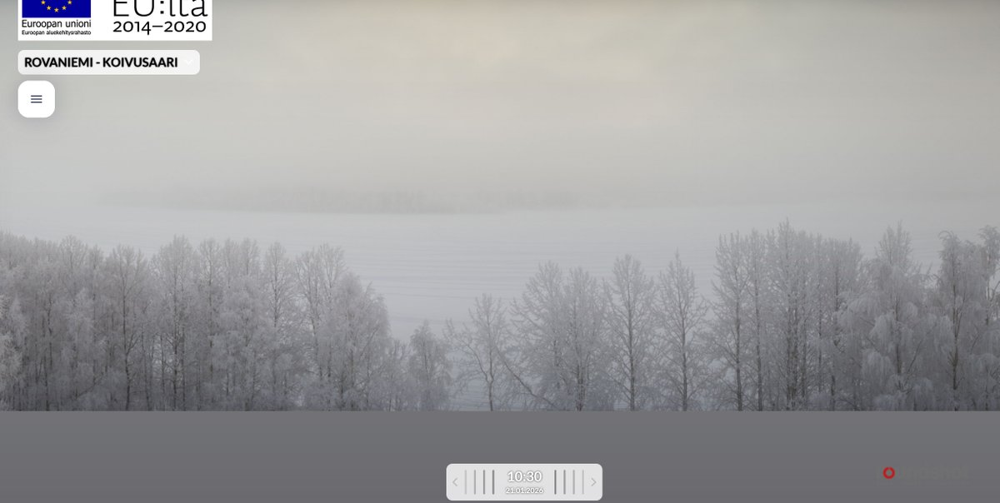

# Thread - 2026-01-21

**Original:** https://x.com/RiikonenMarko/status/2013897181795615125

---

### 1/1 - 2026-01-21 08:51 UTC

A familiar and poignant scene. After having yesterday cleared for the daytime, in the evening the fog came back. At first the temps were too low, but after midnight reached the threshold of -13 C and that's where it remained. Right now -11.8 C at the railway station.

---

