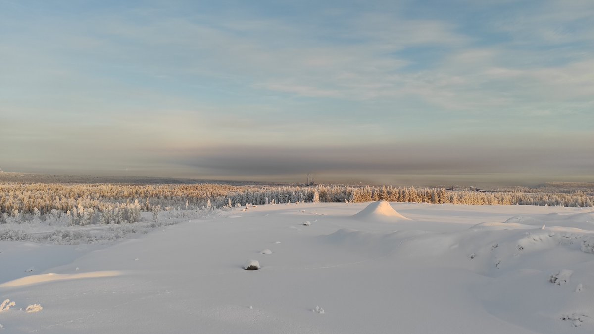
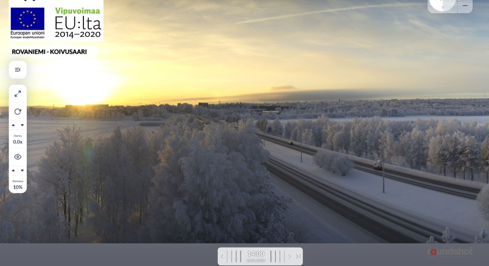

# Thread - 2026-01-23

**Original:** https://x.com/RiikonenMarko/status/2014700593240064401

---

### 1/2 - 2026-01-23 14:03 UTC

23 Jan 2026, Rovaniemi. A sequence of Suosiola plume growing in size and birthing parhelion.

[🎬 2014700593240064401-fFYuAYDWOgp78Kud.mp4](media/2014700593240064401-fFYuAYDWOgp78Kud.mp4)

---

### 2/2 - 2026-01-23 14:03 UTC

Here is a photo I took at 14:02 from Anttilanvaara, which is pretty much diametrically opposed to the webcam relative to the Suosiola plant. Webcam shot at 14:00 for comparison.

A layer of fog is present above the ground, as evidenced in the phone shot by the white fogbow patch left to the Suosiola plant.

Railway station -20 C, Apukka -23 C.

---

