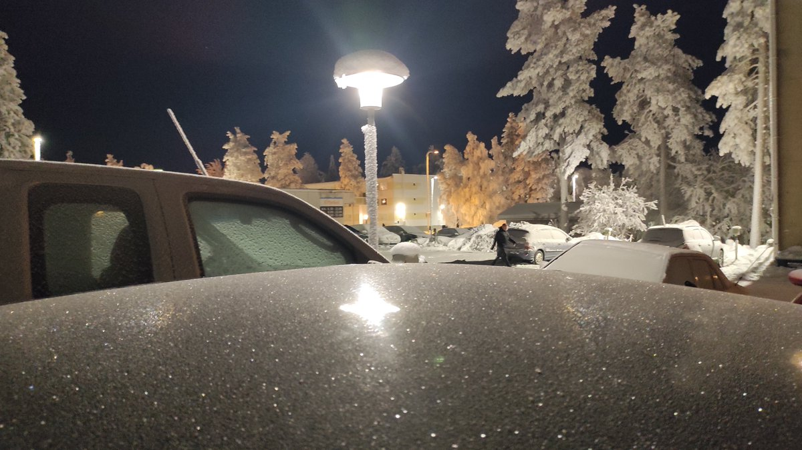
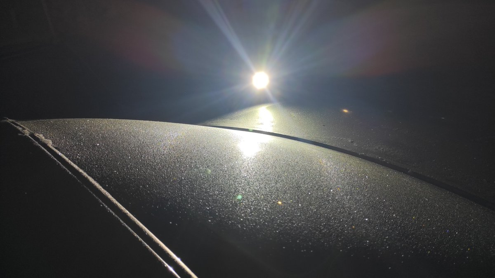

# Thread - 2026-01-24

**Original:** https://x.com/RiikonenMarko/status/2015086100071538821

---

### 1/8 - 2026-01-24 15:35 UTC

24/25 Jan 2026, Rovaniemi. The car is growing a display as we speak. But I didn't notice anything from Parry orientation, just plate.

---

### 2/8 - 2026-01-24 18:22 UTC

24/25 Jan 2026, Rovaniemi. Whattheh-   Looks like odd radii again! Or is it a big elliptical halo? Going out for answers. Gonna be long night of taking "car sale photos".

[🎬 2015127982214414516-xGulx8wOPtDkEsiw.mp4](media/2015127982214414516-xGulx8wOPtDkEsiw.mp4)

---

### 3/8 - 2026-01-25 00:35 UTC

24/25 Jan 2026, Rovaniemi. Came back. I accidentally turned on the rear window heating lines, so it got kind of spoiled even if only three lines are working. And the front window got disturbed a bit when I clambered on the roof. But I was pretty much done at that point.

Got plenty of videos and also some photo series to attempt stacking. This is of course an elliptical halo, no 9° arc from Parry orientation. Here is another video from the phone. Javelot Turbo is placed quite far away, meaning the display proportions stay more true than with headlamp as the light beam is less divergent.

I don't know what is that weak 22° arc above the light. It does not look like vex Parry. And maybe you are not supposed to have tanarc on glass surfaces. Wonder if I should go back to take a another look? The night is still young.

Railway station steady -21°. A little bit wind.

[🎬 2015221922556997938-raIPnN-sg97GE_0u.mp4](media/2015221922556997938-raIPnN-sg97GE_0u.mp4)

---

### 4/8 - 2026-01-25 03:25 UTC

24/25 Jan 2026, Rovaniemi. Before hitting the hay, let's put this one up where the lamp and observer are on the same side of the glass. So this is Bottlinger. I am starting lamp low down and moving it high up above my head. Bott transforms from elliptical shape to a ring of quite large size. This shape change was much easier to do and see without the phone.

[🎬 2015264768534118604-UOFr9L7xoKHFgbtQ.mp4](media/2015264768534118604-UOFr9L7xoKHFgbtQ.mp4)

---

### 5/8 - 2026-01-25 13:38 UTC

24/25 Jan 2026, Rovaniemi. Another video attempting the Bott elevation depended shape change. Two persons are needed to do this properly.

[🎬 2015418912641355953-wLCtxV1G5dm8oN9l.mp4](media/2015418912641355953-wLCtxV1G5dm8oN9l.mp4)

---

### 6/8 - 2026-01-25 13:44 UTC

24/25 Jan 2026, Rovaniemi. Bottlinger. Floody headlight on tripod at close distance.

[🎬 2015420500344795500-AwPn2EU22jB6kQih.mp4](media/2015420500344795500-AwPn2EU22jB6kQih.mp4)

---

### 7/8 - 2026-01-25 13:50 UTC

24/25 Jan 2026, Rovaniemi. Bottlinger. Halos are in more true proportions and sizes thanks to the relatively parallel rays from Javelot Turbo on tripod tens of meters away.

[🎬 2015421906732659168-2X6EQqkG8cQQ8lp_.mp4](media/2015421906732659168-2X6EQqkG8cQQ8lp_.mp4)

---

### 8/8 - 2026-01-25 14:32 UTC

24/25 Jan 2026, Rovaniemi. Something to keep in mind. When I noticed the display having started growing and made the thread's first post with the photo of parhelia in the parking lot light, I took also another photo using the headlamp. In neither of these photos Bottlinger is yet present. It came only with further frosting. Ditto the Parry pyramid helic arc in the earlier display. So waiting may be rewarded. But if the guns are on – as they often are when windscreen displays show up – patience may be in short supply.

Links to the originals of the above videos:

https://t.co/09fXvkoKLh

https://t.co/0alQ0IJ7wm

https://t.co/rRRXtVnodn

https://t.co/iUdVOKJN1u

https://t.co/hci58j9LxV

https://t.co/89DSwVPe6G

---

