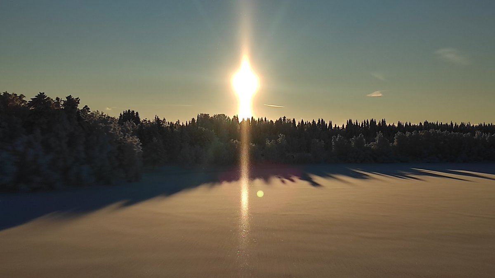
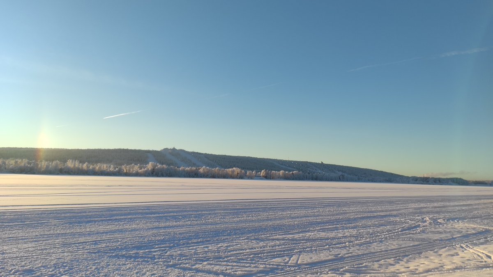
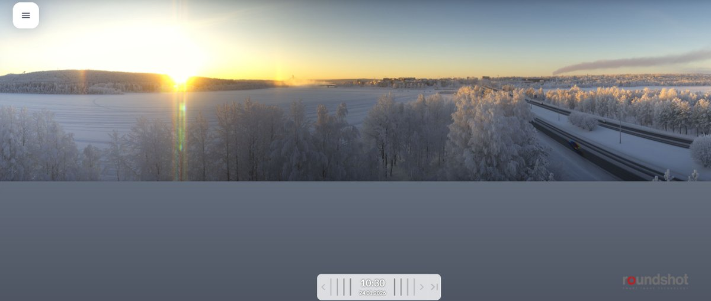
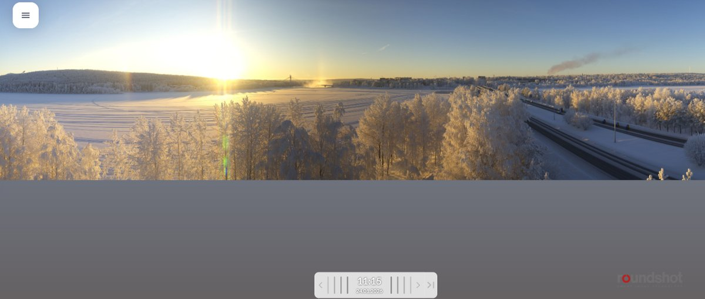
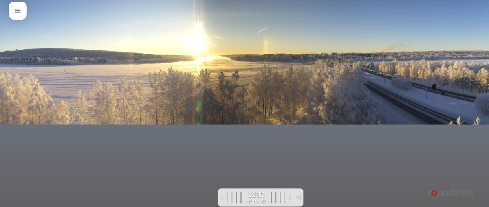
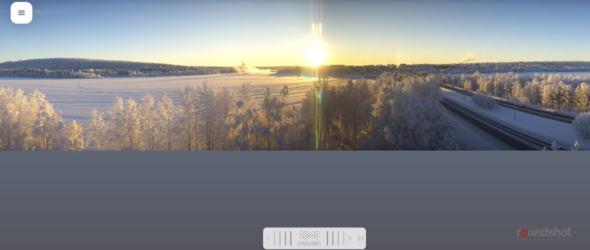

# Thread - 2026-01-24

**Original:** https://x.com/RiikonenMarko/status/2015036060737143073

---

### 1/2 - 2026-01-24 12:16 UTC

24 Jan 2026, Rovaniemi. Far as I can tell, today's diamond dust was natural. At least I was not able to connect it to any source. I made the "Oikarainen-loop" –the far point 17 km east from the city center – and the pillar and weak parhelia were visible all the time.

The countersun photo is from the Oikarainen bridge. Its core was not nearly the brightest I have seen, but was uncomfortable to look at any longer. The other photo with parhelion on the left is across the river opposite to the ski center. No guns are on and Suosiola plume is trailing to the opposite direction.

But of course only after having examined the ice crystal nuclei itself you can tell whether the diamond dust was natural or not.

---

### 2/2 - 2026-01-24 12:35 UTC

24 Jan 2026, Rovaniemi. Let's add also a selection of Koivusaari camera images. Notice how the Suosiola plume dries up and yet we have this diamond dust. Steady -23° C at Apukka, at railway station warmed up to -16° C after midday.

---

