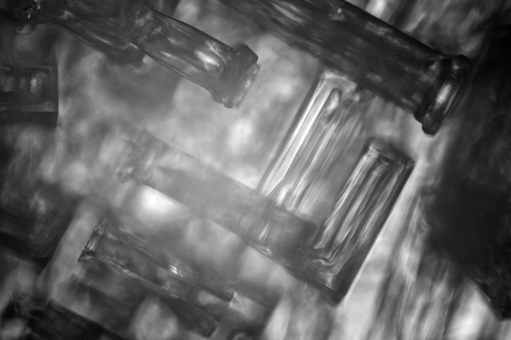
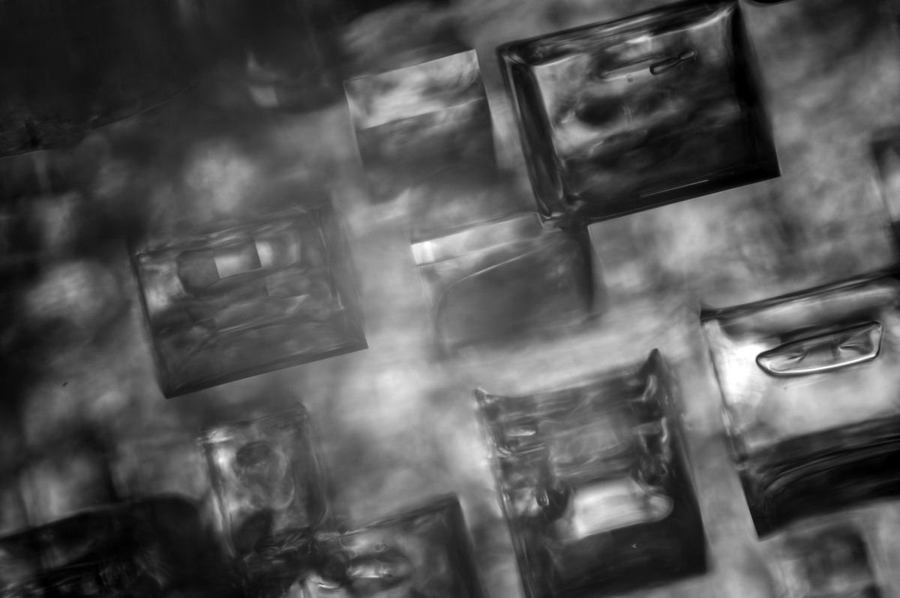
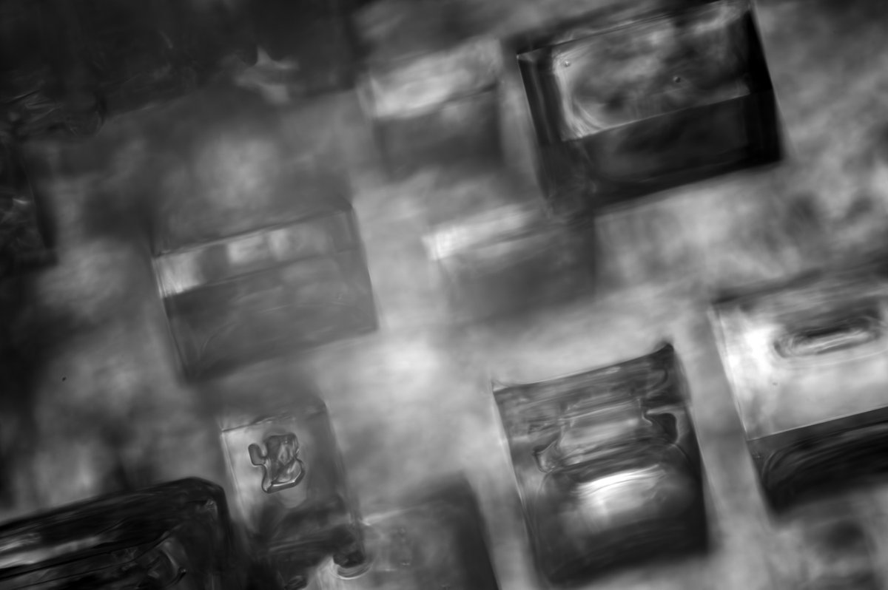
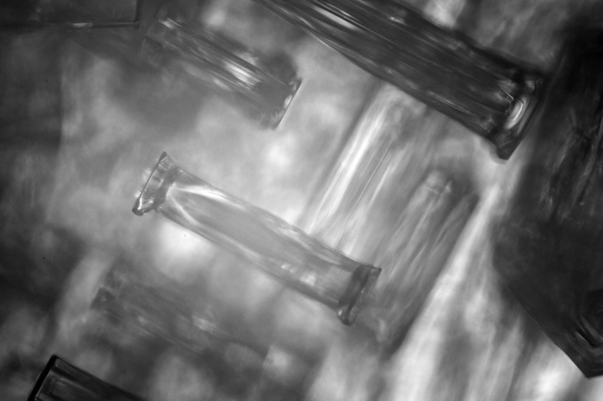
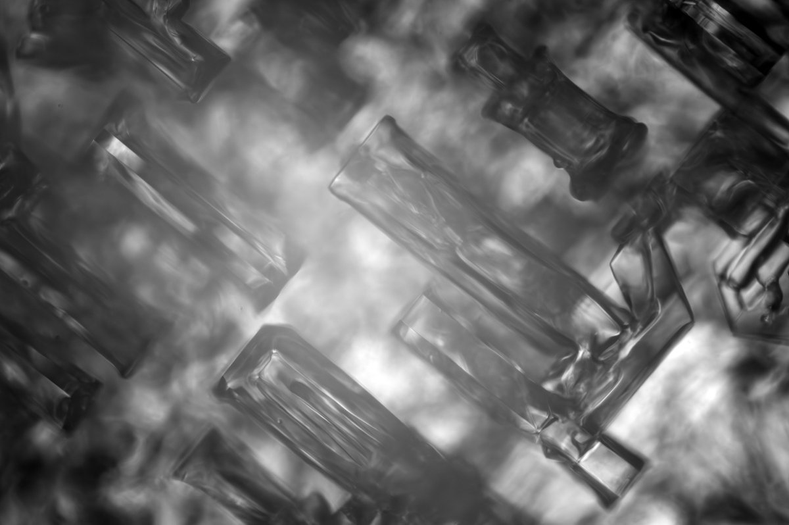
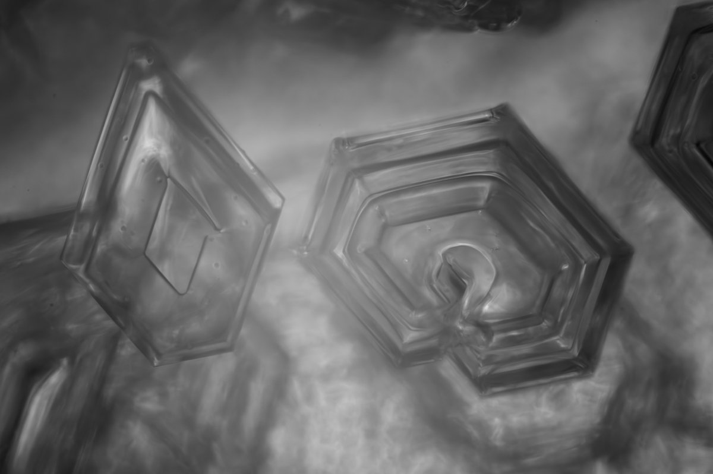
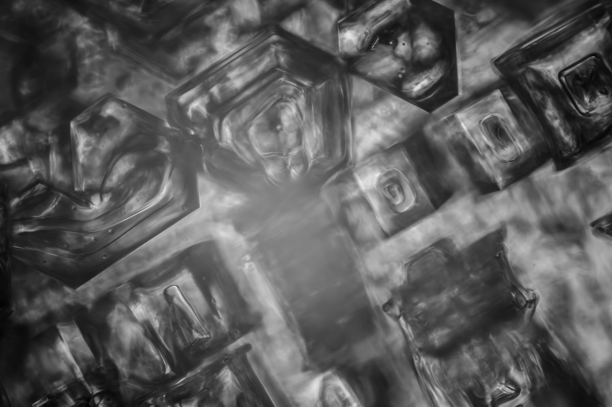
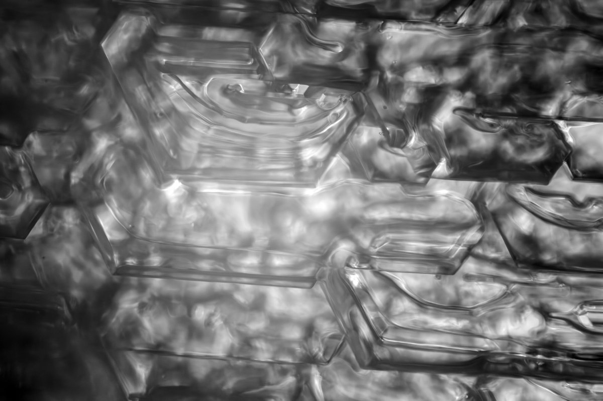

# Thread - 2026-01-27

**Original:** https://x.com/RiikonenMarko/status/2016294580149190768

---

### 1/2 - 2026-01-27 23:37 UTC

10 Nov 2025, Rovaniemi. I had all forgotten about these crystals photographed on the underside of a frozen pond ice early in the winter. Possibly these are the best photos I have of the Parry crystals. In the second pair of photos crystals are in two layers, at the blurred bottom is also a third layer.

---

### 2/2 - 2026-01-27 23:37 UTC

10 Nov 2025, Rovaniemi. Some more photos. The first is of the lowest layer. This layer of terraced plates is difficult to photograph in transmitted light. Second photo shows two crystals sticking up high above that base layer. Third one has a mosaic boundary of Parry and plate crystals. When you view the ice plate, these areas reflect differently.

---

